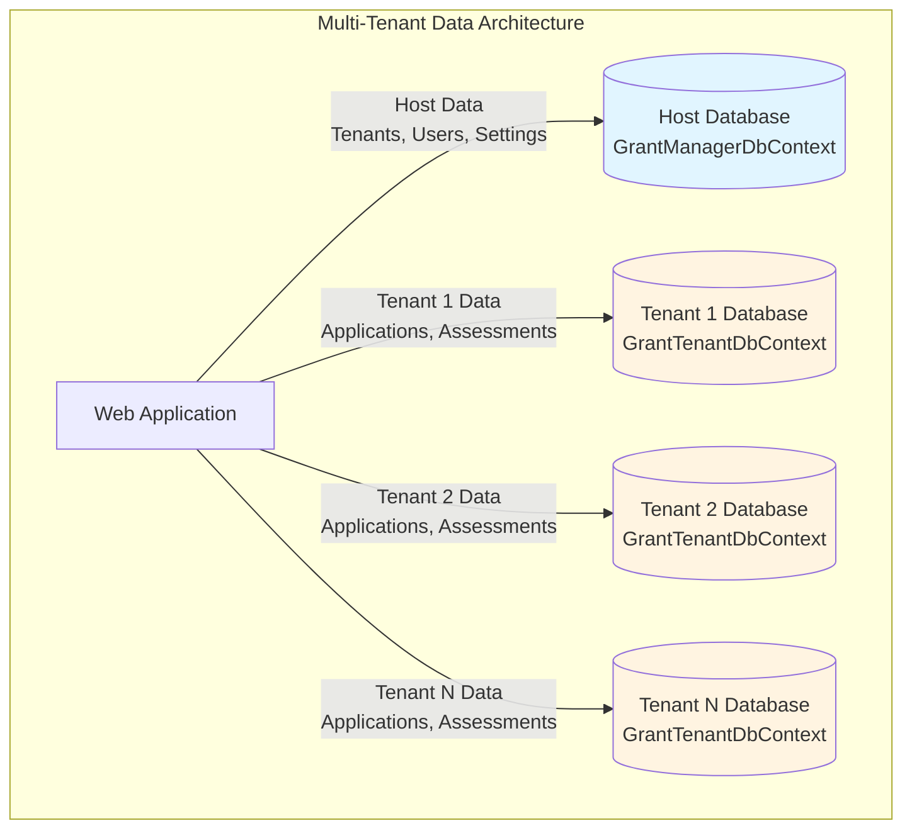
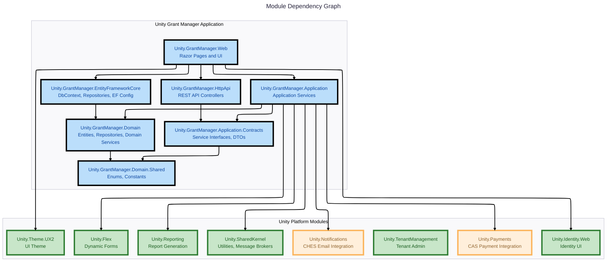
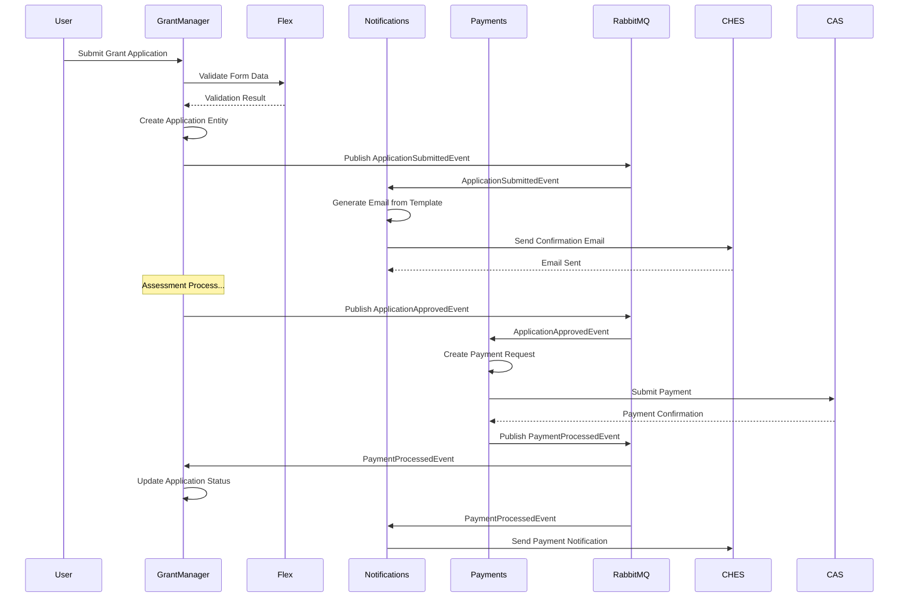
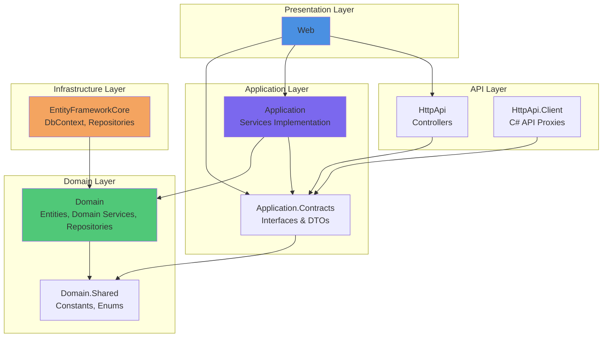
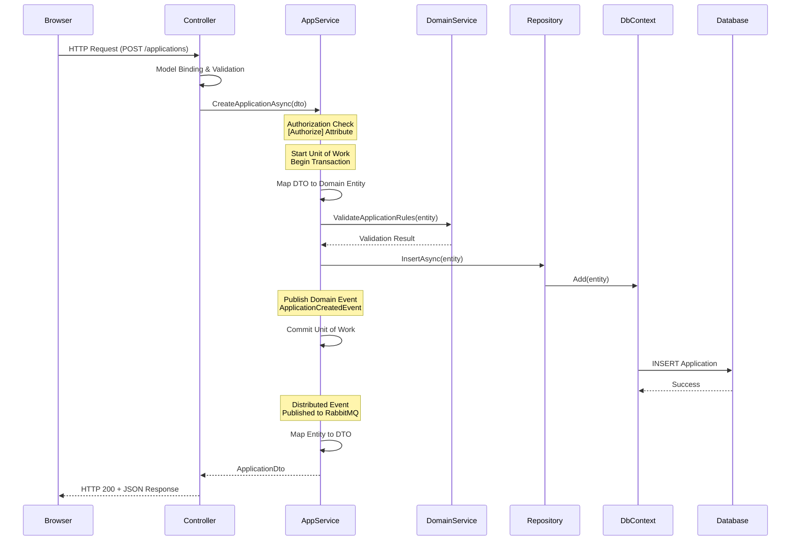
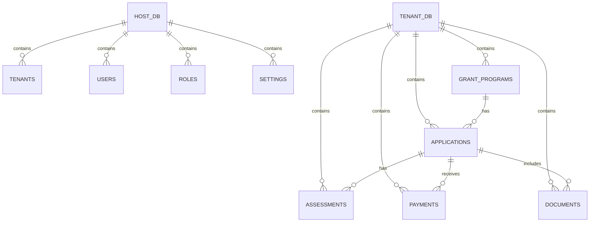
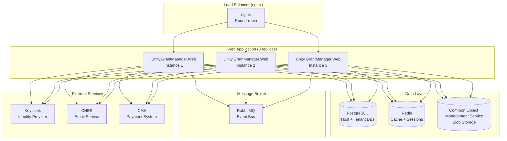
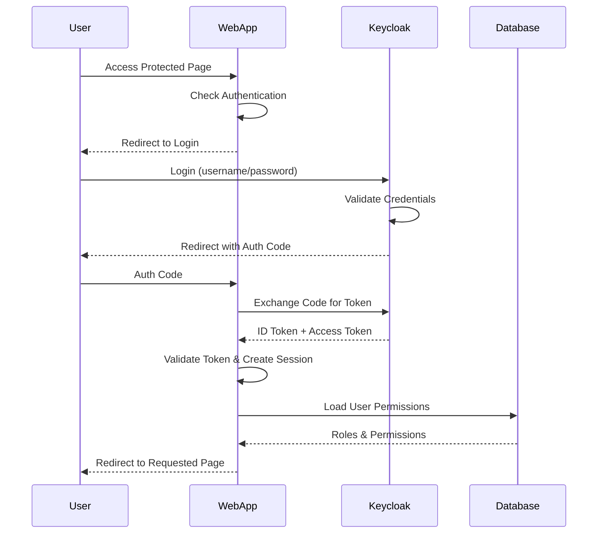

# Unity Grant Manager - System Architecture

## Overview

Unity Grant Manager is built on **ABP Framework 9.1.3**, following Domain-Driven Design (DDD) principles and implementing a modular monolith architecture. The application leverages ABP's opinionated architecture to build enterprise-grade grant management software with clean separation of concerns, multi-tenancy support, and extensible module design.

## Technology Stack

### Core Framework & Runtime
- **.NET 9.0**: Latest .NET platform with C# 12.0 and nullable reference types enabled
- **ABP Framework 9.1.3**: Application framework providing DDD infrastructure, modularity, and multi-tenancy
- **ASP.NET Core MVC**: Web application framework with Razor Pages for server-side rendering

### Data & Persistence
- **PostgreSQL**: Primary relational database management system
- **Entity Framework Core 9.0.5**: ORM for data access with Npgsql provider
- **Redis**: Distributed caching and data protection key storage
- **Common Object Management Service (COMS)**: Blob storage for document management

### Front-End & UI
- **Unity.Theme.UX2**: Custom theme module for consistent government branding
- **Bootstrap 5**: UI component framework
- **jQuery**: JavaScript utilities and DOM manipulation
- **Bundling & Minification**: ABP bundling system for client-side resource optimization

### Messaging & Background Jobs
- **RabbitMQ**: Message broker for event bus and distributed event handling
- **Quartz.NET**: Background job scheduling and execution with clustering support

### Authentication & Authorization
- **Keycloak**: Identity provider for OpenID Connect authentication
- **ABP Identity**: User and role management infrastructure

### Testing & Quality
- **xUnit**: Test framework for unit and integration tests
- **Shouldly**: Fluent assertion library
- **MiniProfiler**: Performance profiling and diagnostics

### Logging & Monitoring
- **Serilog**: Structured logging with multiple sink support
- **ABP Audit Logging**: Comprehensive audit trail for all system operations

## Architectural Patterns

### Domain-Driven Design (DDD)

Unity Grant Manager follows DDD tactical patterns as prescribed by ABP Framework:

- **Entities & Aggregate Roots**: Core business objects with identity and lifecycle
- **Value Objects**: Immutable objects defined by their attributes
- **Domain Services**: Business logic that doesn't naturally fit within entities (suffix: `Manager`)
- **Repositories**: Abstract data access with `IRepository<TEntity, TKey>` pattern
- **Domain Events**: Decouple domain logic and enable event-driven architecture
- **Application Services**: Use case orchestration layer (inherit from `ApplicationService`)
- **Data Transfer Objects (DTOs)**: API contract objects for input/output

### Multi-Tenancy Architecture

Unity Grant Manager implements multi-tenancy with **database-per-tenant isolation**:



**Key Components:**
- **GrantManagerDbContext**: Host database context for shared/global data (tenants, users, global settings)
- **GrantTenantDbContext**: Tenant-specific database context with `[IgnoreMultiTenancy]` attribute for tenant-scoped entities
- **Separate Migrations**: Distinct migration streams for host and tenant databases
- **Tenant Resolver**: Automatically determines current tenant from request context (URL, header, or claims)

## Module Architecture

Unity Grant Manager follows ABP's modular architecture with internal and external modules:

### Module Dependency Graph



### Module Descriptions

#### Unity.GrantManager (Main Application)
The core grant management application implementing grant programs, applications, assessments, and related business logic.

**Layers:**
- **Web**: Razor Pages, view components, client-side assets, MVC controllers for UI
- **HttpApi**: RESTful API controllers extending `AbpController`
- **Application**: Application services implementing business use cases, inheriting from `ApplicationService`
- **Application.Contracts**: Service interfaces, DTOs, and application-layer contracts
- **Domain**: Entities (applications, assessments, programs), domain services, repository interfaces
- **Domain.Shared**: Enums, constants, shared types
- **EntityFrameworkCore**: EF Core DbContexts (`GrantManagerDbContext`, `GrantTenantDbContext`), repository implementations, entity configurations

#### Unity.Flex (Dynamic Forms Module)
Provides dynamic form/field definition and rendering capabilities for customizable grant application forms.

**Key Features:**
- Custom field definitions with validation rules
- Form layout and section management
- Runtime form rendering with data binding
- Field value storage and retrieval

**Integration:** Grant application forms are built using Flex definitions, allowing program administrators to customize intake forms without code changes.

#### Unity.Notifications (Notification Module)
Handles email notifications through CHES (Common Hosted Email Service) integration.

**Key Features:**
- Email template management
- CHES API integration for government email delivery
- Notification queue and retry logic
- Notification history and tracking

**Integration:** Triggered by domain events from Grant Manager (application submitted, assessment completed, payment processed) to send automated email notifications.

#### Unity.Payments (Payment Processing Module)
Integrates with CAS (Common Accounting System) for government payment processing.

**Key Features:**
- CAS API integration for payment submission
- Payment status tracking and reconciliation
- Invoice generation and management
- Payment approval workflows

**Integration:** Grant Manager creates payment requests for approved applications, which are processed through Unity.Payments to CAS.

#### Unity.Reporting (Reporting Module)
Advanced reporting and analytics capabilities.

**Key Features:**
- Custom report definitions
- Data visualization and dashboards
- Report scheduling and distribution
- Export formats (PDF, Excel, CSV)

**Integration:** Provides reporting on grant applications, assessment outcomes, payment distributions, and program performance.

#### Unity.Identity.Web (Identity UI Module)
Custom user interface for identity management operations.

**Key Features:**
- User registration and profile management
- Login/logout pages with Keycloak integration
- Password reset and account recovery
- Organization/team management UI

#### Unity.TenantManagement (Tenant Management Module)
Multi-tenant administration interface.

**Key Features:**
- Tenant creation and configuration
- Database connection string management
- Tenant-specific feature toggles
- Tenant user assignments

#### Unity.Theme.UX2 (UI Theme Module)
Consistent government branding and user experience.

**Key Features:**
- BC Government visual identity compliance
- Responsive layouts and components
- Accessibility (WCAG 2.1 AA) compliance
- Reusable UI components and patterns

#### Unity.SharedKernel (Shared Utilities Module)
Cross-cutting utilities and infrastructure shared across modules.

**Key Features:**
- HTTP client factories and helpers
- RabbitMQ message broker configuration
- Correlation ID propagation for distributed tracing
- Feature flags and utilities
- Integration abstractions

### Module Communication Patterns



**Communication Mechanisms:**
1. **Direct Service References**: Modules can directly inject and call services from dependent modules (e.g., GrantManager → Flex for form validation)
2. **Domain Events (Local)**: In-process events for same-database transactions using ABP's `ILocalEventBus`
3. **Distributed Events (RabbitMQ)**: Cross-module/cross-database events using ABP's `IDistributedEventBus` with RabbitMQ transport
4. **HTTP APIs**: RESTful APIs for external integrations or microservice scenarios

## Layer Structure & Dependencies

Unity Grant Manager follows ABP's layered architecture with strict dependency rules:



### Dependency Rules

1. **Domain Layer** has no dependencies on other layers (only on ABP framework)
2. **Application.Contracts** depends only on **Domain.Shared**
3. **Application** depends on **Domain** and **Application.Contracts**
4. **Infrastructure** (EF Core) depends on **Domain** only
5. **HttpApi** depends on **Application.Contracts**
6. **Web** can depend on any layer for hosting, but business logic stays in Application/Domain

### Project Dependencies (Actual)

**Unity.GrantManager.Web** depends on:
- Unity.GrantManager.Application
- Unity.GrantManager.HttpApi
- Unity.GrantManager.EntityFrameworkCore
- Unity.Theme.UX2
- Unity.Identity.Web

**Unity.GrantManager.Application** depends on:
- Unity.GrantManager.Application.Contracts
- Unity.GrantManager.Domain
- Unity.Flex
- Unity.Notifications
- Unity.Payments
- Unity.Reporting
- Unity.SharedKernel

**Unity.GrantManager.Domain** depends on:
- Unity.GrantManager.Domain.Shared
- Volo.Abp.Identity.Domain
- Volo.Abp.TenantManagement.Domain
- Volo.Abp.AuditLogging.Domain

**Unity.GrantManager.EntityFrameworkCore** depends on:
- Unity.GrantManager.Domain
- Volo.Abp.EntityFrameworkCore.PostgreSql

## Data Flow & Request Pipeline

### Typical Request Flow



### Cross-Cutting Concerns (Automatic via ABP)

ABP Framework automatically handles the following concerns for application services:

1. **Authorization**: `[Authorize]` attributes and permission checks via `IAuthorizationService`
2. **Validation**: Automatic input DTO validation using data annotations and FluentValidation
3. **Unit of Work**: Automatic transaction management with commit/rollback
4. **Audit Logging**: Automatic logging of method calls, parameters, and results
5. **Exception Handling**: Global exception filter with appropriate HTTP status codes
6. **Multi-Tenancy**: Automatic tenant resolution and data isolation

## Database Schema Strategy

### Multi-Database Approach



**Host Database (`GrantManagerDbContext`):**
- Tenant definitions and configurations
- Users and roles (cross-tenant identity)
- Global settings and feature flags
- Audit logs
- Background job definitions

**Tenant Databases (`GrantTenantDbContext`):**
- Grant programs and configurations
- Applications and applicant data
- Assessment workflows and scores
- Payment requests and history
- Documents and attachments
- Tenant-specific settings

### Migration Strategy

1. **Host Migrations**: Located in `Unity.GrantManager.EntityFrameworkCore/Migrations/`
   ```bash
   dotnet ef migrations add <MigrationName> --context GrantManagerDbContext
   ```

2. **Tenant Migrations**: Located in `Unity.GrantManager.EntityFrameworkCore/TenantMigrations/`
   ```bash
   dotnet ef migrations add <MigrationName> --context GrantTenantDbContext
   ```

3. **DbMigrator**: Console application that applies both host and tenant migrations on startup

## Deployment Architecture

### Development Environment

- **Single Instance**: All modules hosted in single ASP.NET Core process
- **Database**: Local PostgreSQL instance (can be Docker container)
- **Redis**: Local Redis instance (optional, uses in-memory cache as fallback)
- **RabbitMQ**: Local RabbitMQ instance (can be disabled for development)

### Production Environment (Modular Monolith)



**Configuration:**
- Load balancer distributes requests across 3 web instances (Docker Compose with nginx)
- Redis used for distributed caching and session storage
- RabbitMQ provides reliable message delivery between instances
- PostgreSQL handles both host and multiple tenant databases
- Background jobs coordinated via Quartz.NET clustering

## Security Architecture

### Authentication Flow



### Authorization Model

- **Role-Based Access Control (RBAC)**: Roles assigned to users (Admin, ProgramOfficer, Assessor, Applicant)
- **Permission-Based**: Granular permissions checked via `[Authorize]` attributes and `IAuthorizationService`
- **Multi-Tenant Isolation**: Tenant context automatically applied to all queries and operations
- **Data-Level Security**: Row-level security via ABP's data filters and tenant resolution

## Performance & Scalability Considerations

### Caching Strategy
- **Distributed Cache (Redis)**: Application settings, user permissions, frequently accessed lookup data
- **Local Memory Cache**: Static configuration, short-lived data
- **HTTP Response Caching**: Public pages and API responses with ETags

### Database Optimization
- **Indexing**: Strategic indexes on foreign keys, tenant IDs, and frequently queried fields
- **Query Optimization**: `IQueryable` projections to load only required fields
- **Eager Loading**: Configured includes to avoid N+1 query problems
- **Async Operations**: All database operations use async/await pattern

### Background Processing
- **Quartz.NET Jobs**: Long-running tasks (report generation, payment processing, email sending)
- **Clustering**: Background jobs coordinated across multiple instances
- **Event-Driven**: Asynchronous processing via RabbitMQ distributed events

### Scalability
- **Horizontal Scaling**: Stateless web instances can be added behind load balancer
- **Database Partitioning**: Separate tenant databases enable independent scaling
- **Blob Storage**: Large files stored in COMS, not in database
- **CDN Ready**: Static assets can be served from CDN

## References

- [ABP Framework Documentation](https://docs.abp.io/en/abp/latest)
- [ABP Domain Driven Design](https://docs.abp.io/en/abp/latest/Domain-Driven-Design)
- [ABP Multi-Tenancy](https://docs.abp.io/en/abp/latest/Multi-Tenancy)
- [ABP Module Architecture Best Practices](https://docs.abp.io/en/abp/latest/Best-Practices/Module-Architecture)
- [Implementing Domain Driven Design (e-book)](https://abp.io/books/implementing-domain-driven-design)
