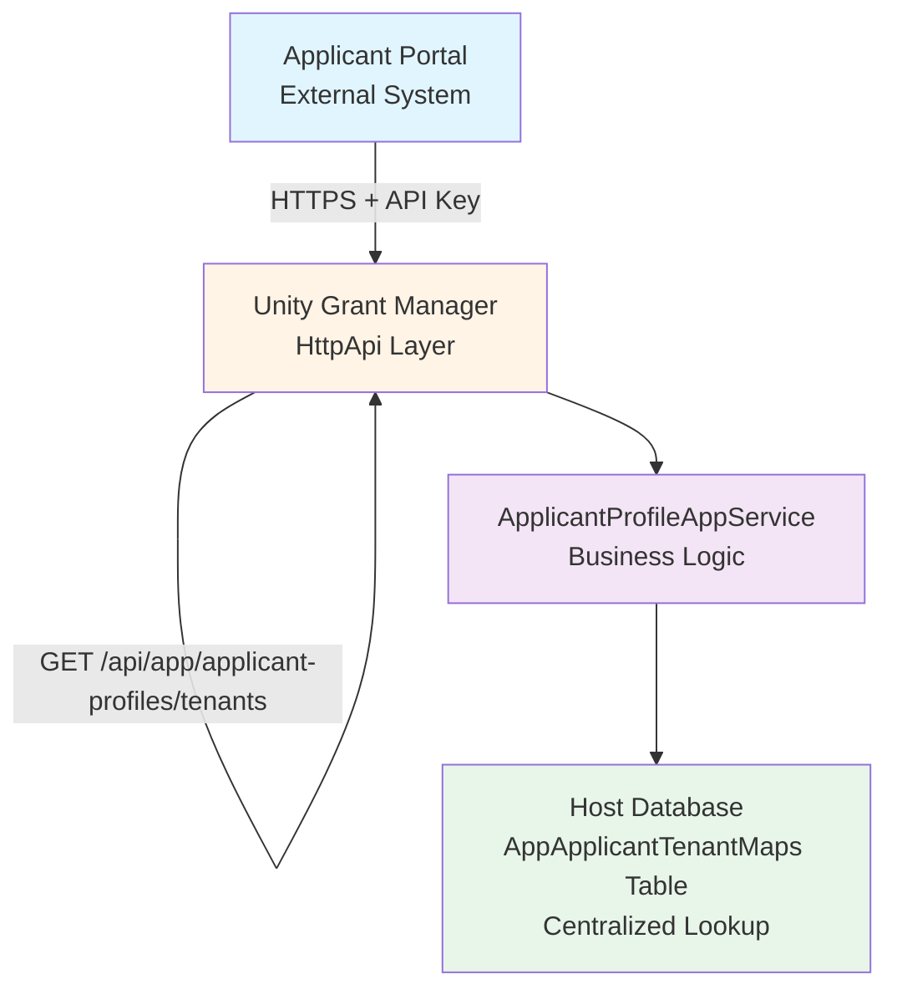
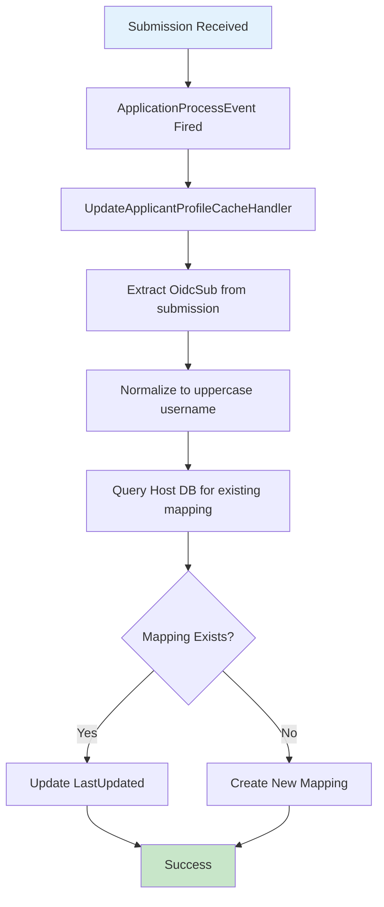
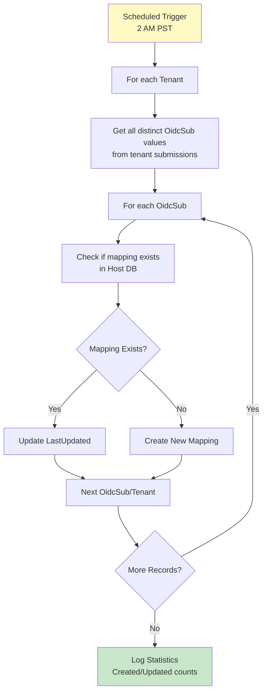
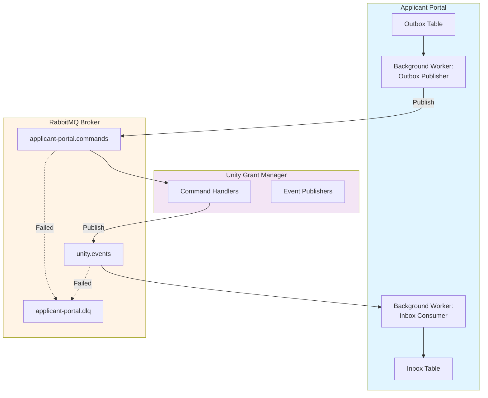
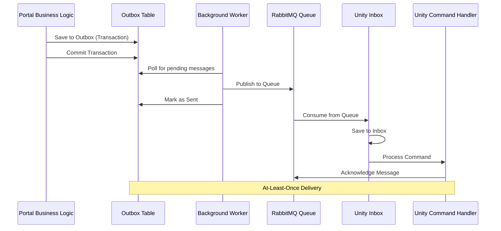
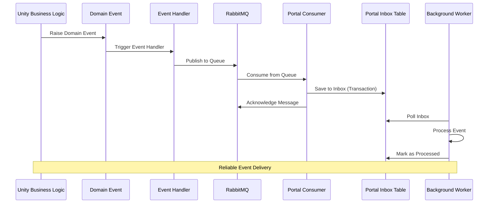
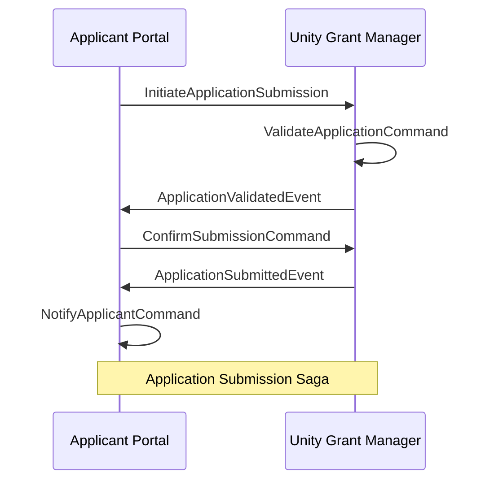

# Applicant Portal Integration Guide

## Overview

The Unity Grant Manager integrates with the Applicant Portal through two primary mechanisms:

1. **REST API Endpoints** - Synchronous queries for profile and tenant information
2. **RabbitMQ Messaging** - Asynchronous commands and events for data synchronization

This dual-integration approach provides both immediate data access (API) and reliable, decoupled communication (messaging) between the systems.

## Architecture



### Data Synchronization Flow

The `AppApplicantTenantMaps` table is kept in sync through two mechanisms:

1. **Real-time Updates** (Event Handler)
   - Triggered when a submission is received
   - `UpdateApplicantProfileCacheHandler` handles `ApplicationProcessEvent`
   - Creates or updates mapping immediately

2. **Nightly Reconciliation** (Background Job)
   - Runs daily at 2 AM PST (10 AM UTC)
   - `ApplicantTenantMapReconciliationWorker` scans all tenants
   - Ensures no mappings are missed
   - Self-healing mechanism

## API Endpoints

### Base URL
```
https://{unity-host}/api/app/applicant-profiles
```

### Authentication
All endpoints require API Key authentication using the `X-Api-Key` header.

**Request Header**:
```
X-Api-Key: {your-api-key}
```

**Error Response** (401 Unauthorized):
```json
{
  "type": "https://tools.ietf.org/html/rfc7235#section-3.1",
  "title": "Unauthorized",
  "status": 401,
  "detail": "API Key missing"
}
```

---

### 1. Get Applicant Profile

Retrieves basic profile information for an applicant.

**Endpoint**: `GET /api/app/applicant-profiles/profile`

**Query Parameters**:
| Parameter | Type | Required | Description |
|-----------|------|----------|-------------|
| `ProfileId` | `Guid` | Yes | Unique identifier for the applicant profile |
| `Subject` | `string` | Yes | OIDC subject identifier (e.g., `user@idp`) |
| `TenantId` | `Guid` | Yes | The tenant ID to query within |

**Request Example**:
```http
GET /api/app/applicant-profiles/profile?ProfileId=3fa85f64-5717-4562-b3fc-2c963f66afa6&Subject=smzfrrla7j5hw6z7wzvyzdrtq6dj6fbr@chefs-frontend-5299&TenantId=7c9e6679-7425-40de-944b-e07fc1f90ae7
X-Api-Key: your-api-key-here
```

**Response Example** (200 OK):
```json
{
  "profileId": "3fa85f64-5717-4562-b3fc-2c963f66afa6",
  "subject": "smzfrrla7j5hw6z7wzvyzdrtq6dj6fbr@chefs-frontend-5299",
  "email": "applicant@example.com",
  "displayName": "John Doe"
}
```

**Response Schema**:
```csharp
public class ApplicantProfileDto
{
    public Guid ProfileId { get; set; }
    public string Subject { get; set; }
    public string Email { get; set; }
    public string DisplayName { get; set; }
}
```

---

### 2. Get Applicant Tenants

Retrieves the list of tenants (grant programs) the applicant has submitted applications to.

**Endpoint**: `GET /api/app/applicant-profiles/tenants`

**Query Parameters**:
| Parameter | Type | Required | Description |
|-----------|------|----------|-------------|
| `ProfileId` | `Guid` | Yes | Unique identifier for the applicant profile |
| `Subject` | `string` | Yes | OIDC subject identifier (e.g., `user@idp`) |

**Request Example**:
``` http
GET /api/app/applicant-profiles/tenants?ProfileId=3fa85f64-5717-4562-b3fc-2c963f66afa6&Subject=smzfrrla7j5hw6z7wzvyzdrtq6dj6fbr@chefs-frontend-5299
X-Api-Key: your-api-key-here
```

**Response Example** (200 OK):
```json
[
  {
    "tenantId": "3fa85f64-5717-4562-b3fc-2c963f66afa6",
    "tenantName": "Housing Grant Program"
  },
  {
    "tenantId": "7c9e6679-7425-40de-944b-e07fc1f90ae7",
    "tenantName": "Business Development Fund"
  }
]
```

**Response Schema**:
```csharp
public class ApplicantTenantDto
{
    public Guid TenantId { get; set; }
    public string TenantName { get; set; }
}
```

**Empty Response** (No tenants found):
```json
[]
```

---

## Subject Identifier Format

The system extracts and normalizes OIDC subject identifiers as follows:

### Input Formats Supported
1. **From CHEFS Submission**:
   - Path: `submission.data.hiddenApplicantAgent.sub`
   - Example: `"smzfrrla7j5hw6z7wzvyzdrtq6dj6fbr@chefs-frontend-5299"`

2. **From CreatedBy Field**:
   - Path: `submission.createdBy`
   - Example: `"anonymous@bcservicescard"`

### Normalization Rules
1. Extract the identifier **before** the `@` symbol
2. Convert to **UPPERCASE**
3. Store in `AppApplicantTenantMaps.OidcSubUsername`

**Examples**:
- `smzfrrla7j5hw6z7wzvyzdrtq6dj6fbr@chefs-frontend-5299` ? `SMZFRRLA7J5HW6Z7WZVYZDRTQ6DJ6FBR`
- `anonymous@bcservicescard` ? `ANONYMOUS`

**Implementation**: See `IntakeSubmissionHelper.ExtractOidcSub(dynamic submission)`

---

## Data Model

### AppApplicantTenantMaps Table (Host Database)

**Table Schema**:
```sql
CREATE TABLE "ApplicantTenantMaps" (
    "Id" UUID PRIMARY KEY,
    "OidcSubUsername" VARCHAR NOT NULL,
    "TenantId" UUID NOT NULL,
    "TenantName" VARCHAR NOT NULL,
    "LastUpdated" TIMESTAMP NOT NULL,
    "CreationTime" TIMESTAMP NOT NULL,
    "CreatorId" UUID,
    CONSTRAINT "UQ_ApplicantTenantMaps_OidcSub_Tenant" 
        UNIQUE ("OidcSubUsername", "TenantId")
);

CREATE INDEX "IX_ApplicantTenantMaps_OidcSubUsername" 
    ON "ApplicantTenantMaps" ("OidcSubUsername");
```

**Entity**: `ApplicantTenantMap`
```csharp
public class ApplicantTenantMap : CreationAuditedAggregateRoot<Guid>
{
    public string OidcSubUsername { get; set; }  // Normalized (uppercase) username
    public Guid TenantId { get; set; }
    public string TenantName { get; set; }
    public DateTime LastUpdated { get; set; }
}
```

**Key Characteristics**:
- **Stored in Host Database**: Single source of truth across all tenants
- **Unique Constraint**: One mapping per (OidcSubUsername, TenantId) pair
- **Indexed**: Fast lookups by OidcSubUsername
- **Audited**: Tracks creation time and creator

---

## Data Synchronization

### 1. Real-time Sync (Event Handler)

**Class**: `UpdateApplicantProfileCacheHandler`  
**Location**: `src/Unity.GrantManager.Application/Intakes/Handlers/UpdateApplicantProfileCacheHandler.cs`

**Trigger**: `ApplicationProcessEvent` (fires when a submission is received)

**Flow**:


**Code Example**:
```csharp
public async Task HandleEventAsync(ApplicationProcessEvent eventData)
{
    var submission = eventData.ApplicationFormSubmission;
    var subUsername = ExtractAndNormalize(submission.OidcSub);
    
    using (currentTenant.Change(null)) // Switch to Host DB
    {
        var existingMapping = await FindMapping(subUsername, tenantId);
        
        if (existingMapping != null)
        {
            existingMapping.LastUpdated = DateTime.UtcNow;
            await UpdateAsync(existingMapping);
        }
        else
        {
            var newMapping = new ApplicantTenantMap
            {
                OidcSubUsername = subUsername,
                TenantId = tenantId,
                TenantName = tenantName,
                LastUpdated = DateTime.UtcNow
            };
            await InsertAsync(newMapping);
        }
    }
}
```

**Benefits**:
- **Immediate**: Mapping available within milliseconds
- **Lightweight**: Single row insert/update per submission
- **Idempotent**: Safe to run multiple times

---

### 2. Nightly Reconciliation (Background Job)

**Class**: `ApplicantTenantMapReconciliationWorker`  
**Location**: `src/Unity.GrantManager.Application/Applicants/BackgroundWorkers/ApplicantTenantMapReconciliationWorker.cs`

**Schedule**: Daily at 2 AM PST (10 AM UTC)  
**Configurable via**: `GrantManager.BackgroundJobs.ApplicantTenantMapReconciliation_Expression`

**Flow**:


**Purpose**:
- **Self-healing**: Catches any missed events or failures
- **Data validation**: Ensures consistency across tenants
- **New tenant support**: Automatically includes new tenants
- **Historical backfill**: Populates mappings for existing data

**Configuration** (appsettings.json):
```json
{
  "Settings": {
    "GrantManager.BackgroundJobs.ApplicantTenantMapReconciliation_Expression": "0 0 10 1/1 * ? *"
  }
}
```

**Testing Configuration** (Every 2 minutes):
```json
{
  "Settings": {
    "GrantManager.BackgroundJobs.ApplicantTenantMapReconciliation_Expression": "0 */2 * * * ?"
  }
}
```

**Logs Example**:
```
[INF] Starting ApplicantTenantMap reconciliation...
[DBG] Processing tenant: Housing Grant Program
[INF] Created missing ApplicantTenantMap for SMZFRRLA7J5HW6Z7WZVYZDRTQ6DJ6FBR in tenant Housing Grant Program
[DBG] Processing tenant: Business Development Fund
[INF] ApplicantTenantMap reconciliation completed. Created: 5, Updated: 127
```

---

## API Key Authentication

### Setup

**Class**: `ApiKeyAuthorizationFilter`  
**Location**: `src/Unity.GrantManager.HttpApi/Controllers/Authentication/ApiKeyAuthorizationFilter.cs`

### Configuration

**appsettings.json**:
```json
{
  "B2BAuth": {
    "ApiKey": "your-secure-api-key-here"
  }
}
```

**Environment Variable** (Recommended for production):
```bash
B2BAuth__ApiKey=your-secure-api-key-here
```

**User Secrets** (Development):
```bash
dotnet user-secrets set "B2BAuth:ApiKey" "your-secure-api-key-here"
```

### Usage

The `ApiKeyAuthorizationFilter` is applied to the controller via `[ServiceFilter]`:

```csharp
[ApiController]
[Route("api/app/applicant-profiles")]
[ServiceFilter(typeof(ApiKeyAuthorizationFilter))]
public class ApplicantProfileController : AbpControllerBase
{
    // Endpoints protected by API key
}
```

### Request Format

**Header**:
```
X-Api-Key: your-secure-api-key-here
```

**cURL Example**:
```bash
curl -X GET "https://unity.example.com/api/app/applicant-profiles/tenants?ProfileId=3fa85f64-5717-4562-b3fc-2c963f66afa6&Subject=user@idp" \
  -H "X-Api-Key: your-secure-api-key-here"
```

### Security Best Practices

1. **Key Generation**: Use cryptographically secure random strings (min 32 characters)
2. **Storage**: Store in Azure Key Vault or equivalent secret management system
3. **Rotation**: Rotate keys regularly (e.g., every 90 days)
4. **Transport**: Always use HTTPS in production
5. **Logging**: Avoid logging API keys (filter logs appropriately)
6. **Rate Limiting**: Consider implementing rate limiting per API key

---

## RabbitMQ Messaging Integration

### Overview

In addition to REST API endpoints, Unity Grant Manager and the Applicant Portal communicate asynchronously via RabbitMQ messaging. This enables reliable, decoupled communication for operations that don't require immediate responses, such as data synchronization, notifications, and workflow orchestration.

### Architecture Pattern: Inbox/Outbox

The Applicant Portal implements the **Transactional Outbox** and **Inbox** patterns for reliable message processing:



**Key Benefits**:
- **Reliability**: Messages persist in database before sending/processing
- **Transactional Consistency**: Database and message operations are atomic
- **At-Least-Once Delivery**: Messages guaranteed not to be lost
- **Idempotency**: Handlers must handle duplicate messages
- **Observability**: Messages tracked in database tables

### Message Flow Patterns

#### 1. Commands (Applicant Portal ? Unity)

Commands represent requests from the Applicant Portal for Unity to perform an action.

**Flow**:


**Example Commands** (Future Implementation):

- **UpdateApplicantProfileCommand**
  - Trigger: User updates profile in Portal
  - Action: Unity updates applicant record
  
- **SubmitApplicationDraftCommand**
  - Trigger: User saves draft application
  - Action: Unity creates/updates draft
  
- **RequestApplicationStatusCommand**
  - Trigger: User requests status update
  - Action: Unity publishes current status event

#### 2. Events (Unity ? Applicant Portal)

Events represent notifications about things that have happened in Unity.

**Flow**:


**Example Events** (Future Implementation):

- **ApplicationStatusChangedEvent**
  - Trigger: Application status changes in Unity
  - Action: Portal updates user's application view
  
- **ApplicationAssignedEvent**
  - Trigger: Application assigned to reviewer
  - Action: Portal updates applicant notifications
  
- **PaymentApprovedEvent**
  - Trigger: Payment approved in Unity
  - Action: Portal notifies applicant
  
- **DocumentRequestedEvent**
  - Trigger: Unity requests additional documents
  - Action: Portal creates notification for user

---

### Queue Structure

#### Queue Naming Convention
```
{system}.{messageType}.{entityType}
```

**Examples**:
- `applicant-portal.commands.application`
- `unity.events.application-status`
- `applicant-portal.commands.profile`

#### Core Queues

| Queue Name | Direction | Purpose | DLQ |
|------------|-----------|---------|-----|
| `applicant-portal.commands` | Portal ? Unity | Commands from portal | `applicant-portal.commands.dlq` |
| `unity.events.application` | Unity ? Portal | Application-related events | `unity.events.application.dlq` |
| `unity.events.payment` | Unity ? Portal | Payment-related events | `unity.events.payment.dlq` |
| `unity.events.notification` | Unity ? Portal | Notification events | `unity.events.notification.dlq` |

**Dead Letter Queues (DLQ)**:
- Messages that fail processing after retry attempts
- Manual inspection and reprocessing required
- Monitoring alerts trigger on DLQ depth

---

### Message Format

#### Standard Message Envelope

All messages follow a common envelope structure:

```json
{
  "messageId": "uuid",
  "correlationId": "uuid",
  "causationId": "uuid",
  "messageType": "string",
  "timestamp": "ISO8601",
  "source": "applicant-portal|unity",
  "version": "1.0",
  "payload": {
    // Message-specific data
  },
  "metadata": {
    "userId": "string",
    "tenantId": "guid",
    "environment": "dev|test|prod"
  }
}
```

**Field Descriptions**:
- **messageId**: Unique identifier for this message (for idempotency)
- **correlationId**: Groups related messages (e.g., all messages for one application)
- **causationId**: ID of the message that caused this message
- **messageType**: Fully qualified message type name
- **timestamp**: When message was created (UTC)
- **source**: Originating system
- **version**: Message schema version
- **payload**: Message-specific data
- **metadata**: Contextual information

#### Example Command Message

**UpdateApplicantProfileCommand**:
```json
{
  "messageId": "550e8400-e29b-41d4-a716-446655440000",
  "correlationId": "7c9e6679-7425-40de-944b-e07fc1f90ae7",
  "causationId": null,
  "messageType": "UpdateApplicantProfileCommand",
  "timestamp": "2026-01-15T22:42:24.115Z",
  "source": "applicant-portal",
  "version": "1.0",
  "payload": {
    "applicantId": "guid",
    "oidcSubject": "smzfrrla7j5hw6z7wzvyzdrtq6dj6fbr@chefs-frontend-5299",
    "email": "user@example.com",
    "displayName": "John Doe",
    "phoneNumber": "(123) 555-1234",
    "address": {
      "street1": "123 Main St",
      "city": "Victoria",
      "province": "BC",
      "postalCode": "V8V 1A1"
    }
  },
  "metadata": {
    "userId": "guid",
    "tenantId": "guid",
    "environment": "dev"
  }
}
```

#### Example Event Message

**ApplicationStatusChangedEvent**:
```json
{
  "messageId": "123e4567-e89b-12d3-a456-426614174000",
  "correlationId": "7c9e6679-7425-40de-944b-e07fc1f90ae7",
  "causationId": "550e8400-e29b-41d4-a716-446655440000",
  "messageType": "ApplicationStatusChangedEvent",
  "timestamp": "2026-01-15T23:10:15.220Z",
  "source": "unity",
  "version": "1.0",
  "payload": {
    "applicationId": "guid",
    "applicantOidcSub": "SMZFRRLA7J5HW6Z7WZVYZDRTQ6DJ6FBR",
    "tenantId": "guid",
    "tenantName": "Housing Grant Program",
    "previousStatus": "UnderReview",
    "currentStatus": "Approved",
    "statusChangedAt": "2026-01-15T23:10:15.220Z",
    "statusChangedBy": "reviewer@gov.bc.ca",
    "reason": "Application meets all criteria"
  },
  "metadata": {
    "userId": "reviewer-guid",
    "tenantId": "guid",
    "environment": "dev"
  }
}
```

---

### Message Processing

#### Idempotency

All message handlers must be idempotent to handle duplicate messages safely.

**Implementation Strategies**:

1. **Message ID Tracking**:
```csharp
public async Task HandleAsync(ApplicationStatusChangedEvent message)
{
    // Check if message already processed
    if (await _processedMessagesRepository.ExistsAsync(message.MessageId))
    {
        _logger.LogWarning("Duplicate message {MessageId} ignored", message.MessageId);
        return; // Already processed
    }
    
    // Process message
    await ProcessMessageAsync(message);
    
    // Record as processed
    await _processedMessagesRepository.InsertAsync(new ProcessedMessage
    {
        MessageId = message.MessageId,
        ProcessedAt = DateTime.UtcNow
    });
}
```

2. **Natural Idempotency**:
```csharp
public async Task HandleAsync(UpdateApplicantProfileCommand command)
{
    // Upsert operation is naturally idempotent
    var applicant = await _repository.FindAsync(command.ApplicantId)
        ?? new Applicant { Id = command.ApplicantId };
    
    applicant.Email = command.Payload.Email;
    applicant.DisplayName = command.Payload.DisplayName;
    
    await _repository.UpsertAsync(applicant);
}
```

#### Retry Strategy

**Exponential Backoff**:
```
Attempt 1: Immediate
Attempt 2: 5 seconds
Attempt 3: 25 seconds (5 * 5)
Attempt 4: 125 seconds (25 * 5)
Attempt 5: Move to DLQ
```

**Configuration**:
```json
{
  "RabbitMQ": {
    "RetryPolicy": {
      "MaxRetries": 5,
      "InitialDelaySeconds": 5,
      "BackoffMultiplier": 5,
      "MaxDelaySeconds": 300
    }
  }
}
```

#### Error Handling

**Transient Errors** (Retry):
- Database connection timeouts
- Temporary network issues
- Rate limiting (429)

**Permanent Errors** (Move to DLQ):
- Invalid message format
- Business rule violations
- Missing referenced entities

**Example Handler**:
```csharp
public async Task<MessageProcessingResult> HandleAsync(ApplicationCommand command)
{
    try
    {
        await _applicationService.ProcessCommandAsync(command);
        return MessageProcessingResult.Success;
    }
    catch (TransientException ex)
    {
        _logger.LogWarning(ex, "Transient error processing message {MessageId}", command.MessageId);
        return MessageProcessingResult.Retry;
    }
    catch (PermanentException ex)
    {
        _logger.LogError(ex, "Permanent error processing message {MessageId}", command.MessageId);
        return MessageProcessingResult.DeadLetter;
    }
}
```

---

### Configuration

#### RabbitMQ Connection

**appsettings.json**:
```json
{
  "RabbitMQ": {
    "HostName": "rabbitmq.example.com",
    "Port": 5672,
    "VirtualHost": "/",
    "UserName": "unity-service",
    "Password": "***",
    "UseSsl": true,
    "Queues": {
      "Commands": "applicant-portal.commands",
      "ApplicationEvents": "unity.events.application",
      "PaymentEvents": "unity.events.payment",
      "NotificationEvents": "unity.events.notification"
    },
    "Exchanges": {
      "Commands": "applicant-portal.commands.exchange",
      "Events": "unity.events.exchange"
    },
    "PrefetchCount": 10,
    "AutomaticRecoveryEnabled": true
  }
}
```

**Environment Variables** (Production):
```bash
RabbitMQ__HostName=rabbitmq.prod.example.com
RabbitMQ__UserName=unity-prod
RabbitMQ__Password=***
RabbitMQ__UseSsl=true
```

#### Inbox/Outbox Configuration

**Applicant Portal Outbox Table**:
```sql
CREATE TABLE "OutboxMessages" (
    "Id" UUID PRIMARY KEY,
    "MessageId" UUID UNIQUE NOT NULL,
    "MessageType" VARCHAR NOT NULL,
    "Payload" JSONB NOT NULL,
    "RoutingKey" VARCHAR NOT NULL,
    "CreatedAt" TIMESTAMP NOT NULL,
    "SentAt" TIMESTAMP NULL,
    "Status" VARCHAR NOT NULL, -- Pending, Sent, Failed
    "RetryCount" INT DEFAULT 0,
    "ErrorMessage" TEXT NULL
);

CREATE INDEX "IX_OutboxMessages_Status_CreatedAt" 
    ON "OutboxMessages" ("Status", "CreatedAt");
```

**Applicant Portal Inbox Table**:
```sql
CREATE TABLE "InboxMessages" (
    "Id" UUID PRIMARY KEY,
    "MessageId" UUID UNIQUE NOT NULL,
    "MessageType" VARCHAR NOT NULL,
    "Payload" JSONB NOT NULL,
    "ReceivedAt" TIMESTAMP NOT NULL,
    "ProcessedAt" TIMESTAMP NULL,
    "Status" VARCHAR NOT NULL, -- Pending, Processed, Failed
    "RetryCount" INT DEFAULT 0,
    "ErrorMessage" TEXT NULL
);

CREATE INDEX "IX_InboxMessages_Status_ReceivedAt" 
    ON "InboxMessages" ("Status", "ReceivedAt");
```

**Background Worker Configuration**:
```json
{
  "BackgroundJobs": {
    "OutboxPublisher": {
      "IntervalSeconds": 5,
      "BatchSize": 50,
      "Enabled": true
    },
    "InboxProcessor": {
      "IntervalSeconds": 5,
      "BatchSize": 50,
      "Enabled": true
    }
  }
}
```

---

### Monitoring & Observability

#### Metrics to Track

**Message Throughput**:
- Messages published per minute
- Messages consumed per minute
- Average message processing time
- Message lag (time in queue)

**Queue Health**:
- Queue depth (messages waiting)
- Dead letter queue depth
- Consumer count
- Unacknowledged messages

**Error Rates**:
- Failed message percentage
- Retry counts
- DLQ message rate
- Timeout rate

**Inbox/Outbox**:
- Pending outbox messages count
- Pending inbox messages count
- Average outbox processing delay
- Failed message counts by type

#### Logging

**Structured Logging Example**:
```csharp
_logger.LogInformation(
    "Processing message. MessageId: {MessageId}, Type: {MessageType}, CorrelationId: {CorrelationId}",
    message.MessageId,
    message.MessageType,
    message.CorrelationId);

_logger.LogError(ex,
    "Failed to process message. MessageId: {MessageId}, Type: {MessageType}, RetryCount: {RetryCount}",
    message.MessageId,
    message.MessageType,
    retryCount);
```

#### Alerts

Configure alerts for:
- DLQ depth > 10 messages
- Queue depth > 1000 messages
- Message processing failures > 5%
- Outbox processing delay > 5 minutes
- Consumer disconnections

---

### Testing

#### Local Development

**Docker Compose for RabbitMQ**:
```yaml
version: '3.8'
services:
  rabbitmq:
    image: rabbitmq:3-management
    ports:
      - "5672:5672"
      - "15672:15672"
    environment:
      RABBITMQ_DEFAULT_USER: admin
      RABBITMQ_DEFAULT_PASS: admin
    volumes:
      - rabbitmq-data:/var/lib/rabbitmq

volumes:
  rabbitmq-data:
```

**Start RabbitMQ**:
```bash
docker-compose up -d rabbitmq
```

**Access Management UI**:
```
http://localhost:15672
Username: admin
Password: admin
```

#### Integration Testing

**Test Scenarios**:
1. ? Command sent from Portal reaches Unity
2. ? Event published by Unity reaches Portal
3. ? Duplicate messages handled idempotently
4. ? Failed messages retry with backoff
5. ? Permanent failures move to DLQ
6. ? Outbox processes pending messages
7. ? Inbox processes received messages
8. ? Connection recovery after broker restart

**Example Test**:
```csharp
[Fact]
public async Task ApplicationStatusChanged_Event_ProcessedSuccessfully()
{
    // Arrange
    var @event = new ApplicationStatusChangedEvent
    {
        MessageId = Guid.NewGuid(),
        ApplicationId = _testApplicationId,
        CurrentStatus = "Approved"
    };
    
    // Act - Publish to queue
    await _messageBus.PublishAsync(@event);
    
    // Wait for processing
    await Task.Delay(2000);
    
    // Assert - Check inbox
    var inboxMessage = await _inboxRepository.FindByMessageIdAsync(@event.MessageId);
    Assert.NotNull(inboxMessage);
    Assert.Equal("Processed", inboxMessage.Status);
    
    // Assert - Check business logic applied
    var notification = await _notificationRepository.FindByApplicationIdAsync(_testApplicationId);
    Assert.NotNull(notification);
    Assert.Contains("Approved", notification.Message);
}
```

---

### Security

#### Authentication

**Connection Credentials**:
- Use service accounts with limited permissions
- Rotate credentials regularly (every 90 days)
- Store in Azure Key Vault or equivalent

**Queue Permissions**:
```
unity-service account:
  - Read/Write: applicant-portal.commands
  - Read/Write: unity.events.*
  
applicant-portal account:
  - Write: applicant-portal.commands
  - Read: unity.events.*
```

#### Message Encryption

**Transport Security**:
- TLS 1.2+ for all connections
- Certificate validation enabled

**Message Payload Encryption** (Future):
```csharp
public class EncryptedMessage
{
    public string EncryptedPayload { get; set; } // AES-256 encrypted
    public string EncryptionKeyId { get; set; }   // Key vault reference
    public string InitializationVector { get; set; }
}
```

#### Sensitive Data Handling

**Do NOT include in messages**:
- Full credit card numbers
- Social insurance numbers
- Passwords or API keys
- Unencrypted PII

**DO include references**:
- Entity IDs (GUIDs)
- Reference numbers
- Status codes

---

### Future Enhancements

#### Planned Message Types

**Commands** (Portal ? Unity):
- `CreateApplicationDraftCommand`
- `UploadDocumentCommand`
- `WithdrawApplicationCommand`
- `RequestApplicationReviewCommand`

**Events** (Unity ? Portal):
- `ReviewerAssignedEvent`
- `AssessmentCompletedEvent`
- `FundingAgreementGeneratedEvent`
- `PaymentProcessedEvent`
- `DocumentReceivedEvent`

#### Saga Pattern

For complex workflows spanning both systems:


#### Event Sourcing

Consider event sourcing for audit trail:
- All state changes captured as events
- Complete history replay capability
- Temporal queries (state at any point in time)

---

### Troubleshooting

#### Issue: Messages Not Being Consumed

**Symptoms**: Queue depth increasing, messages not processed

**Possible Causes**:
1. Consumer not running
2. Connection issues
3. Handler exceptions
4. Prefetch limit reached

**Resolution**:
```bash
# Check RabbitMQ management UI
http://localhost:15672

# Check consumer status
# Verify consumer count > 0 on queue

# Check application logs
grep "RabbitMQ consumer" application.log

# Test connection
telnet rabbitmq-host 5672
```

#### Issue: Messages in Dead Letter Queue

**Symptoms**: DLQ depth > 0

**Resolution**:
1. Inspect message in RabbitMQ UI
2. Check error logs for message ID
3. Fix underlying issue (code bug, missing data)
4. Manually reprocess or discard message

**Reprocess from DLQ**:
```csharp
// Admin endpoint to reprocess DLQ messages
[HttpPost("admin/reprocess-dlq")]
public async Task<IActionResult> ReprocessDeadLetterQueue([FromQuery] string queueName)
{
    var messages = await _deadLetterService.GetMessagesAsync(queueName);
    foreach (var message in messages)
    {
        await _messageBus.RepublishAsync(message);
    }
    return Ok($"Reprocessed {messages.Count} messages");
}
```

#### Issue: Slow Message Processing

**Symptoms**: High message lag, slow throughput

**Possible Causes**:
1. Insufficient consumers
2. Slow handler logic
3. Database bottleneck
4. Network latency

**Resolution**:
- Increase prefetch count
- Add more consumer instances
- Optimize handler logic
- Add database indexes
- Profile slow operations

---

### Support

**RabbitMQ Infrastructure**:
- DevOps Team
- Infrastructure repository

**Message Integration Issues**:
- Unity Grant Manager team
- Applicant Portal team
- Integration Slack channel

---

## Error Handling


### HTTP Status Codes

| Status Code | Description | Example Scenario |
|-------------|-------------|------------------|
| 200 OK | Successful request | Valid query returns results |
| 400 Bad Request | Invalid parameters | Missing required query parameter |
| 401 Unauthorized | Missing or invalid API key | Wrong API key provided |
| 404 Not Found | Resource not found | Profile doesn't exist |
| 500 Internal Server Error | Server-side error | Database connection failure |

### Error Response Format

The API returns [RFC 7807 Problem Details](https://tools.ietf.org/html/rfc7807) responses:

```json
{
  "type": "string (URI reference)",
  "title": "string",
  "status": 0,
  "detail": "string"
}
```

### Common Error Scenarios

**1. Missing API Key**:
```http
HTTP/1.1 401 Unauthorized

{
  "type": "https://tools.ietf.org/html/rfc7235#section-3.1",
  "title": "Unauthorized",
  "status": 401,
  "detail": "API Key missing"
}
```

**2. Invalid API Key**:
```http
HTTP/1.1 401 Unauthorized

{
  "type": "https://tools.ietf.org/html/rfc7235#section-3.1",
  "title": "Unauthorized",
  "status": 401,
  "detail": "Invalid API Key"
}
```

**3. API Key Not Configured on Server**:
```http
HTTP/1.1 401 Unauthorized

{
  "type": "https://tools.ietf.org/html/rfc7235#section-3.1",
  "title": "Unauthorized",
  "status": 401,
  "detail": "API Key not configured"
}
```

**4. Invalid Subject Format**:
```http
HTTP/1.1 400 Bad Request

{
  "type": "https://tools.ietf.org/html/rfc7231#section-6.5.1",
  "title": "Bad Request",
  "status": 400,
  "detail": "Subject parameter is required"
}
```

**3. No Tenants Found**:
```http
HTTP/1.1 200 OK

[]
```
*Note: Returns empty array, not an error*

---

## Performance Considerations

### Query Performance

**Lookup Time**: < 50ms (typically < 10ms)
- Direct index lookup on `OidcSubUsername`
- Single database query to Host DB
- No multi-tenant context switching

**Scalability**:
- Supports millions of mappings
- Performance doesn't degrade with tenant count
- Read-heavy workload optimized

### Caching Strategy

**Why Database Over Redis**:
1. **No Cold Start**: No expensive multi-tenant scan on cache miss
2. **Durability**: Data persists across restarts
3. **Simplicity**: Single source of truth, no cache invalidation
4. **Cost**: No Redis infrastructure required

### Monitoring

**Metrics to Track**:
- API request latency (target: < 100ms p95)
- API request rate per minute
- Error rate by status code
- Background job execution time
- Mapping creation/update counts

**Alerts**:
- API error rate > 5%
- API latency > 500ms
- Background job failures
- Missing mappings detected

---

## Testing

### Manual Testing

**1. Test Tenant Lookup**:
```bash
curl -X GET "https://unity-dev.example.com/api/app/applicant-profiles/tenants?ProfileId=3fa85f64-5717-4562-b3fc-2c963f66afa6&Subject=TESTUSER@idp" \
  -H "X-Api-Key: your-dev-api-key"
```

**Expected Response**:
```json
[
  {
    "tenantId": "7c9e6679-7425-40de-944b-e07fc1f90ae7",
    "tenantName": "Test Tenant"
  }
]
```

**2. Test Profile Retrieval**:
```bash
curl -X GET "https://unity-dev.example.com/api/app/applicant-profiles/profile?ProfileId=3fa85f64-5717-4562-b3fc-2c963f66afa6&Subject=TESTUSER@idp&TenantId=7c9e6679-7425-40de-944b-e07fc1f90ae7" \
  -H "X-Api-Key: your-dev-api-key"
```

**3. Test Invalid API Key**:
```bash
curl -X GET "https://unity-dev.example.com/api/app/applicant-profiles/tenants?ProfileId=3fa85f64-5717-4562-b3fc-2c963f66afa6&Subject=TESTUSER@idp" \
  -H "X-Api-Key: invalid-key"
```

**Expected Response**: 401 Unauthorized

### Integration Testing

**Test Scenarios**:
1. ? User with submissions in multiple tenants returns all tenants
2. ? User with no submissions returns empty array
3. ? New submission creates mapping immediately
4. ? Duplicate submissions update LastUpdated timestamp
5. ? Background job creates missing mappings
6. ? API key authentication blocks unauthorized requests
7. ? OIDC sub normalization handles various formats

### Database Verification

**Check Mapping Exists**:
```sql
SELECT * 
FROM "AppApplicantTenantMaps" 
WHERE "OidcSubUsername" = 'TESTUSER';
```

**Check Mapping Count by Tenant**:
```sql
SELECT "TenantName", COUNT(*) 
FROM "AppApplicantTenantMaps" 
GROUP BY "TenantName";
```

**Find Recent Updates**:
```sql
SELECT * 
FROM "AppApplicantTenantMaps" 
WHERE "LastUpdated" > NOW() - INTERVAL '1 hour'
ORDER BY "LastUpdated" DESC;
```

---

## Deployment

### Initial Data Migration

After deploying this feature, populate existing data:

**Option 1: Call Service Method** (Recommended):
```csharp
var (created, updated) = await applicantProfileAppService.ReconcileApplicantTenantMapsAsync();
Logger.LogInformation("Initial reconciliation: Created {Created}, Updated {Updated}", created, updated);
```

**Option 2: Trigger Background Job Immediately**:
```csharp
// Run job on-demand (e.g., via admin endpoint)
await applicantTenantMapReconciliationWorker.Execute(jobExecutionContext);
```

**Option 3: Wait for Scheduled Run**:
- Background job will run at next scheduled time (2 AM PST)
- May take up to 24 hours for initial population

### Database Migration

**Required Migration**:
```bash
cd src/Unity.GrantManager.EntityFrameworkCore
dotnet ef migrations add AddApplicantTenantMaps
dotnet ef database update
```

**Verify Migration**:
```bash
dotnet ef migrations list
```

### Configuration Checklist

- [ ] `B2BAuth:ApiKey` configured in production secrets
- [ ] Background job cron expression verified (2 AM PST = 10 AM UTC)
- [ ] Database migration applied to Host database
- [ ] Initial data populated (via reconciliation)
- [ ] API endpoints tested with valid API key
- [ ] Monitoring/alerts configured
- [ ] Documentation provided to Applicant Portal team

---

## Troubleshooting

### Issue: No Tenants Returned

**Symptoms**: API returns empty array `[]`

**Possible Causes**:
1. User has never submitted applications
2. Mapping hasn't been created yet
3. OIDC subject normalization mismatch

**Resolution**:
```sql
-- Check if mapping exists
SELECT * FROM "AppApplicantTenantMaps" WHERE "OidcSubUsername" LIKE '%useridentifier%';

-- Check submissions in tenant database
SELECT "OidcSub" FROM "AppApplicationFormSubmissions" WHERE "OidcSub" LIKE '%useridentifier%';

-- Manually trigger reconciliation
-- (via admin endpoint or background job)
```

### Issue: 401 Unauthorized

**Symptoms**: API returns 401 error

**Possible Causes**:
1. Missing `X-Api-Key` header
2. Invalid API key value
3. `B2BAuth:ApiKey` not configured on server

**Resolution**:
- Verify header is included: `X-Api-Key: your-key`
- Check server configuration has `B2BAuth:ApiKey` set correctly
- Review logs for authentication failures

### Issue: Background Job Not Running

**Symptoms**: No log entries for reconciliation

**Possible Causes**:
1. Cron expression misconfigured
2. Background job not registered
3. Quartz scheduler issue

**Resolution**:
```csharp
// Verify cron expression
// Expected: "0 0 10 1/1 * ? *" (2 AM PST)

// Check Quartz logs
Logger.LogInformation("ApplicantTenantMapReconciliationWorker scheduled with: {Cron}", cronExpression);

// Test immediately
await applicantProfileAppService.ReconcileApplicantTenantMapsAsync();
```

### Issue: Slow API Response

**Symptoms**: Requests take > 500ms

**Possible Causes**:
1. Missing database index
2. Large result set (many tenants)
3. Database connection issues

**Resolution**:
```sql
-- Verify index exists
SELECT * FROM pg_indexes WHERE tablename = 'AppApplicantTenantMaps';

-- Check query performance
EXPLAIN ANALYZE 
SELECT * FROM "AppApplicantTenantMaps" WHERE "OidcSubUsername" = 'TESTUSER';

-- Verify connection pooling
-- Check database connection string settings
```

---

## Support

For issues or questions:
- **Internal**: Contact Unity Grant Manager team
- **Repository**: https://github.com/bcgov/Unity
- **Documentation**: This file and related docs in `/docs` folder

---

## Related Documentation

- [Applicant Tenant Mapping Implementation](./ApplicantTenantMapping.md) - Technical implementation details
- [API Key Authentication](../src/Unity.GrantManager.HttpApi/Controllers/Authentication/README.md) - Authentication setup
- [Background Jobs](../src/Unity.GrantManager.Application/HealthChecks/BackgroundWorkers/README.md) - Background worker configuration

---

## Changelog

| Date | Version | Changes |
|------|---------|---------|
| 2026-01-XX | 1.0.0 | Initial documentation |
