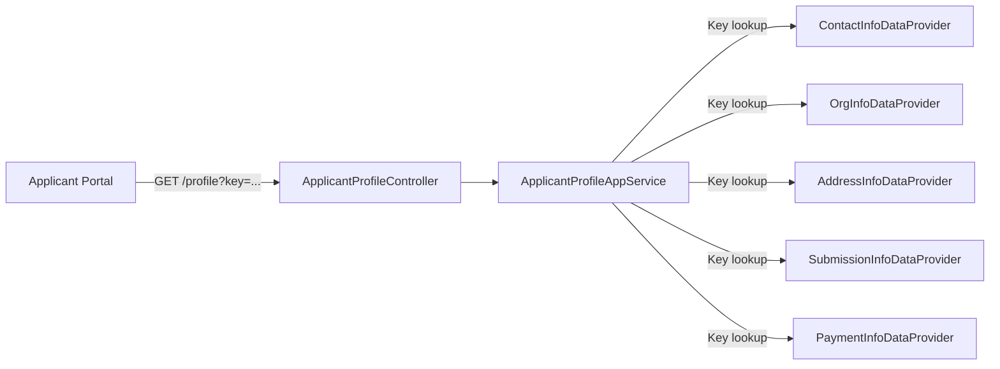

# Applicant Profile — Data Providers

## Overview

The Applicant Profile system uses a provider-based architecture to serve different categories of profile data to the Applicant Portal. Each provider implements `IApplicantProfileDataProvider` and is responsible for a single data domain (contacts, addresses, organizations, etc.).

The portal requests profile data by **key**, and the `ApplicantProfileAppService` routes the request to the matching provider.

---

## Architecture



---

## Provider Interface

```csharp
public interface IApplicantProfileDataProvider
{
    string Key { get; }
    Task<ApplicantProfileDataDto> GetDataAsync(ApplicantProfileInfoRequest request);
}
```

All providers are registered via ABP's `[ExposeServices(typeof(IApplicantProfileDataProvider))]` attribute and resolved as an `IEnumerable<IApplicantProfileDataProvider>` collection. The app service indexes them by `Key` for O(1) dispatch.

### Request Fields

| Field | Type | Description |
|-------|------|-------------|
| `ProfileId` | `Guid` | The applicant's profile identifier |
| `Subject` | `string` | OIDC subject (e.g. `testuser@idir`) — normalized by stripping the `@domain` suffix and upper-casing |
| `TenantId` | `Guid` | Tenant context for data isolation |
| `Key` | `string` | Provider discriminator (e.g. `ORGINFO`, `CONTACTINFO`) |

### Subject Normalization

All providers that query by OIDC subject use the same normalization logic:

```
testuser@idir  →  TESTUSER
TESTUSER       →  TESTUSER
```

This matches the `OidcSub` values stored on `ApplicationFormSubmission` records.

---

## Providers

### OrgInfoDataProvider

**Key**: `ORGINFO`

**Source**: `Applicant` entity, linked via `ApplicationFormSubmission.ApplicantId`.

**Query**: Joins `ApplicationFormSubmission` → `Applicant` where `OidcSub` matches the normalized subject. Returns all matching applicant records — duplicates are **not** removed, since a single user may have multiple submissions pointing to the same or different applicant records. The UI is responsible for presenting this appropriately.

**Response DTO**: `ApplicantOrgInfoDto`

```json
{
  "dataType": "ORGINFO",
  "organizations": [
    {
      "id": "3fa85f64-5717-4562-b3fc-2c963f66afa6",
      "orgName": "Acme Corp",
      "organizationType": "Non-Profit",
      "orgNumber": "BC1234567",
      "orgStatus": "Active",
      "nonRegOrgName": null,
      "fiscalMonth": "April",
      "fiscalDay": 1,
      "organizationSize": "51-100",
      "sector": "Technology",
      "subSector": "Software"
    }
  ]
}
```

**Fields** (from `Applicant` entity):

| DTO Field | Entity Field | Type | Description |
|-----------|-------------|------|-------------|
| `Id` | `Applicant.Id` | `Guid` | Applicant ID — used as `organizationId` for edit commands |
| `OrgName` | `Applicant.OrgName` | `string?` | Organization name |
| `OrganizationType` | `Applicant.OrganizationType` | `string?` | Type of organization |
| `OrgNumber` | `Applicant.OrgNumber` | `string?` | Organization registration number |
| `OrgStatus` | `Applicant.OrgStatus` | `string?` | Organization status |
| `NonRegOrgName` | `Applicant.NonRegOrgName` | `string?` | Non-registered organization name |
| `FiscalMonth` | `Applicant.FiscalMonth` | `string?` | Fiscal year start month |
| `FiscalDay` | `Applicant.FiscalDay` | `int?` | Fiscal year start day |
| `OrganizationSize` | `Applicant.OrganizationSize` | `string?` | Size category |
| `Sector` | `Applicant.Sector` | `string?` | Industry sector |
| `SubSector` | `Applicant.SubSector` | `string?` | Industry sub-sector |

**Multiple Applicants**: It is possible for a single OIDC subject to be linked to multiple distinct `Applicant` records (via different `ApplicationFormSubmission` rows). The provider returns all of them. When the same applicant is linked by multiple submissions, each join result is returned — the UI handles presentation and any eventual deduplication is a process-level concern.

**Relationship to OrganizationEditHandler**: The `ORGANIZATION_EDIT_COMMAND` handler (see [RabbitMQ integration](./grants-portal-rabbitmq-integration.md)) updates a single `Applicant` entity by its ID. The `Id` field in the org info response corresponds to the `organizationId` expected by the edit command payload.

### ContactInfoDataProvider

**Key**: `CONTACTINFO`

**Source**: Aggregates contacts from three sources via `IApplicantProfileContactService`:
1. Profile-linked contacts (by `ProfileId`)
2. Application-level contacts (by normalized subject)
3. Applicant agent contacts (by normalized subject)

### AddressInfoDataProvider

**Key**: `ADDRESSINFO`

**Source**: `ApplicantAddress` entity, linked via both `ApplicationFormSubmission.ApplicationId` and `ApplicationFormSubmission.ApplicantId`.

**Editability rules:**
- Addresses linked by `ApplicationId` are **always read-only** (owned by an application).
- Addresses linked by `ApplicantId` are **editable**, unless the ApplicantId path resolves to more than one distinct `ApplicantId` — in that case, those addresses are also marked read-only to prevent ambiguous edits.

Duplicates (same address ID appearing in both joins) are deduplicated, with the application-linked version taking priority.

### SubmissionInfoDataProvider

**Key**: `SUBMISSIONINFO`

**Source**: `ApplicationFormSubmission` joined to `Application` and `ApplicationStatus`. Resolves submission timestamps from CHEFS JSON data and derives form view URLs from the INTAKE_API_BASE setting.

### PaymentInfoDataProvider

**Key**: `PAYMENTINFO`

**Source**: Placeholder — returns an empty `ApplicantPaymentInfoDto`. Reserved for future implementation.

---

## Data Flow: Read vs. Write

| Direction | Mechanism | Example |
|-----------|-----------|---------|
| **Read** (Portal → Unity) | HTTP GET via `ApplicantProfileController` → provider | Portal requests org info by key `ORGINFO` |
| **Write** (Portal → Unity) | RabbitMQ command via [messaging pipeline](./grants-portal-rabbitmq-integration.md) | Portal sends `ORGANIZATION_EDIT_COMMAND` with applicant ID |

The `Id` returned by each provider's read response is used as the entity identifier in the corresponding write command. For organization data, the `OrgInfoItemDto.Id` maps to the `organizationId` field in `PluginDataPayload`.

---

## Adding a New Provider

1. Create a DTO class inheriting from `ApplicantProfileDataDto` in `Application.Contracts/ApplicantProfile/ProfileData/`
2. Register the DTO as a `[JsonDerivedType]` on `ApplicantProfileDataDto`
3. Add a key constant to `ApplicantProfileKeys`
4. Implement `IApplicantProfileDataProvider` in `Application/ApplicantProfile/`
5. Annotate with `[ExposeServices(typeof(IApplicantProfileDataProvider))]` and `ITransientDependency`
6. Add unit tests following the patterns in `OrgInfoDataProviderTests` or `AddressInfoDataProviderTests`
