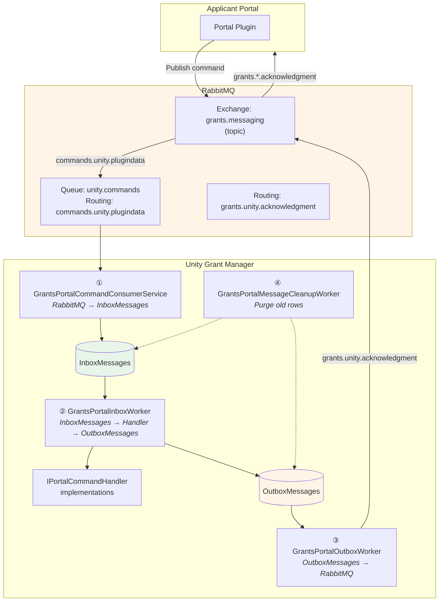
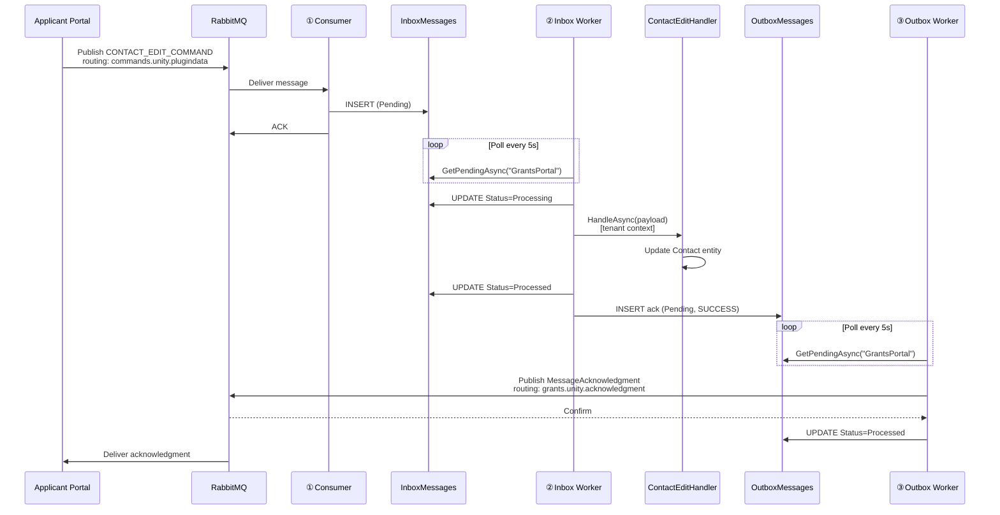

# Grants Portal — RabbitMQ Messaging Integration

## Overview

The Unity Grant Manager receives commands from the Applicant Portal (Grants Portal) via RabbitMQ and sends acknowledgment responses back. This provides reliable, decoupled communication for profile data mutations (contacts, addresses, organizations) that the portal user initiates.

The integration is built on the [Transactional Outbox Pattern](./transactional-outbox-pattern.md) with a message processing pipeline: the consumer runs as a `BackgroundService` (competing consumer on every pod), while the inbox processor, outbox publisher, and cleanup workers run as Quartz `[DisallowConcurrentExecution]` jobs coordinated via the clustered Quartz scheduler.

**Source name**: `"GrantsPortal"` (used as the discriminator in inbox/outbox tables)

---

## Architecture



---

## RabbitMQ Topology

The consumer service declares the following topology on startup:

| Element | Name | Type | Durable |
|---------|------|------|---------|
| **Exchange** | `grants.messaging` | `topic` | ✅ |
| **Queue** | `unity.commands` | — | ✅ |
| **Binding** | `unity.commands` ← `grants.messaging` | Routing key: `commands.unity.plugindata` | — |
| **Ack Routing Key** | `grants.unity.acknowledgment` | Published to same exchange | — |

The exchange and queue are declared idempotently each time the consumer connects (including reconnects).

**Prefetch**: `prefetchCount = 1` — messages are consumed one at a time per connection.

---

## Message Format

### Inbound — PluginDataEnvelope

All inbound commands use the `PluginDataEnvelope` wrapper:

```json
{
  "messageId": "550e8400-e29b-41d4-a716-446655440000",
  "messageType": "PluginData",
  "createdAt": "2026-01-15T22:42:24.115Z",
  "correlationId": "7c9e6679-7425-40de-944b-e07fc1f90ae7",
  "pluginId": "grants-portal",
  "dataType": "CONTACT_CREATE_COMMAND",
  "data": {
    "action": "CONTACT_CREATE_COMMAND",
    "contactId": "a1b2c3d4-...",
    "profileId": "3fa85f64-...",
    "subject": "testuser@idir",
    "provider": "7c9e6679-...",
    "data": { }
  }
}
```

**AMQP Properties** (set by the publisher):

| Property | Usage |
|----------|-------|
| `MessageId` | Idempotency key (falls back to `envelope.messageId`) |
| `Type` | Message type discriminator |
| `CorrelationId` | Correlation ID (falls back to `envelope.correlationId`) |

**Envelope Fields**:

| Field | Type | Description |
|-------|------|-------------|
| `messageId` | `string` | Unique message ID |
| `messageType` | `string` | Message type |
| `createdAt` | `DateTime` | When the message was created |
| `correlationId` | `string` | Groups related messages |
| `pluginId` | `string` | Source plugin identifier |
| `dataType` | `string` | **Command discriminator** — used to route to the correct handler |
| `data` | `JObject` | Nested `PluginDataPayload` with command-specific fields |

**PluginDataPayload Fields** (inside `data`):

| Field | Type | Description |
|-------|------|-------------|
| `action` | `string` | Redundant with `dataType` |
| `contactId` | `string?` | Target contact ID (for contact commands) |
| `addressId` | `string?` | Target address ID (for address commands) |
| `organizationId` | `string?` | Target organization/applicant ID |
| `profileId` | `string?` | Applicant profile ID |
| `subject` | `string?` | Raw OIDC subject identifier (e.g. `testuser@idir`). Used by `ContactCreateHandler` to match submissions — Unity normalizes by stripping the IDP suffix and uppercasing before comparison. |
| `provider` | `string?` | **Tenant ID** as a GUID string — used for tenant resolution |
| `data` | `JObject?` | Inner command-specific data payload |

### Outbound — MessageAcknowledgment

After processing, Unity publishes an acknowledgment:

```json
{
  "messageId": "new-uuid",
  "messageType": "MessageAcknowledgment",
  "createdAt": "2026-01-15T22:42:25.003Z",
  "correlationId": "7c9e6679-...",
  "pluginId": "UNITY",
  "originalMessageId": "550e8400-...",
  "status": "SUCCESS",
  "details": "Contact created successfully",
  "processedAt": "2026-01-15T22:42:25.003Z"
}
```

**AMQP Properties**:

| Property | Value |
|----------|-------|
| `Type` | `"MessageAcknowledgment"` |
| `ContentType` | `"application/json"` |
| `Persistent` | `true` |
| `MessageId` | New UUID for the ack |
| `CorrelationId` | Passthrough from original |

**Ack Loop Prevention**: The consumer discards any received messages where `Type == "MessageAcknowledgment"` to prevent infinite loops when the same exchange is used for both directions.

---

## Pipeline Services

### ① GrantsPortalCommandConsumerService

**Role**: Pulls messages from RabbitMQ, saves to inbox, ACKs.

**Startup**:
- Connects to RabbitMQ with exponential backoff retry (5 attempts, starting at 5s)
- Declares exchange + queue + bindings
- Starts async consumer with `autoAck: false`

**On message received**:
1. Extract `MessageId`, `Type`, `CorrelationId` from AMQP properties (with envelope fallbacks)
2. Discard if `Type == "MessageAcknowledgment"`
3. Deserialize JSON body to `PluginDataEnvelope`
4. Resolve `TenantId` from `data.provider` field (GUID parse)
5. **Idempotency check**: `FindByMessageIdAsync(messageId)` — skip if already exists
6. Insert `InboxMessage` with `Status = Pending`
7. **ACK** the delivery tag (only after commit)

**Connection recovery**: On `ConnectionShutdown`, waits 5s then re-runs `ConnectAndConsumeAsync`. A `SemaphoreSlim` guard prevents parallel reconnect attempts within the same process when RabbitMQ fires multiple shutdown events in rapid succession (e.g., network flap).

**Multi-pod idempotency**: The `InboxMessages.MessageId` column has a **unique index**. The consumer first checks `FindByMessageIdAsync` (fast path), but if two pods race on a redelivered message, the unique constraint prevents duplicate inserts. The consumer catches the PostgreSQL `23505` (unique violation) and treats it as idempotent success — ACKs without requeueing.

### ② GrantsPortalInboxWorker

**Role**: Polls inbox, dispatches to handlers, writes ack to outbox.

**Schedule**: Quartz cron (default: `0/5 * * * * ?` — every 5 seconds). Configurable via `InboxProcessorCron`.

**Concurrency**: `[DisallowConcurrentExecution]` — only one instance runs at a time.

**Per message**:
1. Mark `Status = Processing`, increment `RetryCount`
2. Deserialize `Payload` → `PluginDataEnvelope` → `PluginDataPayload`
3. Find matching `IPortalCommandHandler` by `DataType` (case-insensitive)
4. If no handler: `ackStatus = "FAILED"`, `details = "Unknown command type: ..."`
5. If handler found:
   - **Switch to tenant context** (`ICurrentTenant.Change(inboxMsg.TenantId)`)
   - Execute handler inside a new Unit of Work
   - `ackStatus = "SUCCESS"`, `details` = handler return string
6. On exception:
   - If **transient** and under max retries (3): reset to `Pending` for retry
   - Otherwise: `ackStatus = "FAILED"`, `details` = user-friendly error message
7. Mark inbox as `Processed` or `Failed` and write `OutboxMessage` — **same transaction**

**Tenant context**: Only the handler execution runs under the tenant context. Inbox/outbox operations run against the host database without tenant scoping.

### ③ GrantsPortalOutboxWorker

**Role**: Polls outbox, publishes acks to RabbitMQ with publisher confirms.

**Schedule**: Quartz cron (default: `0/5 * * * * ?` — every 5 seconds). Configurable via `OutboxProcessorCron`.

**Concurrency**: `[DisallowConcurrentExecution]` — only one instance runs at a time.

**Per message**:
1. Ensure RabbitMQ channel is open (with `ConfirmSelect` enabled)
2. Publish via `GrantsPortalAcknowledgmentPublisher` to `grants.messaging` exchange with routing key `grants.unity.acknowledgment`
3. Wait for broker confirm (`WaitForConfirms` with 5s timeout)
4. On confirm: mark `Status = Processed`, set `PublishedAt`
5. On failure: increment `RetryCount`; after 3 attempts mark as `Failed`

### ④ GrantsPortalMessageCleanupWorker

**Role**: Purges old processed/failed messages from both tables.

- **Schedule**: Quartz cron (default: `0 0 0/1 * * ?` — every hour). Configurable via `MessageCleanupCron`.
- **Retention**: Configurable via `MessageRetentionDays` (default: 30)
- **Scope**: Deletes rows where `Status ∈ {Processed, Failed}` and `ReceivedAt`/`CreatedAt` < cutoff
- **Concurrency**: `[DisallowConcurrentExecution]`

---

## Command Handlers

All handlers implement `IPortalCommandHandler` and are registered as transient services:

```csharp
public interface IPortalCommandHandler
{
    string DataType { get; }
    Task<string> HandleAsync(PluginDataPayload payload);
}
```

The return string becomes the `Details` field in the outbound acknowledgment.

### Implemented Commands

| DataType | Handler | Entity | Description |
|----------|---------|--------|-------------|
| `CONTACT_CREATE_COMMAND` | `ContactCreateHandler` | `Contact` + `ContactLink` | Creates a new contact and links it to the profile. Enriches the contact with applicant agent IDs from matching submissions. Idempotent — skips if contact already exists. |
| `CONTACT_EDIT_COMMAND` | `ContactEditHandler` | `Contact` | Updates an existing contact's fields. |
| `CONTACT_SET_PRIMARY_COMMAND` | `ContactSetPrimaryHandler` | `ContactLink` | Sets one contact as primary for a profile; clears primary on all other links. |
| `CONTACT_DELETE_COMMAND` | `ContactDeleteHandler` | `ContactLink` + `Contact` | Deletes contact links then the contact entity. |
| `ADDRESS_EDIT_COMMAND` | `AddressEditHandler` | `ApplicantAddress` | Updates address fields (street, city, province, etc.) and address type. |
| `ADDRESS_SET_PRIMARY_COMMAND` | `AddressSetPrimaryHandler` | `ApplicantAddress` | Sets `isPrimary` extra property on the target address; clears it on sibling addresses that had it set. |
| `ORGANIZATION_EDIT_COMMAND` | `OrganizationEditHandler` | `Applicant` | Updates organization fields on the applicant entity. The `organizationId` corresponds to `Applicant.Id` returned by [OrgInfoDataProvider](./applicant-profile-data-providers.md#orginfordataprovider). |

### Command Data Payloads

Each command that requires inner data deserializes `payload.Data` to a typed class in `GrantsPortal/Messages/Commands/`:

**ContactCreateData / ContactEditData**:
```json
{
  "name": "John Doe",
  "email": "john@example.com",
  "title": "Director",
  "contactType": "ApplicantProfile",
  "homePhoneNumber": "(555) 111-1111",
  "mobilePhoneNumber": "(555) 222-2222",
  "workPhoneNumber": "(555) 333-3333",
  "workPhoneExtension": "123",
  "role": "Primary Contact",
  "isPrimary": true
}
```

### Applicant Agent ID Enrichment

When a contact is created via `CONTACT_CREATE_COMMAND`, the handler enriches the `Contact` entity with applicant agent IDs linked to the subject's submissions. This allows downstream systems to associate portal contacts with existing application agents.

**How it works**:

1. The handler reads the raw OIDC subject from `payload.Subject` (e.g. `testuser@idir`).
2. It normalizes the subject to match the format stored in `ApplicationFormSubmission.OidcSub`:
   - Strips the IDP suffix (everything after and including `@`)
   - Converts to uppercase
   - Example: `testuser@idir` → `TESTUSER`
3. It queries `ApplicationFormSubmission` records where `OidcSub` matches the normalized value.
4. From those submissions, it collects distinct `ApplicationId` values.
5. It queries `ApplicantAgent` records linked to those applications.
6. The distinct agent IDs are stored on the contact's `ExtraProperties` as `applicantAgentIds`.

> **Note**: The normalization follows the same convention as `IntakeSubmissionHelper.ExtractOidcSub`, which is used when CHEFS submissions are ingested.

**Resulting ExtraProperties** (on the `Contact` entity):
```json
{
  "applicantAgentIds": ["agent-guid-1", "agent-guid-2"]
}
```

If `subject` is null/empty, or no matching submissions or agents are found, the `applicantAgentIds` property is not set. This is a best-effort enrichment and does not fail the contact creation.

**AddressEditData**:
```json
{
  "addressType": "PHYSICAL",
  "street": "123 Main St",
  "street2": "Suite 100",
  "unit": "4B",
  "city": "Victoria",
  "province": "BC",
  "postalCode": "V8V 1A1",
  "country": "Canada",
  "isPrimary": false
}
```

**OrganizationEditData**:
```json
{
  "name": "Acme Corp",
  "organizationType": "Non-Profit",
  "organizationNumber": "BC1234567",
  "status": "Active",
  "nonRegOrgName": null,
  "fiscalMonth": "April",
  "fiscalDay": "1",
  "organizationSize": "51-100"
}
```

---

## Tenant Resolution

The consumer extracts the tenant ID from `data.provider` in the message payload:

```csharp
private static Guid? ResolveTenantId(string? provider)
{
    if (string.IsNullOrWhiteSpace(provider)) return null;
    if (Guid.TryParse(provider, out var tenantGuid)) return tenantGuid;
    return null;
}
```

The tenant ID is stored on the `InboxMessage.TenantId` field. The inbox processor uses `ICurrentTenant.Change(tenantId)` only when executing the domain handler — inbox/outbox table operations always run against the host database.

---

## Configuration

### appsettings.json

```json
{
  "RabbitMQ": {
    "HostName": "127.0.0.1",
    "Port": 5672,
    "UserName": "guest",
    "VirtualHost": "/",
    "GrantsPortal": {
      "Exchange": "grants.messaging",
      "ExchangeType": "topic",
      "InboundQueue": "unity.commands",
      "InboundRoutingKeys": [ "commands.unity.plugindata" ],
      "AckRoutingKey": "grants.unity.acknowledgment",
      "MessageRetentionDays": 30,
      "InboxProcessorCron": "0/5 * * * * ?",
      "OutboxProcessorCron": "0/5 * * * * ?",
      "MessageCleanupCron": "0 0 0/1 * * ?"
    }
  }
}
```

### GrantsPortalRabbitMqOptions

```
Unity.GrantManager.Application/GrantsPortal/Configuration/GrantsPortalRabbitMqOptions.cs
```

| Property | Default | Description |
|----------|---------|-------------|
| `Exchange` | `"grants.messaging"` | Topic exchange name |
| `ExchangeType` | `"topic"` | Exchange type |
| `InboundQueue` | `"unity.commands"` | Queue to consume from |
| `InboundRoutingKeys` | `["commands.unity.plugindata"]` | Routing keys to bind |
| `AckRoutingKey` | `"grants.unity.acknowledgment"` | Routing key for outbound acks |
| `MessageRetentionDays` | `30` | Days to retain processed/failed messages |
| `InboxProcessorCron` | `"0/5 * * * * ?"` | Quartz cron for inbox polling (every 5s) |
| `OutboxProcessorCron` | `"0/5 * * * * ?"` | Quartz cron for outbox publishing (every 5s) |
| `MessageCleanupCron` | `"0 0 0/1 * * ?"` | Quartz cron for message cleanup (every hour) |

**Section path**: `RabbitMQ:GrantsPortal`

---

## Service Registration

All services are registered in `GrantManagerApplicationModule.ConfigureServices`:

```csharp
// Options
context.Services.Configure<GrantsPortalRabbitMqOptions>(
    configuration.GetSection(GrantsPortalRabbitMqOptions.SectionName));

// Command handlers
context.Services.AddTransient<IPortalCommandHandler, ContactCreateHandler>();
context.Services.AddTransient<IPortalCommandHandler, ContactEditHandler>();
context.Services.AddTransient<IPortalCommandHandler, ContactSetPrimaryHandler>();
context.Services.AddTransient<IPortalCommandHandler, ContactDeleteHandler>();
context.Services.AddTransient<IPortalCommandHandler, AddressEditHandler>();
context.Services.AddTransient<IPortalCommandHandler, AddressSetPrimaryHandler>();
context.Services.AddTransient<IPortalCommandHandler, OrganizationEditHandler>();

// Acknowledgment publisher
context.Services.AddScoped<GrantsPortalAcknowledgmentPublisher>();

// Pipeline services
context.Services.AddHostedService<GrantsPortalCommandConsumerService>();   // ① RabbitMQ → inbox
// ② GrantsPortalInboxWorker          — Quartz (auto-registered) — inbox → handler → outbox
// ③ GrantsPortalOutboxWorker          — Quartz (auto-registered) — outbox → RabbitMQ
// ④ GrantsPortalMessageCleanupWorker  — Quartz (auto-registered) — purge old rows
```

> **Note**: Workers ②③④ extend `QuartzBackgroundWorkerBase` with `[DisallowConcurrentExecution]` and are auto-registered by ABP when `BackgroundJobs:Quartz:IsAutoRegisterEnabled` is `true`.

---

## End-to-End Example

A portal user edits a contact:



---

## Monitoring

### Key Queries

**Pending messages (stuck?)**:
```sql
SELECT "Source", "DataType", "Status", COUNT(*), MIN("ReceivedAt")
FROM "InboxMessages"
WHERE "Status" IN ('Pending', 'Processing')
GROUP BY "Source", "DataType", "Status";
```

**Failed messages**:
```sql
SELECT "MessageId", "DataType", "Details", "RetryCount", "ReceivedAt"
FROM "InboxMessages"
WHERE "Status" = 'Failed' AND "Source" = 'GrantsPortal'
ORDER BY "ReceivedAt" DESC
LIMIT 20;
```

**Outbox backlog**:
```sql
SELECT COUNT(*), MIN("CreatedAt")
FROM "OutboxMessages"
WHERE "Status" = 'Pending' AND "Source" = 'GrantsPortal';
```

### Log Markers

| Log Message | Service | Meaning |
|-------------|---------|---------|
| `"Grants Portal command consumer starting..."` | Consumer | Service starting |
| `"Message {id} saved to inbox for processing"` | Consumer | Message received and saved |
| `"Message {id} already in inbox"` | Consumer | Duplicate detected |
| `"Processing inbox message {id}"` | Processor | Handler dispatch starting |
| `"Inbox message {id} processed with status {status}"` | Processor | Handler completed |
| `"Message {id} will be retried"` | Processor | Transient error, will retry |
| `"Outbox message {id} published"` | Publisher | Ack sent to broker |
| `"Cleaned up {n} messages older than ..."` | Cleanup | Old rows purged |

---

## Troubleshooting

### Messages stuck in Pending (Inbox)

**Cause**: Inbox processor may have crashed or is not running.

**Check**:
```sql
SELECT * FROM "InboxMessages"
WHERE "Status" = 'Pending' AND "ReceivedAt" < NOW() - INTERVAL '5 minutes';
```

**Resolution**: Verify `GrantsPortalInboxWorker` is running in application logs. Restart the application if needed.

### Messages stuck in Pending (Outbox)

**Cause**: Outbox processor can't connect to RabbitMQ or broker is not confirming.

**Check**: Look for `"Error in outbox processor loop"` in logs. Verify RabbitMQ is reachable.

### Unknown command type

**Cause**: Portal sent a `dataType` that has no registered `IPortalCommandHandler`.

**Resolution**: Register the new handler in `GrantManagerApplicationModule`. The failed message will have `Details = "Unknown command type: ..."`.

### Consumer not connecting

**Cause**: RabbitMQ unreachable or credentials wrong.

**Check**: Consumer retries 5 times with exponential backoff. After 5 failures it throws and the hosted service stops. Look for `"Failed to connect to RabbitMQ after 5 attempts"` in logs.
