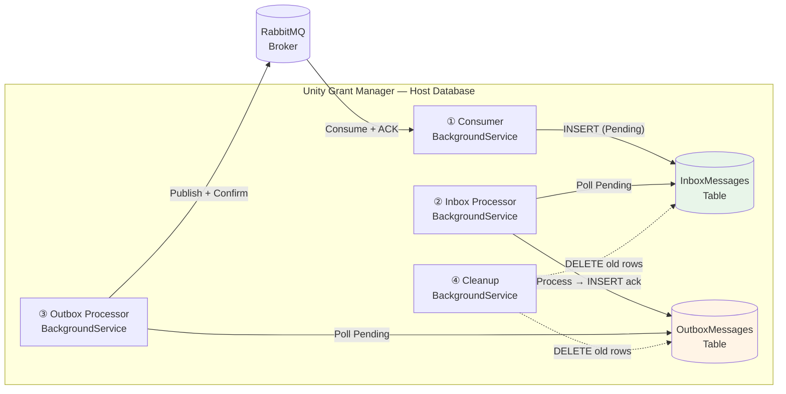
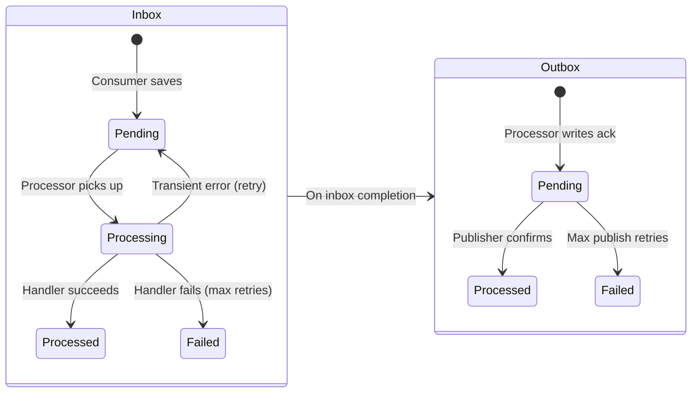

# Transactional Outbox Pattern

## Overview

Unity Grant Manager uses the **Transactional Inbox/Outbox** pattern for reliable asynchronous messaging with external systems. The pattern ensures that message receipt, processing, and response publishing are each atomic operations — even if the broker or application crashes mid-flow.

The implementation is **integration-source agnostic**. The same `InboxMessage` and `OutboxMessage` tables, entities, and repositories are shared by all integrations. Each integration is identified by a `Source` discriminator (e.g. `"GrantsPortal"`).

---

## Why This Pattern

Direct RabbitMQ consumption with inline processing has several failure modes:

| Problem | Without Outbox | With Outbox |
|---------|---------------|-------------|
| App crashes after processing but before ACK | Message redelivered, duplicate side-effects | Message already saved to inbox; ACK happened at save time |
| Broker unavailable when sending response | Response lost | Response saved to outbox table; publisher retries independently |
| Database commit fails after ACK | ACK'd but no state change | ACK only happens after inbox save commits |
| Need to audit message history | Logs only | Full database trail with status, timestamps, retry counts |

---

## Architecture

The pattern separates the messaging pipeline into four independent stages, each run by a dedicated `BackgroundService`:



### Stage Responsibilities

| # | Stage | Scope | Transaction Boundary |
|---|-------|-------|---------------------|
| ① | **Consumer** | Receive from broker → save to inbox → ACK | Inbox INSERT committed before ACK sent |
| ② | **Inbox Processor** | Poll inbox → dispatch to handler → write ack to outbox | Handler execution + outbox INSERT in one UoW |
| ③ | **Outbox Processor** | Poll outbox → publish to broker → mark as sent | Publish with broker confirms before UPDATE |
| ④ | **Cleanup** | Delete old Processed/Failed rows | Periodic bulk delete |

---

## Domain Entities

Both entities live in `Unity.GrantManager.Domain/Messaging/` and are stored in the **host database** (`GrantManagerDbContext`), not in tenant databases. They inherit from ABP's `AuditedAggregateRoot<Guid>`.

### InboxMessage

Represents a message received from an external system, staged for sequential processing.

```
Unity.GrantManager.Domain/Messaging/InboxMessage.cs
```

| Property | Type | Description |
|----------|------|-------------|
| `Source` | `string` | Integration discriminator (e.g. `"GrantsPortal"`) |
| `MessageId` | `string` | Source system's message ID — used for **idempotency** |
| `CorrelationId` | `string` | Correlation ID passed through from the source |
| `DataType` | `string` | Command discriminator (e.g. `CONTACT_CREATE_COMMAND`) |
| `Payload` | `string` | Full JSON payload of the inbound message |
| `Status` | `MessageStatus` | `Pending` → `Processing` → `Processed` / `Failed` |
| `Details` | `string?` | Processing result or user-friendly error message |
| `RetryCount` | `int` | Number of processing attempts |
| `ReceivedAt` | `DateTime` | When the message arrived from the broker |
| `ProcessedAt` | `DateTime?` | When processing completed |
| `TenantId` | `Guid?` | Tenant context for handler dispatch (metadata, not data isolation) |

### OutboxMessage

Represents a response/acknowledgment to be published back to an external system.

```
Unity.GrantManager.Domain/Messaging/OutboxMessage.cs
```

| Property | Type | Description |
|----------|------|-------------|
| `Source` | `string` | Integration discriminator |
| `MessageId` | `string` | Unique ID for this outbound message |
| `OriginalMessageId` | `string` | The inbound message ID this responds to |
| `CorrelationId` | `string` | Correlation ID from the original message |
| `DataType` | `string` | Command type of the original message |
| `AckStatus` | `string` | `SUCCESS` or `FAILED` |
| `Details` | `string` | Human-readable result or error (safe for end-user display) |
| `Status` | `MessageStatus` | `Pending` → `Processed` / `Failed` |
| `RetryCount` | `int` | Number of publish attempts |
| `CreatedAt` | `DateTime` | When the outbox entry was created |
| `PublishedAt` | `DateTime?` | When the message was confirmed by the broker |
| `TenantId` | `Guid?` | Tenant context metadata |

### MessageStatus Enum

```csharp
public enum MessageStatus
{
    Pending = 1,
    Processing = 2,
    Processed = 3,
    Failed = 4
}
```

---

## Database Tables

Both tables are in the **host database** and were added in migration `20260307013604_Add_InboxOutboxMessages`.

### InboxMessages

```sql
CREATE TABLE "InboxMessages" (
    "Id"                   UUID PRIMARY KEY,
    "Source"               VARCHAR(50)   NOT NULL,
    "MessageId"            VARCHAR(64)   NOT NULL,
    "CorrelationId"        VARCHAR(128)  NOT NULL,
    "DataType"             VARCHAR(100)  NOT NULL,
    "Payload"              JSONB         NOT NULL,
    "Status"               TEXT          NOT NULL,
    "Details"              VARCHAR(2000),
    "RetryCount"           INTEGER       NOT NULL DEFAULT 0,
    "ReceivedAt"           TIMESTAMP     NOT NULL,
    "ProcessedAt"          TIMESTAMP,
    "TenantId"             UUID,
    -- ABP audit columns
    "ExtraProperties"      TEXT          NOT NULL,
    "ConcurrencyStamp"     VARCHAR(40)   NOT NULL,
    "CreationTime"         TIMESTAMP     NOT NULL,
    "CreatorId"            UUID,
    "LastModificationTime" TIMESTAMP,
    "LastModifierId"       UUID
);

CREATE UNIQUE INDEX "IX_InboxMessages_Source_MessageId"
    ON "InboxMessages" ("Source", "MessageId");

CREATE INDEX "IX_InboxMessages_Status_ReceivedAt"
    ON "InboxMessages" ("Status", "ReceivedAt");
```

### OutboxMessages

```sql
CREATE TABLE "OutboxMessages" (
    "Id"                   UUID PRIMARY KEY,
    "Source"               VARCHAR(50)   NOT NULL,
    "MessageId"            VARCHAR(64)   NOT NULL,
    "OriginalMessageId"    VARCHAR(64)   NOT NULL,
    "CorrelationId"        VARCHAR(128)  NOT NULL,
    "DataType"             VARCHAR(100)  NOT NULL,
    "AckStatus"            VARCHAR(20)   NOT NULL,
    "Details"              VARCHAR(2000) NOT NULL,
    "Status"               TEXT          NOT NULL,
    "RetryCount"           INTEGER       NOT NULL DEFAULT 0,
    "CreatedAt"            TIMESTAMP     NOT NULL,
    "PublishedAt"          TIMESTAMP,
    "TenantId"             UUID,
    -- ABP audit columns
    "ExtraProperties"      TEXT          NOT NULL,
    "ConcurrencyStamp"     VARCHAR(40)   NOT NULL,
    "CreationTime"         TIMESTAMP     NOT NULL,
    "CreatorId"            UUID,
    "LastModificationTime" TIMESTAMP,
    "LastModifierId"       UUID
);

CREATE INDEX "IX_OutboxMessages_Status_CreatedAt"
    ON "OutboxMessages" ("Status", "CreatedAt");
```

---

## Repository Interfaces

Both repositories extend ABP's `IRepository<TEntity, Guid>` and add integration-specific queries.

```
Unity.GrantManager.Domain/Messaging/IInboxMessageRepository.cs
Unity.GrantManager.Domain/Messaging/IOutboxMessageRepository.cs
```

### IInboxMessageRepository

| Method | Description |
|--------|-------------|
| `FindByMessageIdAsync(string messageId)` | Idempotency check — find by source message ID |
| `GetPendingAsync(string source, int maxCount)` | Poll for messages with `Status == Pending`, ordered by `ReceivedAt` |
| `DeleteProcessedOlderThanAsync(DateTime cutoff)` | Bulk delete `Processed` or `Failed` rows older than cutoff |

### IOutboxMessageRepository

| Method | Description |
|--------|-------------|
| `GetPendingAsync(string source, int maxCount)` | Poll for messages with `Status == Pending`, ordered by `CreatedAt` |
| `DeleteProcessedOlderThanAsync(DateTime cutoff)` | Bulk delete `Processed` or `Failed` rows older than cutoff |

EF Core implementations are in `Unity.GrantManager.EntityFrameworkCore/Repositories/` and use `GrantManagerDbContext` (host DB).

---

## Message Lifecycle



### Detailed Flow

1. **Consumer receives** a message from the broker.
2. Consumer saves it to `InboxMessages` with `Status = Pending` inside a Unit of Work.
3. After the UoW commits, the consumer **ACKs** the broker delivery. If the save fails, the message is **rejected/requeued**.
4. **Inbox Processor** polls `InboxMessages` for `Pending` rows (filtered by `Source`).
5. For each message, the processor:
   - Sets `Status = Processing` and increments `RetryCount`
   - Deserializes the payload and dispatches to the appropriate handler
   - On **success**: sets `Status = Processed` and writes an `OutboxMessage` with `AckStatus = "SUCCESS"` — both in the **same Unit of Work**
   - On **transient failure** (under max retries): resets `Status = Pending` for retry
   - On **permanent failure** (or max retries exceeded): sets `Status = Failed` and writes an `OutboxMessage` with `AckStatus = "FAILED"`
6. **Outbox Processor** polls `OutboxMessages` for `Pending` rows.
7. For each message, the processor:
   - Publishes to the broker using **publisher confirms**
   - After broker confirmation: sets `Status = Processed` and records `PublishedAt`
   - On failure (under max retries): increments `RetryCount`
   - On max retries exceeded: sets `Status = Failed`
8. **Cleanup Service** periodically deletes `Processed` and `Failed` rows older than the retention period.

---

## Idempotency

The consumer performs an idempotency check before saving to the inbox:

```
FindByMessageIdAsync(messageId) → if exists, ACK and skip
```

This prevents duplicate inbox rows if the broker redelivers a message (e.g. after a network hiccup before the ACK reached the broker).

---

## Error Handling

### User-Friendly Error Messages

The inbox processor maps known exception types to user-friendly messages that are safe to return to the external system:

| Exception Type | User-Facing Message |
|---------------|-------------------|
| `EntityNotFoundException` | The requested record was not found. It may have been deleted. |
| `DbUpdateConcurrencyException` | The record was modified by another process. Please try again. |
| `AbpDbConcurrencyException` | The record was modified by another process. Please try again. |
| _(any other)_ | An unexpected error occurred while processing your request. Please try again or contact support. |

Stack traces and internal details are **never** leaked to the external system.

### Transient Error Detection

Errors are considered transient (eligible for retry) if the exception type name contains `Timeout`, `Concurrency`, or `Transient`, or if the inner exception is a `TimeoutException`.

---

## Cleanup / Retention

A dedicated `BackgroundService` runs hourly and deletes `Processed` and `Failed` messages older than the configured retention period. The default retention is **30 days**.

Both inbox and outbox tables are cleaned in the same pass.

---

## Adding a New Integration Source

To add a new external system using this pattern:

1. **Choose a source name** (e.g. `"NewSystem"`) — this discriminates your messages in the shared tables.
2. **Create a Consumer** (`BackgroundService`) that receives from your broker/transport, saves to `InboxMessages` with your source name, and ACKs.
3. **Create command handlers** implementing your handler interface, registered in DI.
4. **Create an Inbox Processor** (`BackgroundService`) that polls `GetPendingAsync(yourSource)`, dispatches to handlers, and writes acknowledgments to `OutboxMessages`.
5. **Create an Outbox Processor** (`BackgroundService`) that polls outbox for your source and publishes responses back.
6. **Create a Cleanup Service** (or reuse the existing one if the retention policy matches).
7. **Register** all services in your application module's `ConfigureServices`.

The entities, tables, and repositories are already shared — no schema changes needed.
