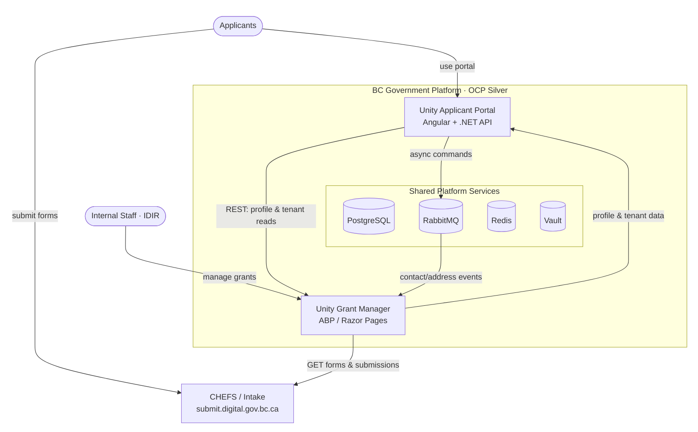

# Unity Platform – External Dependency Chart
_Generated: 2026-06-25_

---

## Architecture Overview



---

## Dependency Matrix

### Unity Grant Manager (UGM) — External Calls

| # | Service | Friendly Name | Config Key | Production URL | Protocol | Operations | Module |
|---|---------|---------------|------------|----------------|----------|------------|--------|
| 1 | **Keycloak / LoginProxy** | Authentication (SSO) | `AuthServer__ServerAddress` | `https://loginproxy.gov.bc.ca/auth` | OIDC | User login, token validation, session | Core / Identity.Web |
| 2 | **CSS API** | Common Single Sign-On (IDIR Lookup) | `CSS_API_BASE` | `https://api.loginproxy.gov.bc.ca/api/v1` | REST | GET users by IDIR, search directory | Application / CssApiService |
| 3 | **CSS Token** | CSS OAuth Token | `CSS_TOKEN_API_BASE` | `https://loginproxy.gov.bc.ca/auth/realms/standard/protocol/openid-connect/token` | OAuth2 client_credentials | POST token for CSS API auth | Application / CssApiService |
| 4 | **CHES** | Notification Email Service | `NOTIFICATION_API_BASE` | `https://ches.api.gov.bc.ca/api/v1` | REST | POST /email, GET /status, DELETE /cancel | Unity.Notifications / ChesClientService |
| 5 | **CHES Auth** | CHES OAuth Token | `NOTIFICATION_AUTH` | `https://loginproxy.gov.bc.ca/auth/realms/comsvcauth/protocol/openid-connect/token` | OAuth2 client_credentials | POST token for CHES API auth | Unity.Notifications / ChesClientService |
| 6 | **MS Teams Webhooks** | Direct Messages (Teams) | `DIRECT_MESSAGE_0`, `DIRECT_MESSAGE_1`, … | `https://bcgov.webhook.office.com/webhookb2/…` | HTTPS POST | POST adaptive card / message payloads | Unity.Notifications / TeamsNotificationService |
| 7 | **CAS / CFS** | Payment System (Payments) | `PAYMENT_API_BASE` | `https://cfs-prodws.cas.gov.bc.ca:7121/ords/cas` | REST/OAuth | POST /oauth/token, GET supplier, POST invoice | Unity.Payments / CasTokenService, SupplierService, InvoiceService |
| 8 | **BC Geocoder** | Address Lookup | `GEOCODER_LOCATION_API_BASE` | `https://geocoder.api.gov.bc.ca` | REST | GET address search, district/region lookups | Application / GeocoderApiService |
| 9 | **OpenMaps / WFS** | Geospatial Features | `GEOCODER_API_BASE` | `https://openmaps.gov.bc.ca/geo/pub/ows?service=WFS&version=1.0.0&request=GetFeature&typeName=` | WFS/OGC | GET geographic boundary features | Application / GeocoderApiService |
| 10 | **OrgBook** | Business Registry Lookup | `ORGBOOK_API_BASE` | `https://orgbook.gov.bc.ca/api` | REST | GET search/autocomplete, GET topic/credential details | Application / OrgBookService |
| 11 | **CHEFS / Intake** | Form Submissions (CHEFS) | `INTAKE_API_BASE` | `https://submit.digital.gov.bc.ca/app/api/v1` | REST | GET forms, GET versions, GET submissions | Application / FormsApiService, SubmissionAppService |
| 12 | **Azure OpenAI** | AI Analysis & Scoring | `OpenAI:Endpoint` + `OpenAI:ApiKey` (Vault) | Azure-hosted endpoint (configured per env) | HTTPS / Azure SDK | Chat completions for AttachmentSummary, ApplicationAnalysis, ApplicationScoring | Unity.AI / OpenAITransportService |
| 13 | **Reporting AI Dashboard** | AI Reporting (Metabase-based) | `REPORTING_AI` | `https://prod-unity-ai-reporting-d18498-prod.apps.silver.devops.gov.bc.ca` | iFrame embed only (no backend HTTP call) | Embedded analytics dashboard | Unity.AI / AIReporting page |
| 14 | **Matomo Analytics** | Web Analytics | `ANALYTICS_MATOMO_BASE` | `https://prod-analytics-matomo.apps.silver.devops.gov.bc.ca` | Browser JS tag | Page views, user events | Web (frontend JS) |
| 15 | **HashiCorp Vault** | Secrets Management | (platform) | `https://vault.developer.gov.bc.ca` | Vault API / ExternalSecrets operator | API keys, DB credentials, OAuth secrets | Platform |

---

### Unity Applicant Portal (UAP) — External Calls

| # | Service | Friendly Name | Config Key | Production URL | Protocol | Operations | Layer |
|---|---------|---------------|------------|----------------|----------|------------|-------|
| 1 | **Keycloak / LoginProxy** | Authentication (SSO) | `KEYCLOAK__AUTHSERVERURL` / `KEYCLOAK__REALM` | `https://loginproxy.gov.bc.ca/auth` | OIDC | POST token exchange (code → token), GET /userinfo | Backend / AuthCallback |
| 2 | **OrgBook** | Business Registry Lookup | `orgbookApiUrl` | `https://orgbook.gov.bc.ca/api` | REST | GET /v3/search/autocomplete, GET /v4/search/topic | Frontend / organization.component.ts |
| 3 | **Matomo Analytics** | Web Analytics | `MATOMO__URL` / `MATOMO__SITEID` | `https://prod-analytics-matomo.apps.silver.devops.gov.bc.ca/` | Browser JS tag | Page views, user events | Frontend |
| 4 | **Unity Grant Manager API** | Internal Portal→UGM calls | `Plugins:UNITY:Configuration:BaseUrl` | `http://{env}-unity-grantmanager-web` (in-cluster) | REST (HTTP, in-cluster) | GET /api/app/applicant-profiles/tenants, GET /api/app/applicant-profiles/profile | Backend / UnityPlugin, Unity.Profile |

---

### UAP → UGM Internal Communication (Async)

| Mechanism | Direction | Operations |
|-----------|-----------|------------|
| **RabbitMQ messages** (MassTransit) | UAP → UGM | Create/Edit/Delete Contacts, Addresses, set-primary; applicant workspace events |
| **REST HTTP** (in-cluster) | UAP → UGM | GET applicant profile, GET tenant list (synchronous reads via plugin) |

---

## Service Dependency Graph

```
Unity Grant Manager (UGM)
│
├── AUTH ──────────────────► Keycloak / LoginProxy
│                            (OIDC login + CSS token + CHES token)
│
├── CSS ───────────────────► api.loginproxy.gov.bc.ca    [IDIR user search]
│
├── NOTIFICATIONS ─────────► ches.api.gov.bc.ca          [Email via CHES]
│                └─────────► bcgov.webhook.office.com     [Teams direct messages]
│
├── PAYMENTS ──────────────► cfs-prodws.cas.gov.bc.ca     [CFS/CAS invoices & suppliers]
│
├── GEOCODER ──────────────► geocoder.api.gov.bc.ca       [Address lookup]
│                └─────────► openmaps.gov.bc.ca            [WFS geospatial features]
│
├── ORGBOOK ───────────────► orgbook.gov.bc.ca             [Business registry]
│
├── INTAKE ────────────────► submit.digital.gov.bc.ca      [CHEFS form submissions]
│
├── AI (operational) ──────► Azure OpenAI endpoint         [Chat completions: analysis, scoring, summaries]
│
├── AI (reporting) ────────► unity-ai-reporting (OCP)      [iFrame embed only — no backend HTTP]
│
├── ANALYTICS ─────────────► analytics-matomo (OCP)        [Browser-side page tracking]
│
└── SECRETS ───────────────► vault.developer.gov.bc.ca     [All credentials via ExternalSecrets operator]


Unity Applicant Portal (UAP)
│
├── AUTH ──────────────────► Keycloak / LoginProxy         [OIDC token exchange + userinfo]
│
├── ORGBOOK ───────────────► orgbook.gov.bc.ca             [Business registry — frontend direct]
│
├── ANALYTICS ─────────────► analytics-matomo (OCP)        [Browser-side page tracking]
│
├── UGM (sync HTTP) ───────► Unity Grant Manager API        [Profile & tenant reads — in-cluster]
│
└── UGM (async) ──────────► RabbitMQ ──► Unity Grant Manager [Contact/Address/Workspace mutations]
```

---

## Environment URL Variants

| Service | Dev | Test/UAT | Production |
|---------|-----|----------|------------|
| Keycloak | `dev.loginproxy.gov.bc.ca/auth` | `test.loginproxy.gov.bc.ca/auth` | `loginproxy.gov.bc.ca/auth` |
| Matomo | `dev-analytics-matomo.apps.silver.devops.gov.bc.ca` | `test-analytics-matomo.apps.silver.devops.gov.bc.ca` | `prod-analytics-matomo.apps.silver.devops.gov.bc.ca` |
| UGM ingress | `dev-unity.apps.silver.devops.gov.bc.ca` | `test-unity.apps.silver.devops.gov.bc.ca` | `prod-unity.apps.silver.devops.gov.bc.ca` |
| CHEFS (dev) | `chefs-test.apps.silver.devops.gov.bc.ca/app/api/v1` | — | `submit.digital.gov.bc.ca/app/api/v1` |
| CSS Env | `dev` | — | `prod` |
| Azure OpenAI | Per-env endpoint (Vault) | Per-env endpoint (Vault) | Per-env endpoint (Vault) |

---

## Config Key → URL Reference

| Config Key | URL | Consumer |
|------------|-----|----------|
| `CSS_API_BASE` | `https://api.loginproxy.gov.bc.ca/api/v1` | UGM |
| `CSS_TOKEN_API_BASE` | `https://loginproxy.gov.bc.ca/auth/realms/standard/protocol/openid-connect/token` | UGM |
| `NOTIFICATION_API_BASE` | `https://ches.api.gov.bc.ca/api/v1` | UGM |
| `NOTIFICATION_AUTH` | `https://loginproxy.gov.bc.ca/auth/realms/comsvcauth/protocol/openid-connect/token` | UGM |
| `DIRECT_MESSAGE_0` | `https://bcgov.webhook.office.com/webhookb2/d7f6b10c-…` | UGM |
| `PAYMENT_API_BASE` | `https://cfs-prodws.cas.gov.bc.ca:7121/ords/cas` | UGM |
| `GEOCODER_LOCATION_API_BASE` | `https://geocoder.api.gov.bc.ca` | UGM |
| `GEOCODER_API_BASE` | `https://openmaps.gov.bc.ca/geo/pub/ows?service=WFS&version=1.0.0&request=GetFeature&typeName=` | UGM |
| `ORGBOOK_API_BASE` | `https://orgbook.gov.bc.ca/api` | UGM + UAP frontend |
| `ANALYTICS_MATOMO_BASE` | `https://prod-analytics-matomo.apps.silver.devops.gov.bc.ca` | UGM + UAP |
| `REPORTING_AI` | `https://prod-unity-ai-reporting-d18498-prod.apps.silver.devops.gov.bc.ca` | UGM (iFrame only) |
| `INTAKE_API_BASE` | `https://submit.digital.gov.bc.ca/app/api/v1` | UGM |
| `OpenAI:Endpoint` + `OpenAI:ApiKey` | Azure OpenAI (per env, from Vault) | UGM |
| `KEYCLOAK__AUTHSERVERURL` | `https://loginproxy.gov.bc.ca/auth` | UAP |
| `MATOMO__URL` | `https://prod-analytics-matomo.apps.silver.devops.gov.bc.ca/` | UAP |
| `Plugins:UNITY:Configuration:BaseUrl` | `http://{env}-unity-grantmanager-web` (in-cluster) | UAP |

---

## Key Findings

- Azure OpenAI is UGM's operational AI endpoint — makes live chat completion calls (analysis, scoring, attachment summaries). Endpoint URL and key come from Vault.
- OrgBook is called by both apps: UGM from its backend, UAP directly from the Angular browser.
- UAP to UGM use sync REST (profile reads via plugin HTTP client) and async RabbitMQ (contact/address mutations).
- All secrets live in HashiCorp Vault and are pulled into OCP via the ExternalSecrets operator.

---

## Notes

- **CSS** = Common Single Sign-On — used by UGM only for IDIR staff directory lookups; OIDC login itself goes directly through Keycloak.
- **CHES** = Common Hosted Email Service — all notification emails route through CHES; it has its own OAuth realm (`comsvcauth`), separate from the standard user-auth realm.
- **Teams** = Multiple webhook URLs supported (`DIRECT_MESSAGE_0`, `DIRECT_MESSAGE_1`, …) stored as dynamic URL settings in the database, seeded by `DynamicUrlDataSeeder`.
- **CAS/CFS** = Corporate Accounting System / Common Financial System — handles supplier registration and invoice creation for grant payments.
- **CHEFS** = Common Hosted Examination and Form Service — UGM pulls form definitions and submission data from CHEFS to populate intake records.
- **Azure OpenAI** = UGM's operational AI (NOT the Reporting AI). Makes live chat completion calls for: AttachmentSummary, ApplicationAnalysis, ApplicationScoring. Configured via `OpenAI:Endpoint` + `OpenAI:ApiKey` stored in Vault/secrets. Models: `gpt-4o-mini`, `gpt-5-mini`.
- **Reporting AI** = A separate Metabase-based analytics app deployed in OCP (`REPORTING_AI`). UGM only embeds it as an iFrame — there is NO backend HTTP API call to it.
- **OrgBook** = UAP makes direct browser-to-OrgBook calls from the Angular frontend. UGM also calls OrgBook from its backend service.
- **Secrets** = All sensitive values (API keys, OAuth secrets, DB passwords) are stored in HashiCorp Vault (`vault.developer.gov.bc.ca`) and pulled via the Kubernetes ExternalSecrets operator into OCP Secrets.
