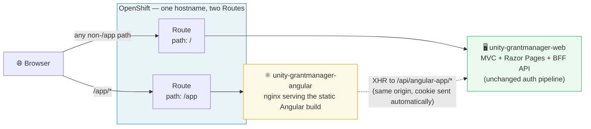
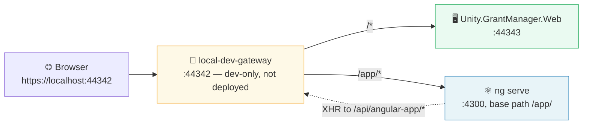
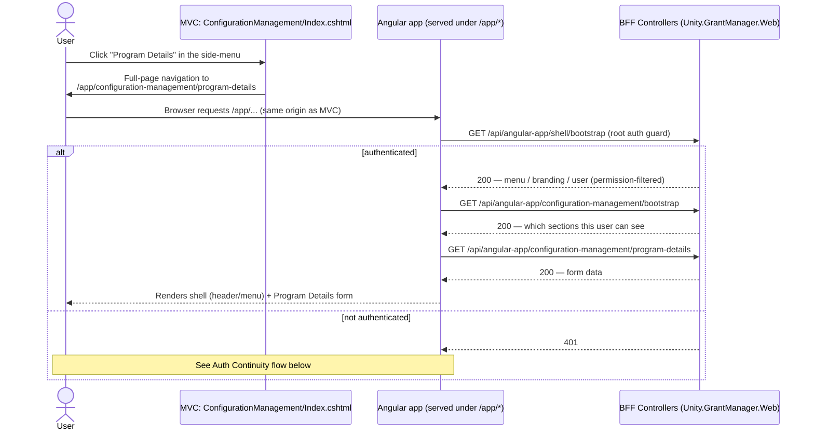
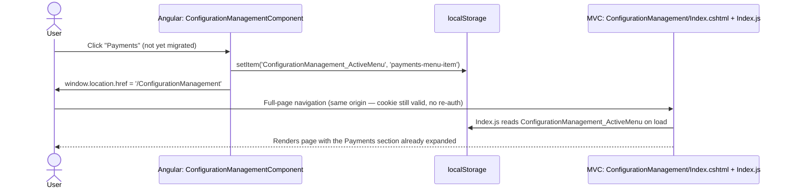
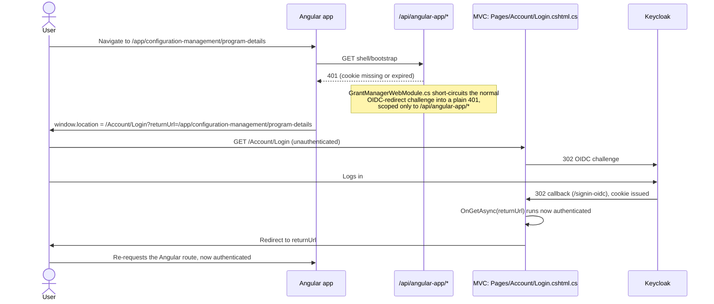
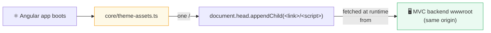
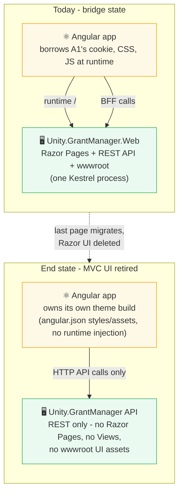

# Angular Strangler-Fig Migration — Architecture & Local Setup

## Overview

Unity.GrantManager is an ABP-framework modular monolith: one ASP.NET Core host serves
Razor Pages UI, an auto-generated REST API, and Swagger from a single Kestrel process.
Rather than a big-bang rewrite, the front end is being replaced incrementally, one page
at a time, using the [strangler-fig pattern](https://martinfowler.com/bliki/StranglerFigApplication.html):
new pages are built in a separate Angular application and reached via normal in-app
navigation, while everything not yet migrated keeps working exactly as it does today.

The first (and so far only) page migrated is **Program Details**, one section of the
**Configuration Management** screen.

Two things make this work without rewriting auth or introducing CORS:

1. **The Angular app is a genuinely separate deployable** (its own container image, own
   OpenShift Deployment/Service) — proving real service independence, not just a
   different folder in the same process.
2. **It shares one hostname with the MVC app**, via an OpenShift Route path split
   (`/app` → Angular, everything else → MVC). Same scheme + host + port means the
   browser treats it as one origin: cookies, CSRF tokens, and full-page navigation all
   just work, with no token-passing or CORS configuration needed anywhere.

---

## System Architecture

### Production (OpenShift)



### Local development

There's no OpenShift Route locally, so a small dev-only reverse proxy
(`applications/Unity.GrantManager.Angular/local-dev-gateway/`) plays the same role —
see [Local Development Setup](#local-development-setup) below.



---

## Request Flows

### MVC → Angular handoff

Today the only entry point is the **Program Details** item in Configuration
Management's own side-menu. Every other item there still works exactly as before
(inline show/hide of a Razor section).



### Angular → MVC handoff

Clicking anything in the Angular side-menu **other than** Program Details doesn't try
to render that section in Angular — it redirects back to the MVC page, landing
directly on the right section.



This reuses a pattern that already existed in the codebase before this migration
(`EmailsWidget/Default.js` jumps to a specific Configuration Management section the
same way) — not a new convention invented for Angular.

The top-level nav menu (outside Configuration Management) works the same way in
reverse: every item Angular's shell renders is a plain `<a href>` back into the MVC
app, since nothing else is migrated yet.

### Auth continuity

The Angular-serving pod/process has no knowledge of cookies or OIDC — it just serves
static files. The permission gate that used to happen server-side on page load now
happens client-side, on the first API call.



Two things had to change in the MVC app to make this work — both were pre-existing
gaps this migration surfaced, not new behavior added just for Angular:

- **`GrantManagerWebModule.cs`** — this app's cookie auth never had an AJAX-aware
  401-vs-redirect distinction (that only comes for free with `AddIdentity`, and this
  app uses a plain `.AddCookie(...)`). Every `[Authorize]` failure, API or page, was
  unconditionally redirecting into the OIDC flow. Fixed narrowly for
  `/api/angular-app/*` only — everything else's behavior is untouched.
- **`Pages/Account/Login.cshtml.cs`** — hardcoded a redirect to `/GrantApplications`
  with no `returnUrl` support at all (its only caller, the anonymous homepage's LOGIN
  button, never needed one). Added an optional, `Url.IsLocalUrl`-validated `returnUrl`,
  falling back to the original behavior when absent.

---

## Component / File Map

| Concern | MVC side | Angular side |
|---|---|---|
| Shell chrome (menu, branding, user) | `Controllers/AngularApp/ShellController.cs` | `shell/shell.component.ts`, `shell/shell.service.ts`, `shell/menu-item/menu-item.component.ts` |
| Root auth gate | `GrantManagerWebModule.cs` (401 short-circuit), `Pages/Account/Login.cshtml.cs` | `core/auth/auth.guard.ts`, `core/auth/bootstrap.service.ts`, `core/auth/auth.config.ts` |
| Configuration Management side-menu | `Pages/ConfigurationManagement/Index.cshtml` + `Index.js` | `features/configuration-management/configuration-management.component.ts`, `.model.ts`, `.service.ts` |
| Program Details | `Views/Settings/ProgramDetails/*` (view component kept, no longer wired into Index.cshtml) | `features/configuration-management/program-details/*` |
| BFF API for the SPA | `Controllers/AngularApp/ConfigurationManagementController.cs` (wraps `IProgramDetailsAppService`) | `program-details.service.ts`, `configuration-management.service.ts` |
| CSRF | `AbpAntiForgeryOptions` (`GrantManagerWebModule.cs`) | `core/http/antiforgery.interceptor.ts` |
| Toast notifications | `abp-toast.js`/`.css` (existing ABP asset, reused as-is) | `core/toast.service.ts` |
| Reusable character counter | `Views/Settings/ProgramDetails/CharacterCounter.js` (original, now unused) | `shared/character-counter.directive.ts` |
| Theme CSS/JS (Bootstrap, fonts, icons, toast) | served from existing `wwwroot`/embedded paths, unchanged | `core/theme-assets.ts` — loads them at runtime via the DOM API (see [Gotchas](#gotchas--lessons-for-the-next-migrated-page)) |
| Menu item entry points | `Themes/UX2/Components/Topbar/Default.cshtml` (top dropdown), `Pages/ConfigurationManagement/Index.cshtml` (side-menu) | — |

All new MVC-side API endpoints live under `/api/angular-app/*` — a deliberately
separate namespace from ABP's own auto-generated conventional API
(`/api/app/*`), so the SPA has a contract this project controls rather than depending
on ABP's dynamic routing shape.

---

## Styling — reused, not duplicated

The visual design system is **loaded, not reimplemented**. Angular doesn't have its
own copy of the theme.



- **`core/theme-assets.ts`** injects `<link>`/`<script>` tags at runtime pointing at
  the *exact same files* the MVC app itself serves — `abp.css`, `bootstrap.css`,
  FontAwesome, the UX2 theme's `fonts.css`/`unity-styles.css`/`layout.css`/
  `fluenticons.min.css`, `bootstrap.bundle.js`, and `abp-toast.js`/`.css`. Page-specific
  files (`Index.css`, `ProgramDetails.css`) are loaded the same way by the component
  that needs them. Same URL, same file, served by the same backend — zero duplicated
  CSS rules. This has to happen at runtime rather than via a normal `<link>` in
  `index.html` or `angular.json`'s `styles` array, because Angular's build/dev-server
  rewrites every root-relative path in those places to live under the app's own
  `/app` base path, which 404s against files that only exist at the un-prefixed path.
- Angular's templates use the **identical CSS class names** the Razor views use
  (`.config-page-layout`, `.unity-navbar`, `.btn-dropdown`, `form-control`, …), so they
  pick up that shared styling automatically without writing any CSS at all.
- Each component's own `.scss` file (`shell.component.scss`,
  `configuration-management.component.scss`, …) exists for two narrow reasons only:
  1. **Bridging a structural mismatch.** Angular inserts a wrapper custom element at
     every routed component boundary that the real Razor output never has, which
     breaks CSS written assuming plain block/flex flow (see
     [Gotchas](#gotchas--lessons-for-the-next-migrated-page)). These fixes are structural glue,
     not visual redesign.
  2. **Small, deliberate fine-tuning** for the handful of spots where the Angular
     markup differs just enough from the original rendered output that the shared
     classes don't land pixel-identical — e.g. `shell.component.scss`'s
     `.dropdown-title` font-size and `.btn-dropdown` height/padding, added because the
     tenant name got its own `<span>` for finer control than the original markup gave.
     This is expected to keep accumulating in small amounts; it is not the theme being
     rebuilt from scratch.
- Angular's default view encapsulation scopes every component's `.scss` to only the
  elements *that component* renders, so none of this can leak out and affect the MVC
  pages or other Angular components.

This whole approach is a **bridge, not the end state** — it depends on the MVC app
still running and still serving these files. See
[End State](#end-state--retiring-the-mvc-ui-entirely) below for what changes once it
isn't.

---

## Local Development Setup

**Why a gateway is needed at all:** locally there's no OpenShift Route to put both
apps on one origin, and that matters for more than convenience — the Keycloak client
(`unity-4899`) only trusts `redirect_uri=https://localhost:44342/signin-oidc`, and the
backend's relative redirects only land in the right place if it *appears* to be on
the same host:port the browser is actually using.

**Full instructions, troubleshooting, and the one-time cert setup:**
[`applications/Unity.GrantManager.Angular/local-dev-gateway/README.md`](../../applications/Unity.GrantManager.Angular/local-dev-gateway/README.md),
with a shorter quickstart in
[`applications/Unity.GrantManager.Angular/README.md`](../../applications/Unity.GrantManager.Angular/README.md).

**Prerequisites**, beyond a checkout: Node.js 22 (the Angular CLI 20 comes from
`npm install` and is invoked as `npx ng`, so no global install is needed), the .NET 10
SDK, `npm install` run in both
`Unity.GrantManager.Angular/` and its `local-dev-gateway/`, the trusted ASP.NET Core dev
cert exported to PEM at `%USERPROFILE%\.dev-certs\`, and a backend that already runs
locally (`abp install-libs` plus a `Unity.GrantManager.DbMigrator` run — see
[`applications/Unity.GrantManager/README.md`](../../applications/Unity.GrantManager/README.md)).
Reaching the migrated page also needs a login with the `system_admin` role, the
`SettingManagement.Enable` feature, and the `SettingManagement.EditProgramDetails`
permission.

Quick reference — three things running, all over HTTPS with the same trusted
ASP.NET Core dev cert: the backend on 44343, Angular on 4300 (serve-path
`/app/`), and the gateway on 44342. A single script starts all three in their
own windows, killing anything already bound to those ports first:

```powershell
applications\Unity.GrantManager.Angular\scripts\start-local-dev.ps1
```

Then browse to **`https://localhost:44342`**.

**Running the pieces manually**, if you need to (e.g. to restart just one):

```powershell
# 1. Backend, on 44343 (not its usual 44342 - the gateway takes that port)
cd applications\Unity.GrantManager\src\Unity.GrantManager.Web
dotnet run --urls https://localhost:44343

# 2. Angular, on 4300, with the /app/ serve-path configuration
cd applications\Unity.GrantManager.Angular
npx ng serve --configuration=development-app-path --port 4300 --serve-path=/app/ `
  --ssl --ssl-cert "$env:USERPROFILE\.dev-certs\localhost-cert.pem" --ssl-key "$env:USERPROFILE\.dev-certs\localhost-key.pem"

# 3. The gateway, on 44342 - this is what you actually browse to
cd applications\Unity.GrantManager.Angular\local-dev-gateway
$env:LOCAL_GATEWAY_CERT = "$env:USERPROFILE\.dev-certs\localhost-cert.pem"
$env:LOCAL_GATEWAY_KEY = "$env:USERPROFILE\.dev-certs\localhost-key.pem"
npm start
```

Then browse to `https://localhost:44342`, open the user dropdown →
**Configuration Management** (still MVC), and click **Program Details** in its side
menu — that is the handoff into the Angular app.

---

## Gotchas & Lessons (for the next migrated page)

- **Angular's component-boundary elements break CSS written for plain block flow.**
  Angular inserts a custom element (e.g. `<app-configuration-management>`) at every
  routed component boundary — the real Razor app has no such wrapper. Any CSS relying
  on percentage-height/width chains, or on an element being a *direct* flex child,
  needs those wrapper elements explicitly bridged (see `styles.scss`'s
  `.unity-app-main-container > router-outlet + *` rule and `shell.component.scss`'s
  flex-column chain). This will recur for every future page sharing the shell.
- **Fixing one of those chains can silently activate a dormant `margin: auto`
  elsewhere.** Two separate elements (`.unity-app-main-container` and `.unity-navbar`)
  had `margin: auto` that was inert under normal block flow but started centering/
  shrinking once their container became a genuine flex box with real extra space to
  distribute. Check for this class of regression after any layout fix, not just
  whether the fix itself worked.
- **Angular directives reading a *dynamic* property binding (`[maxlength]="..."`) in
  `ngOnInit` will see the old/default value**, not the bound one — that binding isn't
  applied yet at that point in the lifecycle. Static HTML attributes don't have this
  problem, which is why a first test using one missed it. Use `ngAfterViewInit`.
- **Reactive form controls can change value with no native `input` DOM event**
  (`form.reset(...)`, `patchValue(...)`). Anything watching for user input via
  `@HostListener('input')` alone will miss programmatic changes — also listen to the
  bound `NgControl`'s own `valueChanges`.
- **Menu URLs from `GrantManagerMenuContributor.cs` are tilde-relative**
  (`~/GrantApplications`) — Razor resolves these via `Url.Content(...)` before
  rendering; Angular has no equivalent, so they need normalizing server-side
  (`ShellController.NormalizeUrl`) before being sent as JSON.
- **The real toggle for the tenant-name/badge dropdown is hand-written JS, not
  Bootstrap's `data-bs-toggle`** (`themes/ux2/layout.js`, clicking `.unity-user-initials`
  toggles `.show` on `#user-dropdown`). It looks like a Bootstrap dropdown; it isn't.

---

## End State — Retiring the MVC UI Entirely

Everything above describes a **bridge state**: the MVC app is still the thing
actually running the site, and Angular is a guest borrowing its cookie, its
API, and its stylesheets. That's deliberate for an incremental migration, but
it isn't the destination. This section is what changes once every page listed
in the Roadmap below has moved over and the Razor UI can be switched off.



- **Theme assets move from runtime-borrowed to Angular-owned.** The whole point
  of `core/theme-assets.ts` injecting `<link>`/`<script>` tags at runtime is
  that the real files still live in the MVC app's `wwwroot` and it's still
  running to serve them. Once there's no MVC UI left to serve them from,
  Angular takes ownership of those assets outright — copied into the Angular
  project and wired through the normal build-time `angular.json`
  `styles`/`scripts`/`assets` arrays, the way any standalone Angular app does
  it. `core/theme-assets.ts` and the whole runtime-injection pattern (including
  the `abp.notify` stub workaround) retire completely at that point — it only
  ever existed to solve "the file exists, but only on a server I don't want to
  duplicate yet."
- **The backend doesn't disappear — it sheds its UI.** `Unity.GrantManager.Web`
  stays the thing serving the REST API (both the existing ABP conventional
  endpoints and whatever `/api/angular-app/*` has become by then); what goes
  away is the Razor Pages, MVC Views, `wwwroot` static UI assets, and the theme
  module's server-rendered components (`Topbar/Default.cshtml`,
  `MainNavbarMenuViewComponent.cs`, etc.) — none of that has a reason to exist
  once nothing renders it. Auth stays server-side and cookie-based; that
  doesn't change just because the UI does.
- **The `/api/angular-app/*` BFF naming and placement gets revisited.** That
  namespace was named and scoped around "a temporary contract for the SPA
  while it's a guest in the MVC app" — once Angular *is* the app, the
  distinction between "BFF for Angular" and "the API" mostly evaporates. This
  is the same seam already called out in the Roadmap below: extracting these
  controllers into their own deployable is the natural point to also fold them
  into the main API surface (or rename them) rather than keeping a
  `/angular-app/` path segment as a permanent artifact of how the migration
  started.
- **Nothing about this needs deciding now.** It's called out here so the
  interim choices above (runtime asset injection, the `/api/angular-app/*`
  namespace, per-component `.scss` bridging) are understood as scaffolding for
  the migration, not the intended long-term shape — so nobody mistakes them
  for a design to preserve once the last page moves over.

---

## Roadmap

- Migrate the remaining Configuration Management sections (Notifications, Payments,
  Custom Fields, Scoresheets, Tags, AI) one at a time, following the same
  BFF-controller + Angular-feature pattern, updating `MVC_SIDE_MENU_ITEMS` in
  `configuration-management.model.ts` as each one moves over.
- Stand up the real OpenShift Deployment/Service/Route for the Angular app (not yet
  done — this has only been built and verified locally so far).
- Once several pages are migrated, consider extracting the `/api/angular-app/*` BFF
  controllers out of `Unity.GrantManager.Web` into their own deployable
  (`HttpApi.Host`-style project) — the current placement was a deliberate "don't lock
  in the monolith" seam, not a permanent home.
