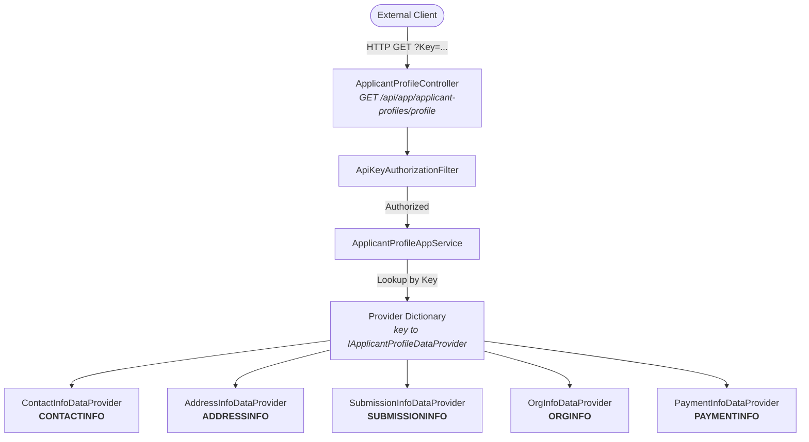
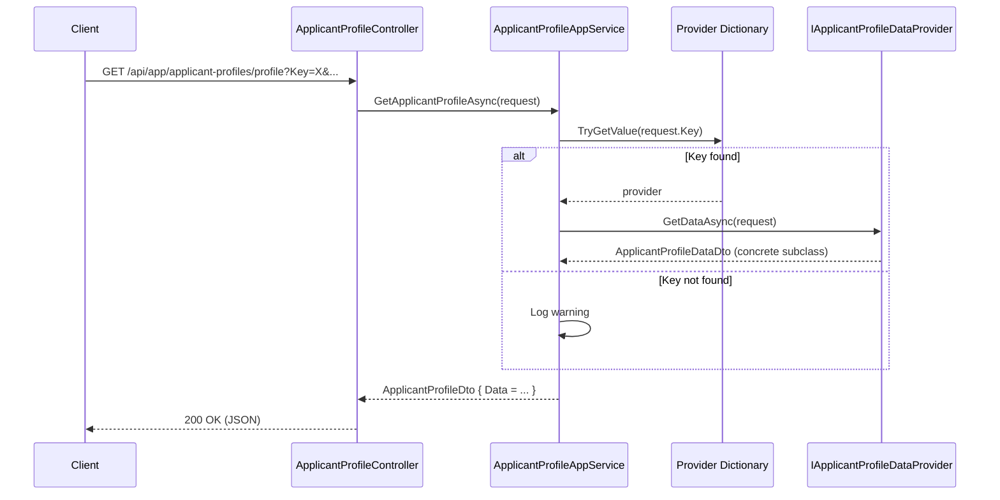
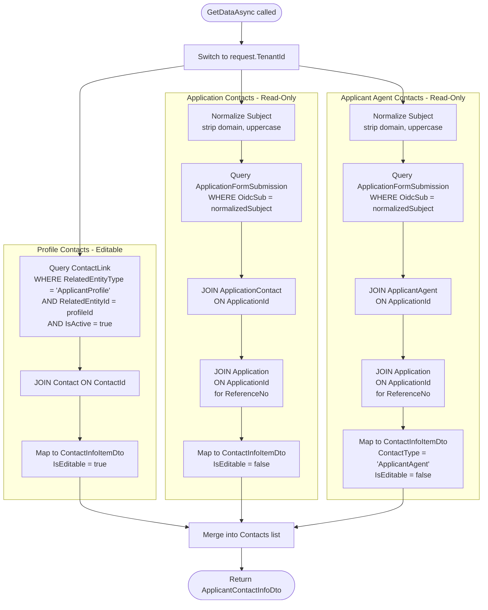
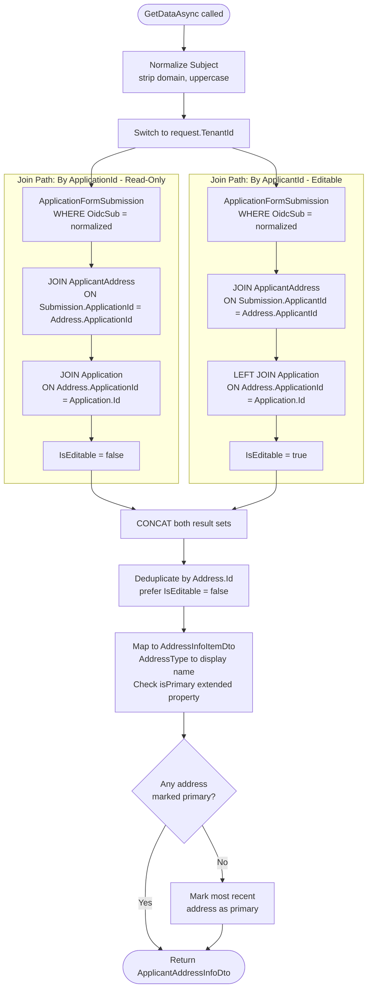
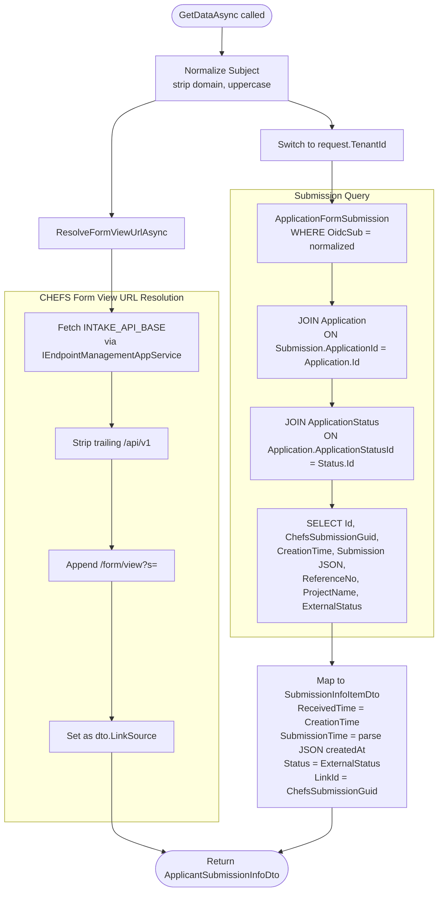
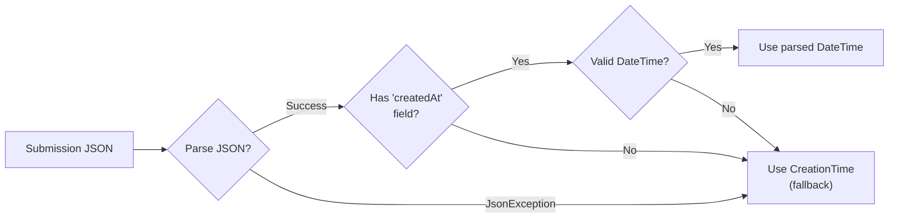
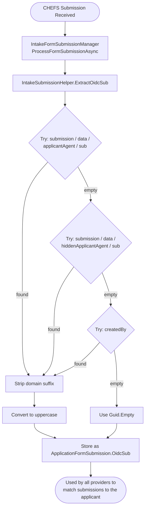
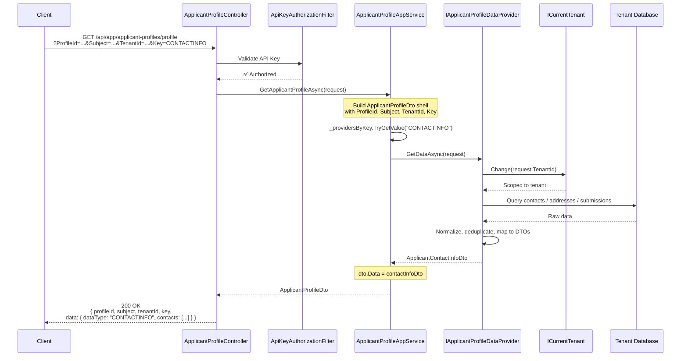

# Applicant Profile Data Providers

## Overview

The Applicant Profile system exposes a single polymorphic API endpoint that returns different data shapes depending on a **key** parameter. The controller delegates to `ApplicantProfileAppService`, which resolves the correct `IApplicantProfileDataProvider` implementation using a strategy/dictionary pattern.

All providers are registered via ABP's `[ExposeServices]` attribute and collected as `IEnumerable<IApplicantProfileDataProvider>` in the app service constructor, where they are indexed by their `Key` property.

---

## Entry Point

**Endpoint:** `GET /api/app/applicant-profiles/profile`

**Authentication:** API Key (via `ApiKeyAuthorizationFilter`)

**Query Parameters** (`ApplicantProfileInfoRequest`):

| Parameter   | Type   | Description                                                  |
|-------------|--------|--------------------------------------------------------------|
| `ProfileId` | `Guid` | The applicant profile identifier                             |
| `Subject`   | `string` | The OIDC subject (e.g. `user@idir`)                        |
| `TenantId`  | `Guid` | The tenant to scope the query to                             |
| `Key`       | `string` | The provider key — determines which data type is returned  |

**Supported Keys:**

| Key              | Provider Class               | DTO Returned                  | Status          |
|------------------|------------------------------|-------------------------------|-----------------|
| `CONTACTINFO`    | `ContactInfoDataProvider`    | `ApplicantContactInfoDto`     | ✅ Implemented  |
| `ADDRESSINFO`    | `AddressInfoDataProvider`    | `ApplicantAddressInfoDto`     | ✅ Implemented  |
| `SUBMISSIONINFO` | `SubmissionInfoDataProvider` | `ApplicantSubmissionInfoDto`  | ✅ Implemented  |
| `ORGINFO`        | `OrgInfoDataProvider`        | `ApplicantOrgInfoDto`         | ✅ Implemented  |
| `PAYMENTINFO`    | `PaymentInfoDataProvider`    | `ApplicantPaymentInfoDto`     | ✅ Implemented  |

**Response:** `ApplicantProfileDto` with a polymorphic `Data` property (JSON discriminator: `dataType`).

---

## High-Level Architecture



---

## Dispatch Flow

The `ApplicantProfileAppService.GetApplicantProfileAsync` method is the central orchestrator. It:

1. Creates a new `ApplicantProfileDto` and copies request fields (`ProfileId`, `Subject`, `TenantId`, `Key`).
2. Looks up the matching `IApplicantProfileDataProvider` by `Key` in an in-memory dictionary (case-insensitive).
3. Calls `provider.GetDataAsync(request)` if found; otherwise logs a warning.
4. Returns the DTO with the polymorphic `Data` property populated.



---

## Provider Interface

```csharp
public interface IApplicantProfileDataProvider
{
    string Key { get; }
    Task<ApplicantProfileDataDto> GetDataAsync(ApplicantProfileInfoRequest request);
}
```

All providers are registered via ABP's `[ExposeServices(typeof(IApplicantProfileDataProvider))]` attribute and resolved as an `IEnumerable<IApplicantProfileDataProvider>` collection. The app service indexes them by `Key` for O(1) dispatch.

---

## Provider Details

### 1. ContactInfoDataProvider (`CONTACTINFO`)

**Purpose:** Aggregates contact information from three sources — profile-linked contacts, application-level contacts, and applicant agent contacts derived from the submission login token.

**Dependencies:**
- `ICurrentTenant` — for multi-tenant scoping
- `IApplicantProfileContactService` — encapsulates contact query logic

**Logic:**

1. Switches to the requested tenant context.
2. Retrieves **profile contacts** — contacts linked to the applicant profile via `ContactLink` records where `RelatedEntityType == "ApplicantProfile"` and `RelatedEntityId == profileId`. These are **editable** (`IsEditable = true`).
3. Retrieves **application contacts** — contacts on applications whose form submissions match the normalized OIDC subject. These are **read-only** (`IsEditable = false`).
4. Retrieves **applicant agent contacts** — contact information derived from `ApplicantAgent` records on applications whose form submissions match the normalized OIDC subject. The join path is `Submission → Application → ApplicantAgent`. These are **read-only** (`IsEditable = false`).
5. Merges all three lists into a single `ApplicantContactInfoDto.Contacts` collection.

**Subject Normalization:** The OIDC subject (e.g. `user@idir`) is normalized by stripping everything after `@` and converting to uppercase.



**Data Sources:**

| Source | Entity | Join Path | Editable |
|--------|--------|-----------|----------|
| Profile Contacts | `ContactLink` → `Contact` | `ContactLink.RelatedEntityId = profileId` | ✅ Yes |
| Application Contacts | `ApplicationFormSubmission` → `ApplicationContact` → `Application` | `Submission.OidcSub = normalizedSubject`, `Application.Id` for `ReferenceNo` | ❌ No |
| Applicant Agent Contacts | `ApplicationFormSubmission` → `ApplicantAgent` → `Application` | `Submission.ApplicationId = Agent.ApplicationId`, `Application.Id` for `ReferenceNo` | ❌ No |

**Applicant Agent Field Mapping:**

The `ApplicantAgent` entity is populated from the CHEFS submission login token during intake import. Its fields are mapped to `ContactInfoItemDto` as follows:

| ApplicantAgent Field | ContactInfoItemDto Field |
|---------------------|-------------------------|
| `Id` | `ContactId` |
| `Name` | `Name` |
| `Title` | `Title` |
| `Email` | `Email` |
| `Phone` | `WorkPhoneNumber` |
| `PhoneExtension` | `WorkPhoneExtension` |
| `Phone2` | `MobilePhoneNumber` |
| `RoleForApplicant` | `Role` |
| `ApplicationId` | `ApplicationId` |
| `Application.ReferenceNo` | `ReferenceNo` |
| _(literal)_ `"ApplicantAgent"` | `ContactType` |

---

### 2. AddressInfoDataProvider (`ADDRESSINFO`)

**Purpose:** Retrieves applicant addresses by querying address records linked to the applicant's form submissions. Addresses are resolved via two join paths and deduplicated.

**Dependencies:**
- `ICurrentTenant` — for multi-tenant scoping
- `IRepository<ApplicationFormSubmission>` — form submissions
- `IRepository<ApplicantAddress>` — address records
- `IRepository<Application>` — applications (for `ReferenceNo`)

**Logic:**

1. Normalizes the OIDC subject.
2. Switches to the requested tenant context.
3. Queries addresses through **two join paths**:
   - **By ApplicationId:** `Submission → Address (on ApplicationId) → Application` — these are **not editable** (owned by an application).
   - **By ApplicantId:** `Submission → Address (on ApplicantId) → Application (LEFT JOIN)` — these are **editable** (owned by the applicant directly).
4. Concatenates both result sets.
5. **Deduplicates** by `Address.Id` — if the same address appears in both sets, the application-linked (non-editable) version takes priority.
6. Maps `AddressType` enum values to human-readable names (`Physical`, `Mailing`, `Business`).
7. Checks the `isPrimary` extended property on addresses; if no address is marked primary, the most recently created address is auto-promoted.



**Deduplication Rule:** When the same address ID appears in both join paths, the application-linked record (`IsEditable = false`) wins. This is achieved by grouping on `Address.Id` and ordering by `IsEditable` ascending (`false` < `true`).

---

### 3. SubmissionInfoDataProvider (`SUBMISSIONINFO`)

**Purpose:** Lists all form submissions associated with the applicant's OIDC subject, along with application metadata and a link to view the form in CHEFS.

**Dependencies:**
- `ICurrentTenant` — for multi-tenant scoping
- `IRepository<ApplicationFormSubmission>` — form submissions
- `IRepository<Application>` — applications
- `IRepository<ApplicationStatus>` — status records
- `IEndpointManagementAppService` — resolves the CHEFS API base URL
- `ILogger<SubmissionInfoDataProvider>` — logging

**Logic:**

1. Normalizes the OIDC subject.
2. Resolves the **CHEFS form view URL** from the `INTAKE_API_BASE` dynamic URL setting:
   - Fetches the base URL (e.g. `https://chefs-dev.apps.silver.devops.gov.bc.ca/app/api/v1`)
   - Strips the trailing `/api/v1` segment
   - Appends `/form/view?s=` to create the view link template
   - Falls back to an empty string on failure.
3. Switches to the requested tenant context.
4. Queries `ApplicationFormSubmission` → `Application` → `ApplicationStatus` where `OidcSub` matches.
5. Maps each result to a `SubmissionInfoItemDto`:
   - `ReceivedTime` = the submission's `CreationTime` in the system.
   - `SubmissionTime` = the `createdAt` timestamp parsed from the CHEFS JSON payload; falls back to `CreationTime` if parsing fails.
   - `Status` = the `ExternalStatus` from the application status record.
   - `LinkId` = the `ChefsSubmissionGuid` used to build a direct link to the form.



**Submission Time Resolution:**



---

### 4. OrgInfoDataProvider (`ORGINFO`)

**Purpose:** Provides organization information for the applicant profile.

**Source**: `Applicant` entity, linked via `ApplicationFormSubmission.ApplicantId`.

**Query**: Joins `ApplicationFormSubmission` → `Applicant` where `OidcSub` matches the normalized subject. Returns all matching applicant records — duplicates are **not** removed, since a single user may have multiple submissions pointing to the same or different applicant records. The UI is responsible for presenting this appropriately.

**Response DTO**: `ApplicantOrgInfoDto`

```json
{
  "dataType": "ORGINFO",
  "organizations": [
    {
      "id": "3fa85f64-5717-4562-b3fc-2c963f66afa6",
      "orgName": "Acme Corp",
      "organizationType": "Non-Profit",
      "orgNumber": "BC1234567",
      "orgStatus": "Active",
      "nonRegOrgName": null,
      "fiscalMonth": "April",
      "fiscalDay": 1,
      "organizationSize": "51-100",
      "sector": "Technology",
      "subSector": "Software"
    }
  ]
}
```

**Fields** (from `Applicant` entity):

| DTO Field | Entity Field | Type | Description |
|-----------|-------------|------|-------------|
| `Id` | `Applicant.Id` | `Guid` | Applicant ID — used as `organizationId` for edit commands |
| `OrgName` | `Applicant.OrgName` | `string?` | Organization name |
| `OrganizationType` | `Applicant.OrganizationType` | `string?` | Type of organization |
| `OrgNumber` | `Applicant.OrgNumber` | `string?` | Organization registration number |
| `OrgStatus` | `Applicant.OrgStatus` | `string?` | Organization status |
| `NonRegOrgName` | `Applicant.NonRegOrgName` | `string?` | Non-registered organization name |
| `FiscalMonth` | `Applicant.FiscalMonth` | `string?` | Fiscal year start month |
| `FiscalDay` | `Applicant.FiscalDay` | `int?` | Fiscal year start day |
| `OrganizationSize` | `Applicant.OrganizationSize` | `string?` | Size category |
| `Sector` | `Applicant.Sector` | `string?` | Industry sector |
| `SubSector` | `Applicant.SubSector` | `string?` | Industry sub-sector |

**Multiple Applicants**: It is possible for a single OIDC subject to be linked to multiple distinct `Applicant` records (via different `ApplicationFormSubmission` rows). The provider returns all of them. When the same applicant is linked by multiple submissions, each join result is returned — the UI handles presentation and any eventual deduplication is a process-level concern.

**Relationship to OrganizationEditHandler**: The `ORGANIZATION_EDIT_COMMAND` handler (see [RabbitMQ integration](./grants-portal-rabbitmq-integration.md)) updates a single `Applicant` entity by its ID. The `Id` field in the org info response corresponds to the `organizationId` expected by the edit command payload.

---

### 5. PaymentInfoDataProvider (`PAYMENTINFO`)

**Purpose:** Provides payment information for the applicant profile.

**Source**: `PaymentRequest` entity (from `Unity.Payments` module), linked via `ApplicationFormSubmission` → `Application` where `PaymentRequest.CorrelationId` matches the application ID.

**Query**: Normalizes the OIDC subject, then joins `ApplicationFormSubmission` → `Application` to build a lookup of `ApplicationId → ReferenceNo`. Payment requests whose `CorrelationId` is in that set are returned with the application's `ReferenceNo` resolved from the lookup.

**Response DTO**: `ApplicantPaymentInfoDto`

```json
{
  "dataType": "PAYMENTINFO",
  "payments": [
    {
      "id": "3fa85f64-5717-4562-b3fc-2c963f66afa6",
      "paymentNumber": "PAY-100",
      "referenceNo": "REF-001",
      "amount": 5000.00,
      "paymentDate": "2025-01-15",
      "paymentStatus": "Paid"
    }
  ]
}
```

**Fields** (from `PaymentRequest` entity):

| DTO Field | Source | Type | Description |
|-----------|--------|------|-------------|
| `Id` | `PaymentRequest.Id` | `Guid` | Payment request identifier |
| `PaymentNumber` | `PaymentRequest.InvoiceNumber` | `string` | CAS invoice number (empty string if null) |
| `ReferenceNo` | `Application.ReferenceNo` | `string` | Application reference number, resolved via `CorrelationId → Application` lookup |
| `Amount` | `PaymentRequest.Amount` | `decimal` | Requested payment amount |
| `PaymentDate` | `PaymentRequest.PaymentDate` | `string?` | Date string populated during CAS reconciliation |
| `PaymentStatus` | `PaymentRequest.Status` | `string` | Enum converted to string (e.g. `L1Pending`, `Submitted`, `Paid`, `Failed`) |

**Cross-module note**: This provider queries the `PaymentRequest` entity directly from the `Unity.Payments` module via `IRepository<PaymentRequest, Guid>`. The `CorrelationId` on `PaymentRequest` corresponds to the `Application.Id` in the grant manager domain.

---

## Common Patterns

### Subject Normalization

All providers that query by OIDC subject apply the same normalization:

```
Input:  "5ay5pewjqddncvlzlukm3gn2r7vdzq6q@chefs-frontend-5299"  →  Output: "5AY5PEWJQDDNCVLZLUKM3GN2R7VDZQ6Q"
Input:  "user@idir"                                             →  Output: "USER"
Input:  "USER"                                                  →  Output: "USER"
```

The portion after `@` is stripped and the remainder is uppercased. This matches the format stored in `ApplicationFormSubmission.OidcSub`, which is populated during intake import (see [OIDC Subject Ingestion from CHEFS](#oidc-subject-ingestion-from-chefs) below).

### Multi-Tenancy

Every provider switches to the requested `TenantId` using `ICurrentTenant.Change(request.TenantId)` before querying tenant-scoped data. This ensures queries hit the correct tenant database.

### Polymorphic Serialization

The `ApplicantProfileDataDto` base class uses `System.Text.Json` polymorphic attributes:

```
[JsonPolymorphic(TypeDiscriminatorPropertyName = "dataType")]
[JsonDerivedType(typeof(ApplicantContactInfoDto), "CONTACTINFO")]
[JsonDerivedType(typeof(ApplicantOrgInfoDto), "ORGINFO")]
[JsonDerivedType(typeof(ApplicantAddressInfoDto), "ADDRESSINFO")]
[JsonDerivedType(typeof(ApplicantSubmissionInfoDto), "SUBMISSIONINFO")]
[JsonDerivedType(typeof(ApplicantPaymentInfoDto), "PAYMENTINFO")]
```

The JSON response includes a `dataType` discriminator field so consumers can deserialize the correct concrete type.

### Editability

Providers distinguish between **editable** and **read-only** data:

| Provider | Editable Source | Read-Only Source |
|----------|----------------|-----------------|
| ContactInfo | Profile-linked contacts | Application-level contacts, Applicant agent contacts |
| AddressInfo | Addresses linked via ApplicantId | Addresses linked via ApplicationId |

---

## OIDC Subject Ingestion from CHEFS

The `OidcSub` field stored on `ApplicationFormSubmission` is the key that links submissions to an applicant across the profile system. It is populated **at intake import time** by `IntakeFormSubmissionManager.ProcessFormSubmissionAsync`, which calls `IntakeSubmissionHelper.ExtractOidcSub`.

### CHEFS Form Prerequisite

For the OIDC subject to be available, the CHEFS form **must** include a **hidden form control** whose value is set to the authenticated user's JWT token. When the form is submitted, CHEFS includes this token payload in the submission JSON, making the `sub` claim accessible to the import process.

If this hidden control is not configured, the `sub` field will be absent and `ExtractOidcSub` will fall back to `Guid.Empty`.

### Token Structure in CHEFS Submission JSON

When set up correctly, the submission JSON received from CHEFS contains the decoded token as a nested object. Example:

```json
{
  "submission": {
    "data": {
      "applicantAgent": {
        "aud": "chefs-frontend-5299",
        "azp": "chefs-frontend-5299",
        "exp": 1770327585,
        "iat": 1770327285,
        "iss": "https://dev.loginproxy.gov.bc.ca/auth/realms/standard",
        "jti": "onrtac:b2571d2d-ebbf-4f50-aaf8-5d603aa6a171",
        "sub": "5ay5pewjqddncvlzlukm3gn2r7vdzq6q@chefs-frontend-5299",
        "typ": "Bearer",
        "scope": "openid chefs-frontend-5299 idir bceidbusiness email profile bceidbasic",
        "family_name": "SURFACE",
        "given_names": "PRISCILA",
        "identity_provider": "chefs-frontend-5299",
        "preferred_username": "5ay5pewjqddncvlzlukm3gn2r7vdzq6q@chefs-frontend-5299"
      }
    }
  }
}
```

### Extraction Logic (`IntakeSubmissionHelper.ExtractOidcSub`)

The helper searches the dynamic submission object through **multiple configured paths** in priority order until a non-empty value is found:

| Priority | Search Path | Description |
|----------|------------|-------------|
| 1 | `submission→data→applicantAgent→sub` | Primary path — standard hidden control name |
| 2 | `submission→data→hiddenApplicantAgent→sub` | Alternate hidden control name |
| 3 | `createdBy` | Top-level CHEFS fallback field |

Once the raw `sub` value is found (e.g. `5ay5pewjqddncvlzlukm3gn2r7vdzq6q@chefs-frontend-5299`), it is normalized:
- Everything after `@` is stripped → `5ay5pewjqddncvlzlukm3gn2r7vdzq6q`
- Converted to uppercase → `5AY5PEWJQDDNCVLZLUKM3GN2R7VDZQ6Q`
- If no value is found, returns `Guid.Empty` as a string



### Import Call Site

In `IntakeFormSubmissionManager.ProcessFormSubmissionAsync`:

```csharp
var newSubmission = new ApplicationFormSubmission
{
    OidcSub = IntakeSubmissionHelper.ExtractOidcSub(formSubmission.submission),
    ApplicantId = application.ApplicantId,
    ApplicationFormId = applicationForm.Id,
    ChefsSubmissionGuid = intakeMap.SubmissionId ?? $"{Guid.Empty}",
    ApplicationId = application.Id,
    Submission = dataNode?.ToString() ?? string.Empty
};
```

The `formSubmission.submission` object passed to `ExtractOidcSub` is the `submission` node from the CHEFS JSON payload. The helper traverses into `data→applicantAgent→sub` to reach the token's `sub` claim.

---

## Full Request Lifecycle



---

## Project Structure

```
src/
├── Unity.GrantManager.Application.Contracts/ApplicantProfile/
│   ├── ApplicantProfileDto.cs                  # Response wrapper DTO
│   ├── ApplicantProfileRequest.cs              # Request models (base + info)
│   ├── IApplicantProfileAppService.cs          # App service interface
│   ├── IApplicantProfileContactService.cs      # Contact service interface
│   ├── IApplicantProfileDataProvider.cs        # Provider strategy interface
│   └── ProfileData/
│       ├── ApplicantProfileDataDto.cs          # Polymorphic base (discriminator)
│       ├── ApplicantContactInfoDto.cs          # CONTACTINFO response
│       ├── ApplicantOrgInfoDto.cs              # ORGINFO response
│       ├── ApplicantAddressInfoDto.cs          # ADDRESSINFO response
│       ├── ApplicantSubmissionInfoDto.cs       # SUBMISSIONINFO response
│       ├── ApplicantPaymentInfoDto.cs          # PAYMENTINFO response
│       ├── ContactInfoItemDto.cs               # Individual contact item
│       ├── AddressInfoItemDto.cs               # Individual address item
│       └── SubmissionInfoItemDto.cs            # Individual submission item
│
├── Unity.GrantManager.Application/ApplicantProfile/
│   ├── ApplicantProfileAppService.cs           # Central orchestrator
│   ├── ApplicantProfileContactService.cs       # Contact query logic
│   ├── ApplicantProfileKeys.cs                 # Key constants
│   ├── AddressInfoDataProvider.cs              # ADDRESSINFO provider
│   ├── ContactInfoDataProvider.cs              # CONTACTINFO provider
│   ├── SubmissionInfoDataProvider.cs           # SUBMISSIONINFO provider
│   ├── OrgInfoDataProvider.cs                  # ORGINFO provider
│   └── PaymentInfoDataProvider.cs              # PAYMENTINFO provider
│
├── Unity.GrantManager.Application/Intakes/
│   ├── IntakeFormSubmissionManager.cs          # Import orchestrator (calls ExtractOidcSub)
│   └── IntakeSubmissionHelper.cs               # OidcSub extraction from CHEFS token
│
└── Unity.GrantManager.HttpApi/Controllers/
    └── ApplicantProfileController.cs           # API controller entry point
```

---

## Data Flow: Read vs. Write

| Direction | Mechanism | Example |
|-----------|-----------|--------|
| **Read** (Portal → Unity) | HTTP GET via `ApplicantProfileController` → provider | Portal requests org info by key `ORGINFO` |
| **Write** (Portal → Unity) | RabbitMQ command via [messaging pipeline](./grants-portal-rabbitmq-integration.md) | Portal sends `ORGANIZATION_EDIT_COMMAND` with applicant ID |

The `Id` returned by each provider's read response is used as the entity identifier in the corresponding write command. For organization data, the `OrgInfoItemDto.Id` maps to the `organizationId` field in `PluginDataPayload`.

---

## Adding a New Provider

1. Create a DTO class inheriting from `ApplicantProfileDataDto` in `Application.Contracts/ApplicantProfile/ProfileData/`
2. Register the DTO as a `[JsonDerivedType]` on `ApplicantProfileDataDto`
3. Add a key constant to `ApplicantProfileKeys`
4. Implement `IApplicantProfileDataProvider` in `Application/ApplicantProfile/`
5. Annotate with `[ExposeServices(typeof(IApplicantProfileDataProvider))]` and `ITransientDependency`
6. Add unit tests following the patterns in `OrgInfoDataProviderTests` or `AddressInfoDataProviderTests`
