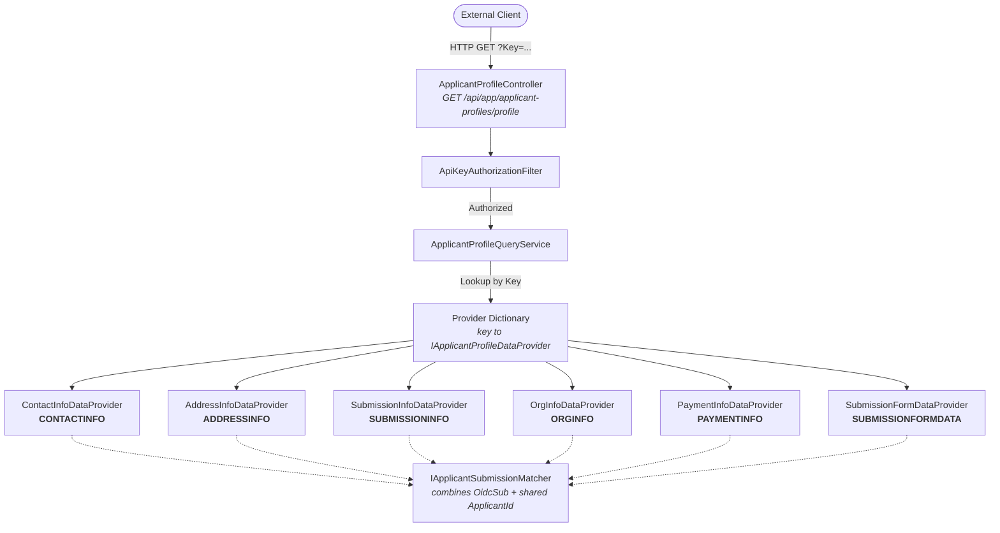
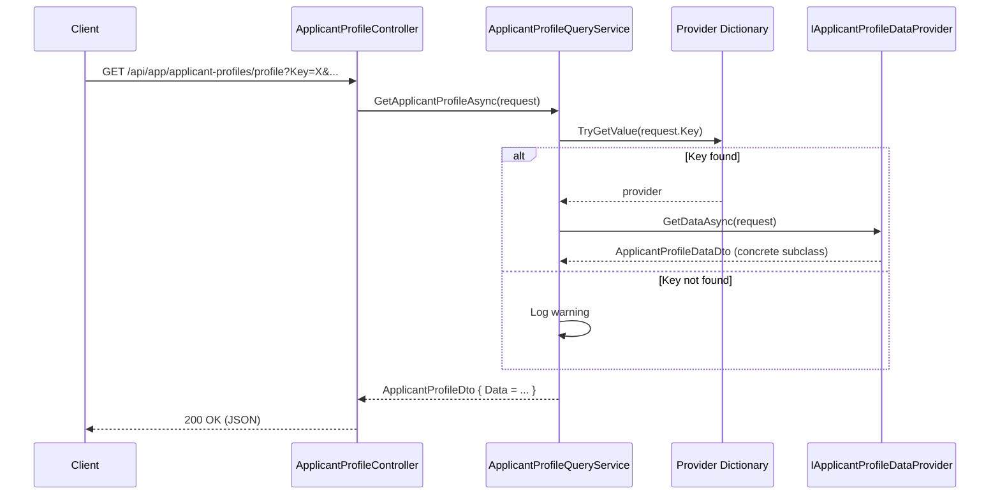
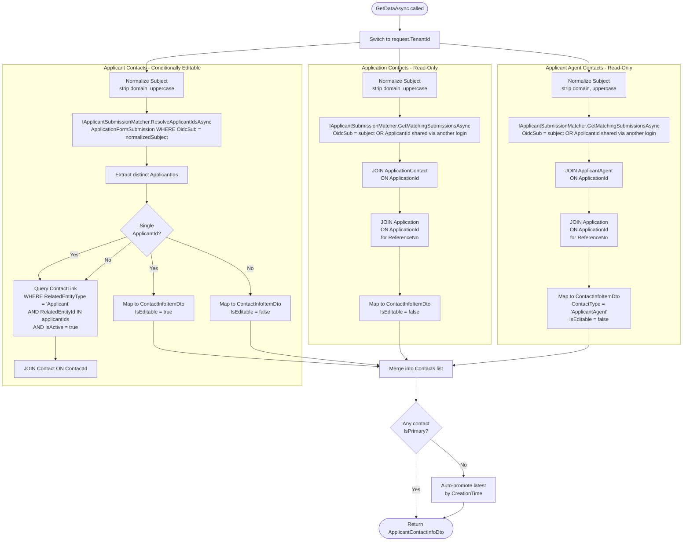
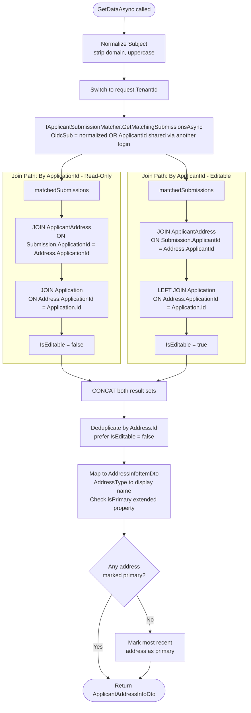
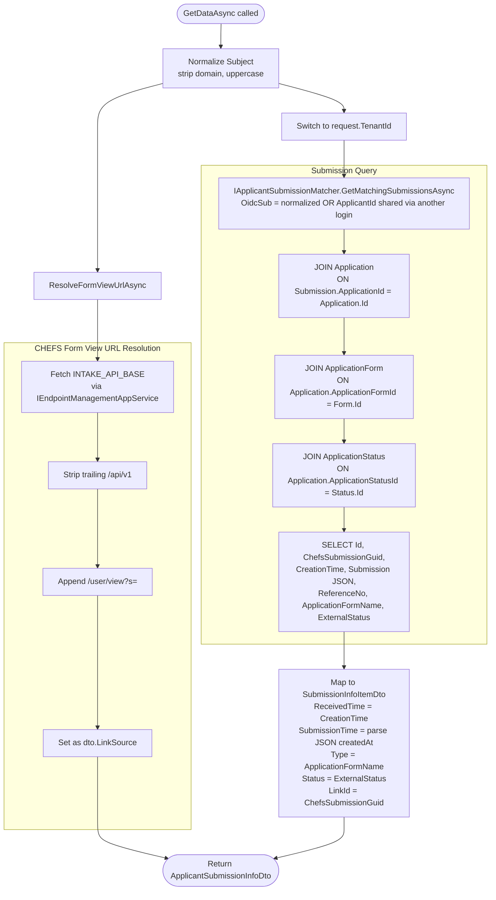
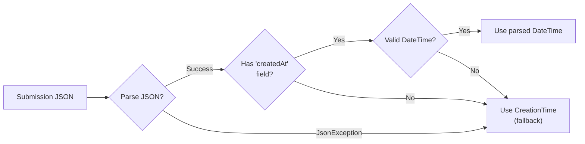
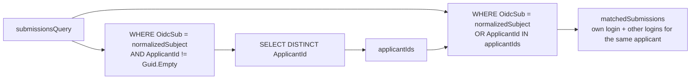
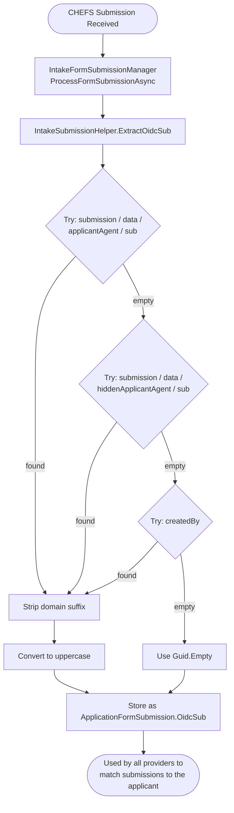
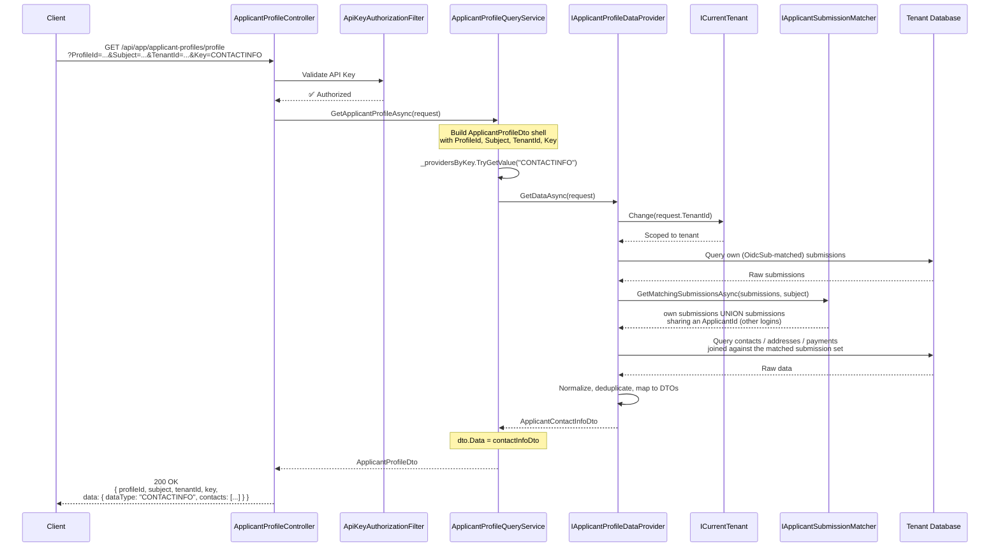

# Applicant Profile Data Providers

## Overview

The Applicant Profile system exposes a single polymorphic API endpoint that returns different data shapes depending on a **key** parameter. The controller delegates to `ApplicantProfileQueryService`, which resolves the correct `IApplicantProfileDataProvider` implementation using a strategy/dictionary pattern.

Every provider (and the contact query service it delegates to) resolves data for the caller's `OidcSub` **combined** with any other submissions that share the same underlying `ApplicantId` — see [Cross-Login Applicant Matching](#cross-login-applicant-matching). This lets an applicant who has used two different login methods (e.g. BCeID once, BC Services Card another time — two different `OidcSub` values) see and manage all of their data through either login.

All providers are registered via ABP's `[ExposeServices]` attribute and collected as `IEnumerable<IApplicantProfileDataProvider>` in the app service constructor, where they are indexed by their `Key` property.

---

## Entry Point

**Endpoint:** `GET /api/app/applicant-profiles/profile`

**Authentication:** API Key (via `ApiKeyAuthorizationFilter`)

**Query Parameters** (`ApplicantProfileInfoRequest`):

| Parameter   | Type   | Description                                                  |
|-------------|--------|--------------------------------------------------------------|
| `ProfileId` | `Guid` | The applicant profile identifier                             |
| `Subject`   | `string` | The OIDC subject (e.g. `user@idir`)                        |
| `TenantId`  | `Guid` | The tenant to scope the query to                             |
| `Key`       | `string` | The provider key — determines which data type is returned  |
| `SubmissionId` | `Guid?` | Required only when `Key = SUBMISSIONFORMDATA` — identifies the single submission to return schema/data for |

**Supported Keys:**

| Key                 | Provider Class               | DTO Returned                     | Status          |
|---------------------|-------------------------------|-----------------------------------|-----------------|
| `CONTACTINFO`       | `ContactInfoDataProvider`     | `ApplicantContactInfoDto`         | ✅ Implemented  |
| `ADDRESSINFO`       | `AddressInfoDataProvider`     | `ApplicantAddressInfoDto`         | ✅ Implemented  |
| `SUBMISSIONINFO`    | `SubmissionInfoDataProvider`  | `ApplicantSubmissionInfoDto`      | ✅ Implemented  |
| `ORGINFO`           | `OrgInfoDataProvider`         | `ApplicantOrgInfoDto`             | ✅ Implemented  |
| `PAYMENTINFO`       | `PaymentInfoDataProvider`     | `ApplicantPaymentInfoDto`         | ✅ Implemented  |
| `SUBMISSIONFORMDATA`| `SubmissionFormDataProvider`  | `ApplicantSubmissionFormDataDto`  | ✅ Implemented  |

**Response:** `ApplicantProfileDto` with a polymorphic `Data` property (JSON discriminator: `dataType`).

---

## High-Level Architecture


```mermaid
graph TB
    Client([External Client])
    Controller["ApplicantProfileController<br/><i>GET /api/app/applicant-profiles/profile</i>"]
    Filter["ApiKeyAuthorizationFilter"]
    AppService["ApplicantProfileQueryService"]
    ProviderDict["Provider Dictionary<br/><i>key to IApplicantProfileDataProvider</i>"]
    Matcher["IApplicantSubmissionMatcher<br/><i>combines OidcSub + shared ApplicantId</i>"]

    Client -->|"HTTP GET ?Key=..."| Controller
    Controller --> Filter
    Filter -->|Authorized| AppService
    AppService -->|"Lookup by Key"| ProviderDict

    ProviderDict --> ContactProvider["ContactInfoDataProvider<br/><b>CONTACTINFO</b>"]
    ProviderDict --> AddressProvider["AddressInfoDataProvider<br/><b>ADDRESSINFO</b>"]
    ProviderDict --> SubmissionProvider["SubmissionInfoDataProvider<br/><b>SUBMISSIONINFO</b>"]
    ProviderDict --> OrgProvider["OrgInfoDataProvider<br/><b>ORGINFO</b>"]
    ProviderDict --> PaymentProvider["PaymentInfoDataProvider<br/><b>PAYMENTINFO</b>"]
    ProviderDict --> FormDataProvider["SubmissionFormDataProvider<br/><b>SUBMISSIONFORMDATA</b>"]

    ContactProvider -.-> Matcher
    AddressProvider -.-> Matcher
    SubmissionProvider -.-> Matcher
    OrgProvider -.-> Matcher
    PaymentProvider -.-> Matcher
    FormDataProvider -.-> Matcher
```

---

## Dispatch Flow

The `ApplicantProfileQueryService.GetApplicantProfileAsync` method is the central orchestrator. It:

1. Creates a new `ApplicantProfileDto` and copies request fields (`ProfileId`, `Subject`, `TenantId`, `Key`).
2. Looks up the matching `IApplicantProfileDataProvider` by `Key` in an in-memory dictionary (case-insensitive).
3. Calls `provider.GetDataAsync(request)` if found; otherwise logs a warning.
4. Returns the DTO with the polymorphic `Data` property populated.


```mermaid
sequenceDiagram
    participant C as Client
    participant Ctrl as ApplicantProfileController
    participant Svc as ApplicantProfileQueryService
    participant Dict as Provider Dictionary
    participant P as IApplicantProfileDataProvider

    C->>Ctrl: GET /api/app/applicant-profiles/profile?Key=X&...
    Ctrl->>Svc: GetApplicantProfileAsync(request)
    Svc->>Dict: TryGetValue(request.Key)
    alt Key found
        Dict-->>Svc: provider
        Svc->>P: GetDataAsync(request)
        P-->>Svc: ApplicantProfileDataDto (concrete subclass)
    else Key not found
        Svc->>Svc: Log warning
    end
    Svc-->>Ctrl: ApplicantProfileDto { Data = ... }
    Ctrl-->>C: 200 OK (JSON)
```

---

## Provider Interface

```csharp
public interface IApplicantProfileDataProvider
{
    string Key { get; }
    Task<ApplicantProfileDataDto> GetDataAsync(ApplicantProfileInfoRequest request);
}
```

All providers are registered via ABP's `[ExposeServices(typeof(IApplicantProfileDataProvider))]` attribute and resolved as an `IEnumerable<IApplicantProfileDataProvider>` collection. The app service indexes them by `Key` for O(1) dispatch.

---

## Provider Details

### 1. ContactInfoDataProvider (`CONTACTINFO`)

**Purpose:** Aggregates contact information from three sources — applicant-linked contacts, application-level contacts, and applicant agent contacts derived from the submission login token.

**Dependencies:**
- `ICurrentTenant` — for multi-tenant scoping
- `IApplicantContactQueryService` (`ApplicantContactQueryService`) — encapsulates contact query logic; internally uses `IApplicantSubmissionMatcher` (see [Cross-Login Applicant Matching](#cross-login-applicant-matching))

**Logic:**

1. Switches to the requested tenant context.
2. Retrieves **applicant contacts** — resolves the distinct applicant IDs linked to the subject's own (`OidcSub`-matched) `ApplicationFormSubmission` records via `IApplicantSubmissionMatcher.ResolveApplicantIdsAsync`, then queries `ContactLink` records where `RelatedEntityType == "Applicant"` and `RelatedEntityId` is in that set. When the subject resolves to a **single** applicant ID the contacts are **editable** (`IsEditable = true`); when **multiple** applicant IDs are found they are **read-only** (`IsEditable = false`). If no submissions match, an empty list is returned.
3. Retrieves **application contacts** — contacts on applications whose form submissions match `IApplicantSubmissionMatcher.GetMatchingSubmissionsAsync`, i.e. the subject's own submissions **plus** any other submissions sharing one of those applicant IDs (a different login for the same applicant). These are **read-only** (`IsEditable = false`).
4. Retrieves **applicant agent contacts** — contact information derived from `ApplicantAgent` records on applications reached through that same matched submission set. The join path is `Submission → Application → ApplicantAgent`. These are **read-only** (`IsEditable = false`).
5. Merges all three lists into a single `ApplicantContactInfoDto.Contacts` collection.
6. Checks the `IsPrimary` flag on contacts; if no contact is marked primary, the most recently created contact (by `CreationTime`) is auto-promoted to primary.

**Subject Normalization:** The OIDC subject (e.g. `user@idir`) is normalized by stripping everything after `@` and converting to uppercase.


```mermaid
flowchart TD
    Start([GetDataAsync called])
    Tenant["Switch to request.TenantId"]

    subgraph ProfileContacts["Applicant Contacts - Conditionally Editable"]
        PC0["Normalize Subject<br/>strip domain, uppercase"]
        PC0a["IApplicantSubmissionMatcher.ResolveApplicantIdsAsync<br/>ApplicationFormSubmission WHERE OidcSub = normalizedSubject"]
        PC0b["Extract distinct ApplicantIds"]
        PC0c{"Single<br/>ApplicantId?"}
        PC1["Query ContactLink<br/>WHERE RelatedEntityType = 'Applicant'<br/>AND RelatedEntityId IN applicantIds<br/>AND IsActive = true"]
        PC2["JOIN Contact ON ContactId"]
        PC3e["Map to ContactInfoItemDto<br/>IsEditable = true"]
        PC3r["Map to ContactInfoItemDto<br/>IsEditable = false"]
        PC0 --> PC0a --> PC0b --> PC0c
        PC0c -->|Yes| PC1
        PC0c -->|No| PC1
        PC1 --> PC2
        PC0c -->|Yes| PC3e
        PC0c -->|No| PC3r
    end

    subgraph AppContacts["Application Contacts - Read-Only"]
        AC1["Normalize Subject<br/>strip domain, uppercase"]
        AC2["IApplicantSubmissionMatcher.GetMatchingSubmissionsAsync<br/>OidcSub = subject OR ApplicantId shared via another login"]
        AC3["JOIN ApplicationContact<br/>ON ApplicationId"]
        AC3b["JOIN Application<br/>ON ApplicationId<br/>for ReferenceNo"]
        AC4["Map to ContactInfoItemDto<br/>IsEditable = false"]
        AC1 --> AC2 --> AC3 --> AC3b --> AC4
    end

    subgraph AgentContacts["Applicant Agent Contacts - Read-Only"]
        AG1["Normalize Subject<br/>strip domain, uppercase"]
        AG2["IApplicantSubmissionMatcher.GetMatchingSubmissionsAsync<br/>OidcSub = subject OR ApplicantId shared via another login"]
        AG3["JOIN ApplicantAgent<br/>ON ApplicationId"]
        AG3b["JOIN Application<br/>ON ApplicationId<br/>for ReferenceNo"]
        AG4["Map to ContactInfoItemDto<br/>ContactType = 'ApplicantAgent'<br/>IsEditable = false"]
        AG1 --> AG2 --> AG3 --> AG3b --> AG4
    end

    Start --> Tenant
    Tenant --> PC0
    Tenant --> AC1
    Tenant --> AG1
    PC3e --> Merge["Merge into Contacts list"]
    PC3r --> Merge
    AC4 --> Merge
    AG4 --> Merge
    Merge --> PrimaryCheck{"Any contact\nIsPrimary?"}
    PrimaryCheck -->|Yes| Return([Return ApplicantContactInfoDto])
    PrimaryCheck -->|No| AutoPromote["Auto-promote latest\nby CreationTime"]
    AutoPromote --> Return
```

**Data Sources:**

| Source | Entity | Join Path | Editable |
|--------|--------|-----------|----------|
| Applicant Contacts | `ApplicationFormSubmission` → `ContactLink` → `Contact` | `Submission.OidcSub = normalizedSubject` → distinct `ApplicantId` set (via `IApplicantSubmissionMatcher.ResolveApplicantIdsAsync`) → `ContactLink.RelatedEntityId IN applicantIds` | ✅ Single applicant / ❌ Multiple |
| Application Contacts | `ApplicationFormSubmission` → `ApplicationContact` → `Application` | `Submission` matched via `IApplicantSubmissionMatcher.GetMatchingSubmissionsAsync` (own `OidcSub` + shared `ApplicantId`), `Application.Id` for `ReferenceNo` | ❌ No |
| Applicant Agent Contacts | `ApplicationFormSubmission` → `ApplicantAgent` → `Application` | `Submission` matched via `IApplicantSubmissionMatcher.GetMatchingSubmissionsAsync`, `Submission.ApplicationId = Agent.ApplicationId`, `Application.Id` for `ReferenceNo` | ❌ No |

**Applicant Agent Field Mapping:**

The `ApplicantAgent` entity is populated from the CHEFS submission login token during intake import. Its fields are mapped to `ContactInfoItemDto` as follows:

| ApplicantAgent Field | ContactInfoItemDto Field |
|---------------------|-------------------------|
| `Id` | `ContactId` |
| `Name` | `Name` |
| `Title` | `Title` |
| `Email` | `Email` |
| `Phone` | `WorkPhoneNumber` |
| `PhoneExtension` | `WorkPhoneExtension` |
| `Phone2` | `MobilePhoneNumber` |
| `RoleForApplicant` | `Role` |
| `ApplicationId` | `ApplicationId` |
| `Application.ReferenceNo` | `ReferenceNo` |
| `CreationTime` | `CreationTime` |
| _(literal)_ `"ApplicantAgent"` | `ContactType` |

---

### 2. AddressInfoDataProvider (`ADDRESSINFO`)

**Purpose:** Retrieves applicant addresses by querying address records linked to the applicant's form submissions. Addresses are resolved via two join paths and deduplicated.

**Dependencies:**
- `ICurrentTenant` — for multi-tenant scoping
- `IRepository<ApplicationFormSubmission>` — form submissions
- `IRepository<ApplicantAddress>` — address records
- `IRepository<Application>` — applications (for `ReferenceNo`)
- `IApplicantSubmissionMatcher` — combines the subject's own submissions with any others sharing the same `ApplicantId` (see [Cross-Login Applicant Matching](#cross-login-applicant-matching))

**Logic:**

1. Normalizes the OIDC subject.
2. Switches to the requested tenant context.
3. Resolves the matched submission set via `IApplicantSubmissionMatcher.GetMatchingSubmissionsAsync` (own `OidcSub` **plus** any other submission sharing an `ApplicantId` with one of the subject's own submissions), then queries addresses through **two join paths** against that set:
   - **By ApplicationId:** `Submission → Address (on ApplicationId) → Application` — these are **not editable** (owned by an application).
   - **By ApplicantId:** `Submission → Address (on ApplicantId) → Application (LEFT JOIN)` — these are **editable** (owned by the applicant directly).
4. Concatenates both result sets.
5. **Deduplicates** by `Address.Id` — if the same address appears in both sets, the application-linked (non-editable) version takes priority.
6. Maps `AddressType` enum values to human-readable names (`Physical`, `Mailing`, `Business`).
7. Checks the `isPrimary` extended property on addresses; if no address is marked primary, the most recently created address is auto-promoted.


```mermaid
flowchart TD
    Start([GetDataAsync called])
    Norm["Normalize Subject<br/>strip domain, uppercase"]
    Tenant["Switch to request.TenantId"]

    Start --> Norm --> Tenant

    Matcher["IApplicantSubmissionMatcher.GetMatchingSubmissionsAsync<br/>OidcSub = normalized OR ApplicantId shared via another login"]
    Tenant --> Matcher

    subgraph ByAppId["Join Path: By ApplicationId - Read-Only"]
        A1["matchedSubmissions"]
        A2["JOIN ApplicantAddress<br/>ON Submission.ApplicationId = Address.ApplicationId"]
        A3["JOIN Application<br/>ON Address.ApplicationId = Application.Id"]
        A4["IsEditable = false"]
        A1 --> A2 --> A3 --> A4
    end

    subgraph ByApplicantId["Join Path: By ApplicantId - Editable"]
        B1["matchedSubmissions"]
        B2["JOIN ApplicantAddress<br/>ON Submission.ApplicantId = Address.ApplicantId"]
        B3["LEFT JOIN Application<br/>ON Address.ApplicationId = Application.Id"]
        B4["IsEditable = true"]
        B1 --> B2 --> B3 --> B4
    end

    Matcher --> A1
    Matcher --> B1

    A4 --> Concat["CONCAT both result sets"]
    B4 --> Concat
    Concat --> Dedup["Deduplicate by Address.Id<br/>prefer IsEditable = false"]
    Dedup --> Map["Map to AddressInfoItemDto<br/>AddressType to display name<br/>Check isPrimary extended property"]
    Map --> Primary{"Any address<br/>marked primary?"}
    Primary -->|Yes| Return([Return ApplicantAddressInfoDto])
    Primary -->|No| AutoPrimary["Mark most recent<br/>address as primary"]
    AutoPrimary --> Return
```

**Deduplication Rule:** When the same address ID appears in both join paths, the application-linked record (`IsEditable = false`) wins. This is achieved by grouping on `Address.Id` and ordering by `IsEditable` ascending (`false` < `true`).

---

### 3. SubmissionInfoDataProvider (`SUBMISSIONINFO`)

**Purpose:** Lists all form submissions associated with the applicant's OIDC subject, along with application metadata and a link to view the form in CHEFS.

**Dependencies:**
- `ICurrentTenant` — for multi-tenant scoping
- `IRepository<ApplicationFormSubmission>` — form submissions
- `IRepository<Application>` — applications
- `IRepository<ApplicationForm>` — application forms (for form name)
- `IRepository<ApplicationStatus>` — status records
- `IEndpointManagementAppService` — resolves the CHEFS API base URL
- `IApplicantSubmissionMatcher` — combines the subject's own submissions with any others sharing the same `ApplicantId` (see [Cross-Login Applicant Matching](#cross-login-applicant-matching))
- `ILogger<SubmissionInfoDataProvider>` — logging

**Logic:**

1. Normalizes the OIDC subject.
2. Resolves the **CHEFS form view URL** from the `INTAKE_API_BASE` dynamic URL setting:
   - Fetches the base URL (e.g. `https://chefs-dev.apps.silver.devops.gov.bc.ca/app/api/v1`)
   - Strips the trailing `/api/v1` segment
   - Appends `/user/view?s=` to create the view link template
   - Falls back to an empty string on failure.
3. Switches to the requested tenant context.
4. Resolves the matched submission set via `IApplicantSubmissionMatcher.GetMatchingSubmissionsAsync`, then queries `ApplicationFormSubmission` → `Application` → `ApplicationForm` → `ApplicationStatus` against that set — this returns submissions from the subject's own `OidcSub` **and** any other submission sharing an `ApplicantId` with one of them.
5. Maps each result to a `SubmissionInfoItemDto`:
   - `ReceivedTime` = the submission's `CreationTime` in the system.
   - `SubmissionTime` = the `createdAt` timestamp parsed from the CHEFS JSON payload; falls back to `CreationTime` if parsing fails.
   - `Type` = the `ApplicationFormName` from the joined `ApplicationForm` record.
   - `Status` = `Application.ExternalStatusVisibility ? (ApplicationStatus.NotifiedStatus ?? ApplicationStatus.ExternalStatus) : ApplicationStatus.ExternalStatus`.
   - `LinkId` = the `ChefsSubmissionGuid` used to build a direct link to the form.
   - `EligibleForRenewal` = `Application.EligibleForRenewal`.
   - `RenewalLink` = when `EligibleForRenewal` is true, the form's published `Renewal`-type external link (from `ApplicationForm.ExternalLinksConfig`); otherwise `null`.
   - `RelatedLinks` = the form's published `Related`-type external links, ordered by their configured `Order` (unordered links, `Order = -1`, sort last).
   - `ApplicantMessage` = the external links config's applicant-facing message, populated only when a renewal link was resolved.


```mermaid
flowchart TD
    Start([GetDataAsync called])
    Norm["Normalize Subject<br/>strip domain, uppercase"]

    Start --> Norm
    Norm --> ResolveUrl["ResolveFormViewUrlAsync"]
    Norm --> Tenant["Switch to request.TenantId"]

    subgraph URLResolution["CHEFS Form View URL Resolution"]
        U1["Fetch INTAKE_API_BASE<br/>via IEndpointManagementAppService"]
        U2["Strip trailing /api/v1"]
        U3["Append /user/view?s="]
        U4["Set as dto.LinkSource"]
        U1 --> U2 --> U3 --> U4
    end

    ResolveUrl --> U1

    subgraph Query["Submission Query"]
        Q1["IApplicantSubmissionMatcher.GetMatchingSubmissionsAsync<br/>OidcSub = normalized OR ApplicantId shared via another login"]
        Q2["JOIN Application<br/>ON Submission.ApplicationId = Application.Id"]
        Q2b["JOIN ApplicationForm<br/>ON Application.ApplicationFormId = Form.Id"]
        Q3["JOIN ApplicationStatus<br/>ON Application.ApplicationStatusId = Status.Id"]
        Q4["SELECT Id, ChefsSubmissionGuid,<br/>CreationTime, Submission JSON,<br/>ReferenceNo, ApplicationFormName, ExternalStatus"]
        Q1 --> Q2 --> Q2b --> Q3 --> Q4
    end

    Tenant --> Q1

    Q4 --> MapItems["Map to SubmissionInfoItemDto<br/>ReceivedTime = CreationTime<br/>SubmissionTime = parse JSON createdAt<br/>Type = ApplicationFormName<br/>Status = ExternalStatus<br/>LinkId = ChefsSubmissionGuid"]

    U4 --> Result
    MapItems --> Result([Return ApplicantSubmissionInfoDto])
```

**Submission Time Resolution:**


```mermaid
flowchart LR
    JSON["Submission JSON"]
    Parse{"Parse JSON?"}
    HasField{"Has 'createdAt'<br/>field?"}
    ValidDate{"Valid DateTime?"}
    Use["Use parsed DateTime"]
    Fallback["Use CreationTime<br/>(fallback)"]
    
    JSON --> Parse
    Parse -->|Success| HasField
    Parse -->|JsonException| Fallback
    HasField -->|Yes| ValidDate
    HasField -->|No| Fallback
    ValidDate -->|Yes| Use
    ValidDate -->|No| Fallback
```

---

### 4. OrgInfoDataProvider (`ORGINFO`)

**Purpose:** Provides organization information for the applicant profile.

**Source**: `Applicant` entity, linked via `ApplicationFormSubmission.ApplicantId`.

**Query**: Resolves the matched submission set via `IApplicantSubmissionMatcher.GetMatchingSubmissionsAsync` (own `OidcSub` plus any other submission sharing an `ApplicantId`), then joins that set → `Applicant`. Because the matched set's `ApplicantId`s are already exactly the distinct applicant IDs linked to the subject's own submissions (the matcher only adds *more submissions* for those same IDs, never new IDs), this provider's distinct-applicant result is unchanged by cross-login matching — it is applied here for consistency with the other providers rather than to broaden the result. Returns all matching applicant records — duplicates are **not** removed, since a single user may have multiple submissions pointing to the same or different applicant records. The UI is responsible for presenting this appropriately.

**Response DTO**: `ApplicantOrgInfoDto`

```json
{
  "dataType": "ORGINFO",
  "organizations": [
    {
      "id": "3fa85f64-5717-4562-b3fc-2c963f66afa6",
      "applicantRefId": "100000",
      "applicantName": "Jane Smith",
      "orgName": "Acme Corp",
      "organizationType": "Non-Profit",
      "orgNumber": "BC1234567",
      "orgStatus": "Active",
      "nonRegOrgName": null,
      "fiscalMonth": "April",
      "fiscalDay": 1,
      "organizationSize": "51-100",
      "approxNumberOfEmployees": "51-100",
      "sector": "Technology",
      "subSector": "Software"
    }
  ]
}
```

**Fields** (from `Applicant` entity):

| DTO Field | Entity Field | Type | Description |
|-----------|-------------|------|-------------|
| `Id` | `Applicant.Id` | `Guid` | Applicant ID — used as `organizationId` for edit commands |
| `ApplicantRefId` | `Applicant.UnityApplicantId` | `string?` | System-generated applicant reference identifier |
| `ApplicantName` | `Applicant.ApplicantName` | `string?` | Name of the applicant |
| `OrgName` | `Applicant.OrgName` | `string?` | Organization name |
| `OrganizationType` | `Applicant.OrganizationType` | `string?` | Type of organization |
| `OrgNumber` | `Applicant.OrgNumber` | `string?` | Organization registration number |
| `OrgStatus` | `Applicant.OrgStatus` | `string?` | Organization status |
| `NonRegOrgName` | `Applicant.NonRegOrgName` | `string?` | Non-registered organization name |
| `FiscalMonth` | `Applicant.FiscalMonth` | `string?` | Fiscal year start month |
| `FiscalDay` | `Applicant.FiscalDay` | `int?` | Fiscal year start day |
| `OrganizationSize` | `Applicant.ApproxNumberOfEmployees` | `string?` | Sourced from `ApproxNumberOfEmployees` for backward portal compatibility; `Applicant.OrganizationSize` column retained in DB pending migration but no longer read or displayed |
| `ApproxNumberOfEmployees` | `Applicant.ApproxNumberOfEmployees` | `string?` | Approximate number of employees (replaces OrganizationSize in UI) |
| `Sector` | `Applicant.Sector` | `string?` | Industry sector |
| `SubSector` | `Applicant.SubSector` | `string?` | Industry sub-sector |

**Multiple Applicants**: It is possible for a single OIDC subject to be linked to multiple distinct `Applicant` records (via different `ApplicationFormSubmission` rows). The provider returns all of them. When the same applicant is linked by multiple submissions, each join result is returned — the UI handles presentation and any eventual deduplication is a process-level concern.

**Relationship to OrganizationEditHandler**: The `ORGANIZATION_EDIT_COMMAND` handler (see [RabbitMQ integration](./grants-portal-rabbitmq-integration.md)) updates a single `Applicant` entity by its ID. The `Id` field in the org info response corresponds to the `organizationId` expected by the edit command payload. The inbound JSON field `organizationSize` is kept for external API compatibility but is now stored in `Applicant.ApproxNumberOfEmployees`, not `Applicant.OrganizationSize`.

---

### 5. PaymentInfoDataProvider (`PAYMENTINFO`)

**Purpose:** Provides payment information for the applicant profile.

**Source**: `PaymentRequest` entity (from `Unity.Payments` module), linked via `ApplicationFormSubmission` → `Application` where `PaymentRequest.CorrelationId` matches the application ID.

**Query**: Normalizes the OIDC subject, resolves the matched submission set via `IApplicantSubmissionMatcher.GetMatchingSubmissionsAsync`, then joins that set → `Application` to build a lookup of `ApplicationId → ReferenceNo`. Because this join is keyed on `ApplicationId` (not `ApplicantId`), cross-login matching genuinely broadens the result here — it picks up payments for applications that were submitted under a different login than the one the caller is using, as long as both logins share the same `ApplicantId`. Payment requests whose `CorrelationId` is in that lookup **and** whose CAS `PaymentStatus` is `"Fully Paid"` (or whose `Status` is `HistoricalPayment`) are returned with the application's `ReferenceNo` resolved from the lookup.

**Response DTO**: `ApplicantPaymentInfoDto`

```json
{
  "dataType": "PAYMENTINFO",
  "payments": [
    {
      "id": "3fa85f64-5717-4562-b3fc-2c963f66afa6",
      "paymentNumber": "PAY-100",
      "referenceNo": "REF-001",
      "amount": 5000.00,
      "paymentDate": "2025-01-15",
      "paymentStatus": "Fully Paid"
    }
  ]
}
```

**Fields** (from `PaymentRequest` entity):

| DTO Field | Source | Type | Description |
|-----------|--------|------|-------------|
| `Id` | `PaymentRequest.Id` | `Guid` | Payment request identifier |
| `PaymentNumber` | `PaymentRequest.InvoiceNumber` | `string` | CAS invoice number (empty string if null) |
| `ReferenceNo` | `Application.ReferenceNo` | `string` | Application reference number, resolved via `CorrelationId → Application` lookup |
| `Amount` | `PaymentRequest.Amount` | `decimal` | Requested payment amount |
| `PaymentDate` | `PaymentRequest.PaymentDate` | `string?` | Date string populated during CAS reconciliation |
| `PaymentStatus` | `"Fully Paid"` or `"Paid"` | `string` | `"Paid"` for historical payments (`PaymentRequest.Status == HistoricalPayment`); `"Fully Paid"` for everything else in the result set |

**Cross-module note**: This provider queries the `PaymentRequest` entity directly from the `Unity.Payments` module via `IRepository<PaymentRequest, Guid>`. The `CorrelationId` on `PaymentRequest` corresponds to the `Application.Id` in the grant manager domain.

---

### 6. SubmissionFormDataProvider (`SUBMISSIONFORMDATA`)

**Purpose:** Returns the form.io schema and the submitted answers for a **single** submission, so the Applicant Portal can render a client-side PDF of that submission (AB#34070). Unlike every other provider, this one is looked up by a specific `SubmissionId`, not by subject alone.

**Dependencies:**
- `ICurrentTenant` — for multi-tenant scoping
- `IRepository<ApplicationFormSubmission>` — the target submission
- `IApplicationFormVersionRepository` — resolves the form.io schema for the submission's form version
- `IApplicantSubmissionMatcher` — used for the ownership check (see below)
- `ILogger<SubmissionFormDataProvider>` — logging

**Logic:**

1. Normalizes the OIDC subject. If the subject is missing, or `request.SubmissionId` is `null`/`Guid.Empty`, throws `EntityNotFoundException` immediately.
2. Switches to the requested tenant context, then loads the submission by `Id` alone (not yet filtered by subject).
3. **Ownership check** — the submission is considered the caller's if either:
   - `submission.OidcSub == normalizedSubject` (their own login), **or**
   - `submission.ApplicantId` is in the set returned by `IApplicantSubmissionMatcher.ResolveApplicantIdsAsync` for the subject (the same applicant, reached via a different login).

   If neither holds (or the submission doesn't exist at all), throws `EntityNotFoundException`.
4. Resolves the form.io schema via `ApplicationFormVersionId` (preferred) or, failing that, `FormVersionId` (the CHEFS form version GUID). Throws `EntityNotFoundException` if no schema is available.
5. Extracts the `submission.data` object from the stored CHEFS submission JSON. Throws `EntityNotFoundException` if it's missing or malformed.
6. Returns an `ApplicantSubmissionFormDataDto` with the parsed `Schema` and `Data` as raw `JsonElement` values.

**Security note:** This provider intentionally returns `EntityNotFoundException` (mapped to HTTP 404) for every failure case — unknown ID, wrong owner, missing schema, missing data — rather than a more specific error or an empty payload. The caller must not be able to distinguish "this submission doesn't exist" from "this submission exists but isn't yours," since this DTO carries PII/financial data (the raw form answers). This is the one provider where the cross-login expansion is a genuine *widening of access*, not just a widening of a list: extending the ownership check to `ApplicantId` membership means a submission filed under a different login is now viewable, wherever previously it would have 404'd.

**Response DTO**: `ApplicantSubmissionFormDataDto`

| Field | Type | Description |
|-------|------|--------------|
| `Schema` | `JsonElement` | The form.io schema (`ApplicationFormVersion.FormSchema`), parsed |
| `Data` | `JsonElement` | The `submission` node from the CHEFS submission JSON (`{ data: {...}, state: ... }`) |

---

## Common Patterns

### Subject Normalization

All providers that query by OIDC subject apply the same normalization:

```
Input:  "5ay5pewjqddncvlzlukm3gn2r7vdzq6q@chefs-frontend-5299"  →  Output: "5AY5PEWJQDDNCVLZLUKM3GN2R7VDZQ6Q"
Input:  "user@idir"                                             →  Output: "USER"
Input:  "USER"                                                  →  Output: "USER"
```

The portion after `@` is stripped and the remainder is uppercased. This matches the format stored in `ApplicationFormSubmission.OidcSub`, which is populated during intake import (see [OIDC Subject Ingestion from CHEFS](#oidc-subject-ingestion-from-chefs) below).

### Cross-Login Applicant Matching

An applicant can reach Unity through more than one login method — for example BCeID once and a BC Services Card another time. Each login produces a **different** `OidcSub`, but every `ApplicationFormSubmission` also carries an `ApplicantId` that identifies the underlying applicant independent of login method. Filtering purely by `OidcSub` would silently hide a user's own data whenever they switch logins.

Every provider (directly, or indirectly via `IApplicantContactQueryService`) resolves data through `IApplicantSubmissionMatcher`, a domain service at `Unity.GrantManager.Domain/Applications/ApplicantSubmissionMatcher.cs`:

```csharp
public interface IApplicantSubmissionMatcher
{
    // Applicant IDs directly linked to the subject's own (OidcSub-matched) submissions.
    Task<List<Guid>> ResolveApplicantIdsAsync(IQueryable<ApplicationFormSubmission> submissionsQuery, string normalizedSubject);

    // The subject's own submissions UNION any other submissions sharing one of those applicant IDs.
    Task<IQueryable<ApplicationFormSubmission>> GetMatchingSubmissionsAsync(IQueryable<ApplicationFormSubmission> submissionsQuery, string normalizedSubject);
}
```

`GetMatchingSubmissionsAsync` is a **one-hop** expansion, not a recursive chase: it resolves the distinct `ApplicantId`s linked to the subject's own submissions, then returns every submission whose `OidcSub` matches the subject **or** whose `ApplicantId` is in that resolved set. `ApplicantId == Guid.Empty` is excluded from matching so an unlinked/default applicant ID can't cause an accidental broad match across unrelated submissions.


```mermaid
flowchart LR
    A["submissionsQuery"] --> B["WHERE OidcSub = normalizedSubject<br/>AND ApplicantId != Guid.Empty"]
    B --> C["SELECT DISTINCT ApplicantId"]
    C --> D["applicantIds"]
    A --> E["WHERE OidcSub = normalizedSubject<br/>OR ApplicantId IN applicantIds"]
    D --> E
    E --> F["matchedSubmissions<br/>own login + other logins for the same applicant"]
```

**Where this changes results vs. where it doesn't:** every provider now runs its submission query through `GetMatchingSubmissionsAsync` for consistency, but it only *broadens the result set* for providers that join onward through `ApplicationId` (`SubmissionInfoDataProvider`, `PaymentInfoDataProvider`, `AddressInfoDataProvider`'s ApplicationId path, the `ContactInfoDataProvider`'s application/agent contacts). Providers that only need the distinct `ApplicantId` set itself (`OrgInfoDataProvider`, the applicant-linked-contacts path, `AddressInfoDataProvider`'s ApplicantId path) already saw the full picture before this existed, because that set is identical whether or not the extra submissions are included — the matcher's expansion never introduces a *new* `ApplicantId`, only more submissions carrying `ApplicantId`s already in the set. This also means the "editable when a single distinct `ApplicantId` is resolved" rule (see [Editability](#editability) below) is unaffected by the expansion.

**Write path is unaffected:** the Applicant Portal's write commands (RabbitMQ, see [grants-portal-rabbitmq-integration.md](./grants-portal-rabbitmq-integration.md)) were already scoped by an explicit `ApplicantId` in the command payload, not by `OidcSub` — see [Write commands are ApplicantId-scoped, not OidcSub-scoped](./grants-portal-rabbitmq-integration.md#write-commands-are-applicantid-scoped-not-oidcsub-scoped). Broadening the read side to combine logins by `ApplicantId` makes it *more* consistent with the write side, not less: previously a user could never even be shown (and so could never edit) data tied to their other login; now they can see and edit it, through the same `ApplicantId`-keyed write path that already accepted it.

**External surface only:** this matching only runs behind the API-key-gated `ApplicantProfileController` (`api/app/applicant-profiles/profile`) and the subject-based methods on `IApplicantContactQueryService`. Internal, staff-facing contact lookups (`ApplicantContactAppService`, the `ApplicantContacts` view component) call `IApplicantContactQueryService.GetByApplicantIdAsync(Guid)` directly with an explicit applicant ID and never touch `IApplicantSubmissionMatcher`.

### Multi-Tenancy

Every provider switches to the requested `TenantId` using `ICurrentTenant.Change(request.TenantId)` before querying tenant-scoped data. This ensures queries hit the correct tenant database.

### Polymorphic Serialization

The `ApplicantProfileDataDto` base class uses `System.Text.Json` polymorphic attributes:

```
[JsonPolymorphic(TypeDiscriminatorPropertyName = "dataType")]
[JsonDerivedType(typeof(ApplicantContactInfoDto), "CONTACTINFO")]
[JsonDerivedType(typeof(ApplicantOrgInfoDto), "ORGINFO")]
[JsonDerivedType(typeof(ApplicantAddressInfoDto), "ADDRESSINFO")]
[JsonDerivedType(typeof(ApplicantSubmissionInfoDto), "SUBMISSIONINFO")]
[JsonDerivedType(typeof(ApplicantPaymentInfoDto), "PAYMENTINFO")]
[JsonDerivedType(typeof(ApplicantSubmissionFormDataDto), "SUBMISSIONFORMDATA")]
```

The JSON response includes a `dataType` discriminator field so consumers can deserialize the correct concrete type.

### Editability

Providers distinguish between **editable** and **read-only** data:

| Provider | Editable Source | Read-Only Source |
|----------|----------------|-----------------|
| ContactInfo | Applicant-linked contacts | Application-level contacts, Applicant agent contacts |
| AddressInfo | Addresses linked via ApplicantId | Addresses linked via ApplicationId |

---

## OIDC Subject Ingestion from CHEFS

The `OidcSub` field stored on `ApplicationFormSubmission` is the key that links submissions to an applicant across the profile system. It is populated **at intake import time** by `IntakeFormSubmissionManager.ProcessFormSubmissionAsync`, which calls `IntakeSubmissionHelper.ExtractOidcSub`.

### CHEFS Form Prerequisite

For the OIDC subject to be available, the CHEFS form **must** include a **hidden form control** whose value is set to the authenticated user's JWT token. When the form is submitted, CHEFS includes this token payload in the submission JSON, making the `sub` claim accessible to the import process.

If this hidden control is not configured, the `sub` field will be absent and `ExtractOidcSub` will fall back to `Guid.Empty`.

### Token Structure in CHEFS Submission JSON

When set up correctly, the submission JSON received from CHEFS contains the decoded token as a nested object. Example:

```json
{
  "submission": {
    "data": {
      "applicantAgent": {
        "aud": "chefs-frontend-5299",
        "azp": "chefs-frontend-5299",
        "exp": 1770327585,
        "iat": 1770327285,
        "iss": "https://dev.loginproxy.gov.bc.ca/auth/realms/standard",
        "jti": "onrtac:b2571d2d-ebbf-4f50-aaf8-5d603aa6a171",
        "sub": "5ay5pewjqddncvlzlukm3gn2r7vdzq6q@chefs-frontend-5299",
        "typ": "Bearer",
        "scope": "openid chefs-frontend-5299 idir bceidbusiness email profile bceidbasic",
        "family_name": "SURFACE",
        "given_names": "PRISCILA",
        "identity_provider": "chefs-frontend-5299",
        "preferred_username": "5ay5pewjqddncvlzlukm3gn2r7vdzq6q@chefs-frontend-5299"
      }
    }
  }
}
```

### Extraction Logic (`IntakeSubmissionHelper.ExtractOidcSub`)

The helper searches the dynamic submission object through **multiple configured paths** in priority order until a non-empty value is found:

| Priority | Search Path | Description |
|----------|------------|-------------|
| 1 | `submission→data→applicantAgent→sub` | Primary path — standard hidden control name |
| 2 | `submission→data→hiddenApplicantAgent→sub` | Alternate hidden control name |
| 3 | `createdBy` | Top-level CHEFS fallback field |

Once the raw `sub` value is found (e.g. `5ay5pewjqddncvlzlukm3gn2r7vdzq6q@chefs-frontend-5299`), it is normalized:
- Everything after `@` is stripped → `5ay5pewjqddncvlzlukm3gn2r7vdzq6q`
- Converted to uppercase → `5AY5PEWJQDDNCVLZLUKM3GN2R7VDZQ6Q`
- If no value is found, returns `Guid.Empty` as a string


```mermaid
flowchart TD
    Start([CHEFS Submission Received])
    Import["IntakeFormSubmissionManager<br/>ProcessFormSubmissionAsync"]
    Extract["IntakeSubmissionHelper.ExtractOidcSub"]
    P1{"Try: submission / data /<br/>applicantAgent / sub"}
    P2{"Try: submission / data /<br/>hiddenApplicantAgent / sub"}
    P3{"Try: createdBy"}
    Strip["Strip domain suffix"]
    Upper["Convert to uppercase"]
    Empty["Use Guid.Empty"]
    Store["Store as ApplicationFormSubmission.OidcSub"]
    Used(["Used by all providers to<br/>match submissions to the applicant"])

    Start --> Import --> Extract
    Extract --> P1
    P1 -->|found| Strip
    P1 -->|empty| P2
    P2 -->|found| Strip
    P2 -->|empty| P3
    P3 -->|found| Strip
    P3 -->|empty| Empty
    Strip --> Upper --> Store
    Empty --> Store
    Store --> Used
```

### Import Call Site

In `IntakeFormSubmissionManager.ProcessFormSubmissionAsync`:

```csharp
var newSubmission = new ApplicationFormSubmission
{
    OidcSub = IntakeSubmissionHelper.ExtractOidcSub(formSubmission.submission),
    ApplicantId = application.ApplicantId,
    ApplicationFormId = applicationForm.Id,
    ChefsSubmissionGuid = intakeMap.SubmissionId ?? $"{Guid.Empty}",
    ApplicationId = application.Id,
    Submission = dataNode?.ToString() ?? string.Empty
};
```

The `formSubmission.submission` object passed to `ExtractOidcSub` is the `submission` node from the CHEFS JSON payload. The helper traverses into `data→applicantAgent→sub` to reach the token's `sub` claim.

---

## Full Request Lifecycle


```mermaid
sequenceDiagram
    participant Client
    participant Controller as ApplicantProfileController
    participant AuthFilter as ApiKeyAuthorizationFilter
    participant Svc as ApplicantProfileQueryService
    participant Provider as IApplicantProfileDataProvider
    participant TenantCtx as ICurrentTenant
    participant Matcher as IApplicantSubmissionMatcher
    participant DB as Tenant Database

    Client->>Controller: GET /api/app/applicant-profiles/profile<br/>?ProfileId=...&Subject=...&TenantId=...&Key=CONTACTINFO
    Controller->>AuthFilter: Validate API Key
    AuthFilter-->>Controller: ✅ Authorized
    Controller->>Svc: GetApplicantProfileAsync(request)
    
    Note over Svc: Build ApplicantProfileDto shell<br/>with ProfileId, Subject, TenantId, Key
    
    Svc->>Svc: _providersByKey.TryGetValue("CONTACTINFO")
    Svc->>Provider: GetDataAsync(request)
    
    Provider->>TenantCtx: Change(request.TenantId)
    TenantCtx-->>Provider: Scoped to tenant
    
    Provider->>DB: Query own (OidcSub-matched) submissions
    DB-->>Provider: Raw submissions
    Provider->>Matcher: GetMatchingSubmissionsAsync(submissions, subject)
    Matcher-->>Provider: own submissions UNION submissions<br/>sharing an ApplicantId (other logins)
    Provider->>DB: Query contacts / addresses / payments<br/>joined against the matched submission set
    DB-->>Provider: Raw data
    
    Provider->>Provider: Normalize, deduplicate, map to DTOs
    Provider-->>Svc: ApplicantContactInfoDto
    
    Note over Svc: dto.Data = contactInfoDto
    
    Svc-->>Controller: ApplicantProfileDto
    Controller-->>Client: 200 OK<br/>{ profileId, subject, tenantId, key,<br/>  data: { dataType: "CONTACTINFO", contacts: [...] } }
```

---

## Project Structure

```
src/
├── Unity.GrantManager.Application.Contracts/ApplicantProfile/
│   ├── Queries/
│   │   ├── ApplicantProfileDto.cs              # Response wrapper DTO
│   │   ├── ApplicantProfileRequest.cs          # Request models (base + info)
│   │   └── IApplicantProfileQueryService.cs    # Central orchestrator interface
│   ├── Contacts/
│   │   ├── IApplicantContactQueryService.cs    # Subject/applicant-based contact query interface
│   │   └── IApplicantContactAppService.cs      # Internal staff-facing contact app service interface
│   ├── DataProviders/
│   │   └── IApplicantProfileDataProvider.cs    # Provider strategy interface
│   ├── Payments/                               # Internal staff-facing payment summary/list (by ApplicantId)
│   ├── History/                                # Internal staff-facing funding/audit/issue/reports history
│   └── ProfileData/
│       ├── ApplicantProfileDataDto.cs          # Polymorphic base (discriminator)
│       ├── ApplicantContactInfoDto.cs          # CONTACTINFO response
│       ├── ApplicantOrgInfoDto.cs              # ORGINFO response
│       ├── ApplicantAddressInfoDto.cs          # ADDRESSINFO response
│       ├── ApplicantSubmissionInfoDto.cs       # SUBMISSIONINFO response
│       ├── ApplicantPaymentInfoDto.cs          # PAYMENTINFO response
│       ├── ApplicantSubmissionFormDataDto.cs   # SUBMISSIONFORMDATA response
│       ├── ContactInfoItemDto.cs               # Individual contact item
│       ├── AddressInfoItemDto.cs               # Individual address item
│       ├── OrgInfoItemDto.cs                   # Individual organization item
│       ├── PaymentInfoItemDto.cs               # Individual payment item
│       ├── SubmissionInfoItemDto.cs            # Individual submission item
│       └── ExternalLinkDto.cs                  # Renewal / related link item
│
├── Unity.GrantManager.Application/ApplicantProfile/
│   ├── ApplicantProfileKeys.cs                 # Key constants
│   ├── SubjectNormalizer.cs                    # OidcSub normalization (shared helper)
│   ├── Queries/
│   │   ├── ApplicantProfileQueryService.cs     # Central orchestrator (dispatches by Key)
│   │   └── ApplicantContactQueryService.cs     # Subject/applicant-based contact query logic
│   ├── DataProviders/
│   │   ├── AddressInfoDataProvider.cs          # ADDRESSINFO provider
│   │   ├── ContactInfoDataProvider.cs          # CONTACTINFO provider
│   │   ├── SubmissionInfoDataProvider.cs       # SUBMISSIONINFO provider
│   │   ├── OrgInfoDataProvider.cs              # ORGINFO provider
│   │   ├── PaymentInfoDataProvider.cs          # PAYMENTINFO provider
│   │   └── SubmissionFormDataProvider.cs       # SUBMISSIONFORMDATA provider
│   ├── AppServices/
│   │   └── ApplicantContactAppService.cs       # Internal staff-facing facade (GetByApplicantIdAsync, writes)
│   ├── TenantMappings/                         # ApplicantTenantMap reconciliation (separate host-level mechanism)
│   ├── Payments/                               # Internal staff-facing payment summary/list app service
│   └── History/                                # Internal staff-facing funding/audit/issue/reports history app service
│
├── Unity.GrantManager.Domain/Applications/
│   ├── IApplicantSubmissionMatcher.cs          # Cross-login matching interface
│   └── ApplicantSubmissionMatcher.cs           # Cross-login matching implementation (DomainService)
│
├── Unity.GrantManager.Application/Intakes/
│   ├── IntakeFormSubmissionManager.cs          # Import orchestrator (calls ExtractOidcSub)
│   └── IntakeSubmissionHelper.cs               # OidcSub extraction from CHEFS token
│
└── Unity.GrantManager.HttpApi/Controllers/
    └── ApplicantProfileController.cs           # API controller entry point
```

---

## Data Flow: Read vs. Write

| Direction | Mechanism | Example |
|-----------|-----------|--------|
| **Read** (Portal → Unity) | HTTP GET via `ApplicantProfileController` → provider | Portal requests org info by key `ORGINFO` |
| **Write** (Portal → Unity) | RabbitMQ command via [messaging pipeline](./grants-portal-rabbitmq-integration.md) | Portal sends `ORGANIZATION_EDIT_COMMAND` with applicant ID |

The `Id` returned by each provider's read response is used as the entity identifier in the corresponding write command. For organization data, the `OrgInfoItemDto.Id` maps to the `organizationId` field in `PluginDataPayload`.

The read side (this document) resolves a caller's data by combining their `OidcSub` with any other submissions sharing the same `ApplicantId` (see [Cross-Login Applicant Matching](#cross-login-applicant-matching)). The write side has always operated purely on `ApplicantId` + record ID, independent of `OidcSub` — see [Write commands are ApplicantId-scoped, not OidcSub-scoped](./grants-portal-rabbitmq-integration.md#write-commands-are-applicantid-scoped-not-oidcsub-scoped). The two are consistent: both are ultimately keyed on `ApplicantId`.

---

## Adding a New Provider

1. Create a DTO class inheriting from `ApplicantProfileDataDto` in `Application.Contracts/ApplicantProfile/ProfileData/`
2. Register the DTO as a `[JsonDerivedType]` on `ApplicantProfileDataDto`
3. Add a key constant to `ApplicantProfileKeys`
4. Implement `IApplicantProfileDataProvider` in `Application/ApplicantProfile/DataProviders/`
5. Annotate with `[ExposeServices(typeof(IApplicantProfileDataProvider))]` and `ITransientDependency`
6. If the provider queries `ApplicationFormSubmission` (directly, or via a join), inject `IApplicantSubmissionMatcher` and resolve the submission set through `GetMatchingSubmissionsAsync` (or `ResolveApplicantIdsAsync` if only the distinct applicant IDs are needed) rather than filtering on `OidcSub` alone — see [Cross-Login Applicant Matching](#cross-login-applicant-matching)
7. Add unit tests following the patterns in `OrgInfoDataProviderTests` or `AddressInfoDataProviderTests`, including a case for a submission under a different `OidcSub` sharing the same `ApplicantId`
