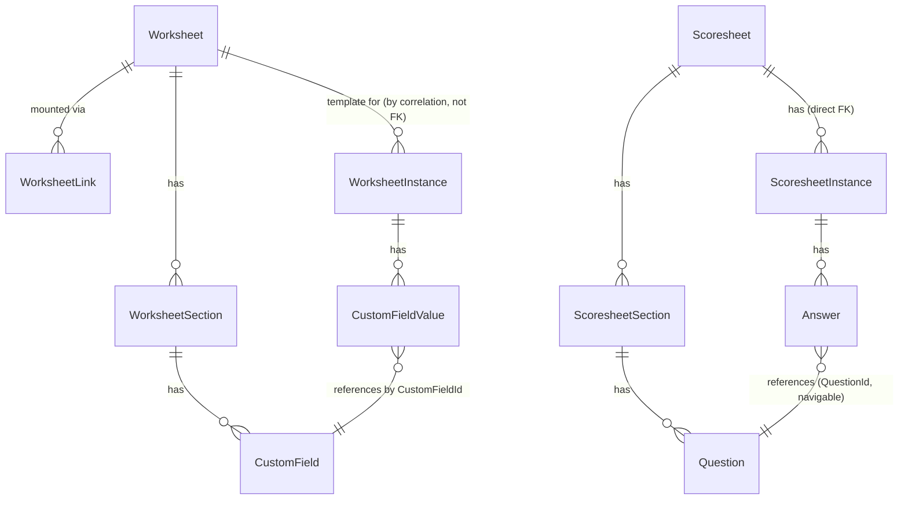

# Flex Domain Model

## Entity relationship diagram

Two parallel sub-systems share one architectural pattern — **definition → instance → value** — implemented independently for worksheets and scoresheets.

## Aggregate roots

| Aggregate root | Base type | Owns |
|---|---|---|
| `Worksheet` | `FullAuditedAggregateRoot<Guid>` | `Sections` (→ `CustomField`s) |
| `WorksheetLink` | `AuditedAggregateRoot<Guid>` | — (attaches a `Worksheet` to a UI anchor on an external entity) |
| `WorksheetInstance` | `FullAuditedAggregateRoot<Guid>` | `CustomFieldValue`s |
| `Scoresheet` | `FullAuditedAggregateRoot<Guid>` | `Sections` (→ `Question`s), `Instances` |
| `ScoresheetInstance` | `FullAuditedAggregateRoot<Guid>` | `Answer`s |

Child entities (`WorksheetSection`, `CustomField`, `CustomFieldValue`, `ScoresheetSection`, `Question`, `Answer`) are `FullAuditedEntity`/`AuditedEntity` owned via conventional EF `HasMany`/`HasForeignKey` — not true EF owned-entity ownership. `CustomFieldValue` is only `AuditedEntity` (no soft-delete); every other entity is full-audited (`CreationTime/CreatorId/LastModificationTime/LastModifierId/IsDeleted/DeleterId/DeletionTime`), plus standard ABP `ExtraProperties`/`ConcurrencyStamp`, and all implement `IMultiTenant`.

## Worksheet template tree

`Worksheet 1─* WorksheetSection 1─* CustomField`

- `Worksheet` (`Domain/Worksheets/Worksheet.cs`) — named, versioned, publishable/archivable form template.
- `WorksheetSection` (`Domain/Worksheets/WorksheetSection.cs`) — named, ordered group of fields.
- `CustomField` (`Domain/Worksheets/CustomField.cs`) — one field: name/key/label/type/order/enabled + a JSON `Definition` describing type-specific config (options, required-ness, etc.).

**In-memory invariants enforced by the aggregate (not DB constraints):**

- `Worksheet.SetTitle` throws `UserFriendlyException("Blank titles are not allowed")` on empty title.
- `Worksheet.AddSection` throws `UserFriendlyException("Section names must be unique")` on a duplicate section name within the worksheet.
- `WorksheetSection.AddField` / `CustomField.SetKey` throw on a duplicate field **`Name`** — checked across the **whole worksheet**, not just the owning section.
- `CustomField.Name` is auto-derived: `custom_<worksheetname>_<key>` (`CustomField.ConfigureName`). This is the stable machine name used for JSON lookups, and the naming convention that `WorksheetsManager.CreateWorksheetDataByFields` parses back apart (splitting on `_`) when bulk-creating instances from a flat field list.
- `Order` (uint, 1-based) is assigned automatically on add, append-only. No reorder validation at the domain layer — resequencing is an app-service concern (`ResequenceSectionsAsync`, `ResequenceCustomFieldsAsync`).

## Worksheet instance tree

`WorksheetInstance 1─* CustomFieldValue`

- `WorksheetInstance` (`Domain/WorksheetInstances/WorksheetInstance.cs`) — one filled instance of a Worksheet. Holds a rolled-up `CurrentValue` JSON blob plus the individual `CustomFieldValue`s. `AddValue(customFieldId, currentValue)` appends a new value.
- `CustomFieldValue` (`Domain/WorksheetInstances/CustomFieldValue.cs`) — one field's value, JSON-typed, tied to `CustomFieldId` by **ID only** (no navigation property — a child of one aggregate referencing another aggregate's descendant by ID, per the "reference other aggregates by ID" DDD convention used throughout this codebase).

### Polymorphic correlation — how instances attach to the outside world

Both `WorksheetInstance` and `WorksheetLink` implement `ICorrelationEntity` (`Unity.Modules.Shared.Correlation`), giving them a generic `(CorrelationId, CorrelationProvider)` pair instead of a hard foreign key:

- `WorksheetLink.CorrelationId/CorrelationProvider` + `UiAnchor` + `Order` + `WorksheetId` define **where** and **how many times** a worksheet template is mounted onto a target entity (e.g. an Application's Project Info tab).
- `WorksheetInstance.CorrelationId/CorrelationProvider` identifies the target record the filled-in data belongs to (e.g. the Application itself).
- `WorksheetInstance.WorksheetCorrelationId/WorksheetCorrelationProvider` additionally correlates back to the *link* that placed the worksheet — distinguishing "which mounting of the worksheet is this instance for" when the same worksheet could theoretically be mounted more than once.
- `WorksheetInstance.UiAnchor` records which named UI slot the instance belongs to.

UI anchor constants live on the **host** side, not in Flex itself: `Unity.GrantManager.Domain.Shared/Flex/FlexConsts.cs` defines `ProjectInfoUiAnchor`, `ApplicantInfoUiAnchor`, `FundingAgreementInfoUiAnchor`, `AssessmentInfoUiAnchor`, `PaymentInfoUiAnchor`, `CustomTab`, `Preview`, and a `UiAnchors[]` array of the first five. This is the mechanism by which a single Application can carry several independent worksheet instances — one per tab/section of the application detail UI.

## Scoresheet template tree

`Scoresheet 1─* ScoresheetSection 1─* Question`

- `Scoresheet` (`Domain/Scoresheets/Scoresheet.cs`) — named/titled, versioned, publishable, ordered. Also has a **direct** `Instances` navigation collection (unlike Worksheet, which only relates to its instances via correlation).
- `ScoresheetSection` (`Domain/Scoresheets/ScoresheetSection.cs`) — named, ordered group of questions.
- `Question` (`Domain/Scoresheets/Question.cs`) — name/label/description/type/order/enabled + JSON `Definition`.

Same duplicate-name guards as Worksheet: section names unique per scoresheet (case-insensitive), question names unique across the whole scoresheet. **Inconsistency worth knowing:** `Scoresheet.UpdateSectionName` throws a namespaced, localizable `BusinessException(ErrorConsts.DuplicateSectionName)`, while most of the equivalent Worksheet guards (and other Scoresheet guards) throw a plain `UserFriendlyException` with a hardcoded English string. `ErrorConsts.DuplicateFieldName` is defined but not observed in use anywhere in the domain layer.

## Scoresheet instance tree

`ScoresheetInstance 1─* Answer`

- `ScoresheetInstance` (`Domain/ScoresheetInstances/ScoresheetInstance.cs`) — one assessor's completed scoresheet. `CorrelationId/CorrelationProvider` ties it to one external assessment record. Holds a rolled-up serialized `Value` plus the individual `Answer`s. Direct `ScoresheetId` FK to its parent `Scoresheet` (no correlation indirection needed here, unlike worksheets).
- `Answer` (`Domain/ScoresheetInstances/Answer.cs`) — one question's answer, JSON `CurrentValue`, versioned. FKs to `Question` via `QuestionId` **with** a real navigation property (`Answer.Question`) — unlike `CustomFieldValue → CustomField`, which is ID-only.

## Required-answer validation

`ScoresheetsManager.ValidateScoresheetAnswersAsync(instance, scoresheet)` (static) walks every `Question` in every section; for each `Question.IsRequired()` (read out of the type-specific `Definition` JSON via `DefinitionResolver.ResolveIsRequired`), it checks a matching `Answer` exists and `IsProvided()` (non-null/non-empty via `ValueResolver.Resolve`). Returns human-readable errors like `"{sectionOrder+1}.{questionOrder+1}: {label} (required)"`.

## Field types and question types

`CustomFieldType` (`Unity.Flex.Shared/Worksheets/Enums/CustomFieldType.cs`) — 16 values: `Undefined, Numeric, Text, Date, DateTime, Currency, YesNo, Email, Phone, Radio, Checkbox, CheckboxGroup, SelectList, BCAddress, TextArea, DataGrid`.

`QuestionType` (`Unity.Flex.Shared/Scoresheets/Enums/QuestionType.cs`) is a **deliberate subset reusing the same numeric values** as `CustomFieldType`: `Number=1, Text=2, YesNo=6, SelectList=12, TextArea=14` — scoresheet questions only support 5 of the 15 usable worksheet field types. Sharing numeric values lets conversion code (`ValueConverter`/`ValueResolver`) work against either enum interchangeably.

Each field/question type has a matching pair of classes:

- **`*Definition`** (`Worksheets/Definitions/`) — the type-specific *configuration* shape, e.g. `TextDefinition`, `NumericDefinition`, `CurrencyDefinition`, `DateDefinition`, `DateTimeDefinition`, `EmailDefinition`, `PhoneDefinition`, `RadioDefinition` (+`RadioOption`), `CheckboxDefinition`, `CheckboxGroupDefinition` (+`CheckboxGroupDefinitionOption`), `SelectListDefinition` (+`SelectListOption`), `QuestionSelectListDefinition` (+`QuestionSelectListOption`, scoresheet-specific), `BCAddressDefinition`, `TextAreaDefinition`, `DataGridDefinition`, `YesNoDefinition`/`QuestionYesNoDefinition`. All implement `ICustomFieldFormat`. `DefinitionResolver` resolves/serializes the right definition type for a given `CustomFieldType`/`QuestionType`.
- **`*Value`** (`Worksheets/Values/`) — the type-specific *stored value* shape, e.g. `TextValue`, `NumericValue`, `CurrencyValue`, `DataGridValue`, `CheckboxGroupValue` (+`CheckboxGroupValueOption`), `BCAddressValue` (+`BCAddressLocationValue`), etc. All extend `CustomValueBase`, used by `ValueConverter`/`ValueResolver` for typed (de)serialization of the JSON-stored field/answer values.

Every `*Definition` also inherits a common base, `CustomFieldDefinition`, carrying presentation and governance properties independent of data type — `LabelPosition`, `Style`, `CssClass`, `LabelStyle`, `LabelCssClass`, `SecurityClassification` (BC Government Protected A/B/C), `Placeholder`, `IsHidden`, `HideLabel`, `IsDisabled`, `Required` — plus type-specific validation constraints (`MinLength`/`MaxLength` on `Text`/`TextArea`, `Min`/`Max` on `Numeric`/`Currency`/`Date`). Coverage of these is uneven — some are fully wired end to end, others are captured but never enforced. See **[flex-styling-and-classification.md](flex-styling-and-classification.md)** for the full breakdown, including which properties currently have no builder UI and which are dead code.

`DataGrid` is by far the most complex field type — repeating rows, columns sourced from an admin-declared list, a live CHEFS form schema, or both at once, plus auto-sum and its own reporting handling. See **[flex-datagrid.md](flex-datagrid.md)** for the full treatment; it's out of scope for this summary table.

## Settings and error codes

- `FlexSettingDefinitionProvider` defines **no settings** — it's an empty override. `FlexSettings` only exposes `GroupName = "Flex"`. Placeholder/scaffold, not currently used.
- `FlexErrorCodes` is intentionally empty (`// Intentionally left blank`). The only real structured errors are in `Domain/Exceptions/ErrorConsts.cs`: `DuplicateSectionName` and `DuplicateFieldName` (`Unity.Flex:Errors:...`), and only `DuplicateSectionName` is actually thrown (from `Scoresheet.UpdateSectionName`).
- `PrivateSetterContractResolver`, `WorksheetContractResolver`, `ScoresheetContractResolver` (`Domain/Settings/`) are Newtonsoft `IContractResolver`s that let entities with private setters serialize/deserialize directly — needed because nearly every property on these entities is `private set`. These back JSON import/export of whole Worksheet/Scoresheet aggregates (see [flex-application-services.md](flex-application-services.md)).

## Cloning and versioning

`SheetParserFunctions` (`Domain/Utils/SheetParserFunctions.cs`) provides `SplitSheetNameAndVersion(name)` (splits `"myform-v3"` into `["myform", "-v3"]`) and `RemoveTrailingNumbers(input)`. Used by `WorksheetsManager.CloneWorksheetAsync` to compute the next version name when cloning (`myform-v1` → `myform-v2`), duplicating every section and field with fresh GUIDs.

## Runtime data pipeline (WorksheetsManager)

`WorksheetsManager` (`Domain/Services/WorksheetsManager.cs`) implements the "fill a worksheet instance from raw field data" pipeline:

- **`PersistWorksheetData`** — handles an event with a flat dictionary of field values, resolves the target `WorksheetInstance`/`Worksheet` by correlation or name, converts each raw value via `ValueConverter.Convert` per field's `CustomFieldType`, rolls the values into the instance's `CurrentValue` JSON, and optionally triggers reporting-data generation if the `Reporting` feature is enabled.
- **`CreateWorksheetDataByFields`** — bulk-creates new `WorksheetInstance`s from a flat field-value list keyed by the `custom_<worksheet>_<field>` naming convention, guarding against duplicate instance creation.

This is the mechanism by which an external form submission (a CHEFS intake form — see [flex-integration.md](flex-integration.md#intake--worksheet)) populates a Flex worksheet instance.

## Database schema

- Both Worksheets and Scoresheets tables live in **schema `Flex`**, inside the **tenant database** (`FlexDbProperties.ConnectionStringName = "Tenant"` → `GrantTenantDbContext`). No table prefix.
- Confirmed tables (`FlexDbContextModelCreatingExtensions.ConfigureFlex`, migration `20260721203242_Initial.cs`): `Worksheets`, `WorksheetSections`, `CustomFields`, `CustomFieldValues`, `WorksheetInstances`, `WorksheetLinks`, `Scoresheets`, `ScoresheetSections`, `Questions`, `Answers`, `ScoresheetInstances` — all under `schema: "Flex"`.
- **JSON columns** (Postgres `jsonb`, via `[Column(TypeName = "jsonb")]`): `WorksheetSection.Definition`, `CustomField.Definition`, `WorksheetInstance.CurrentValue`, `WorksheetInstance.ReportData`, `CustomFieldValue.CurrentValue`, `Question.Definition`, `Answer.CurrentValue`, `ScoresheetInstance.ReportData`. (`Scoresheet.ReportColumns`/`ReportKeys`/`ReportViewName` and `ScoresheetInstance.Value` are plain `text`, not `jsonb`.)
- This is a **schema-per-row / EAV-style design**: both field *definitions* (shape/validation rules) and field *values* are stored as flexible JSON rather than fixed relational columns — the mechanism that makes the whole system dynamic without per-form schema migrations.
- Multi-tenant: every entity implements `IMultiTenant` (nullable `TenantId`) — standard ABP row-level tenant filtering.
- **Reporting support:** `Worksheet` and `Scoresheet` implement `IReportableEntity<T>` and carry `ReportColumns`/`ReportKeys`/`ReportViewName` text columns, backing a generated-SQL-view mechanism that flattens the dynamic JSON into queryable columns — see [flex-application-services.md](flex-application-services.md#reporting-integration) and `documentation/reporting/`.
- No additional unique indexes/constraints beyond primary keys were found — duplicate-name prevention is purely an application/domain-layer invariant, not DB-enforced.
