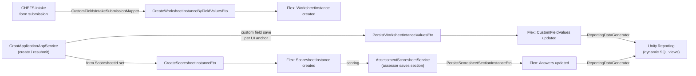

# Flex Integration with Unity.GrantManager

All integration points below are gated by the ABP tenant feature `"Unity.Flex"` (`IFeatureChecker.IsEnabledAsync("Unity.Flex")`), checked on the host side before publishing any Flex-related local event.

## Intake → Worksheet

`Unity.GrantManager.Domain/Intakes/CustomFieldsIntakeSubmissionMapper.cs` (`[IntegrationService]`, `DomainService`), method `MapAndPersistCustomFields(applicationId, formVersionId, formSubmission, formVersionSubmissionHeaderMapping)`:

- Parses a CHEFS form submission's JSON and pulls out fields whose config key is prefixed `custom_` (format `custom_<worksheetname>.<type>`).
- Resolves each field's `CustomFieldType` from the suffix.
- Publishes `CreateWorksheetInstanceByFieldValuesEto` with `SheetCorrelationId = formVersionId` (`CorrelationConsts.FormVersion`), `InstanceCorrelationId = applicationId` (`CorrelationConsts.Application`), and the extracted custom fields.

This is the mechanism by which grant-intake form fields defined in CHEFS map onto a Flex `WorksheetInstance` attached to the `GrantApplication`.

## Application → Scoresheet instance creation

`Unity.GrantManager.Application/GrantApplications/GrantApplicationAppService.cs` — at two call sites (application creation, and resubmission/status-change), checks `form.ScoresheetId != null && Unity.Flex enabled`, then publishes `CreateScoresheetInstanceEto { ScoresheetId = form.ScoresheetId, ... }`. Every application tied to a form with a configured scoresheet gets a `ScoresheetInstance` seeded automatically.

## Application custom field persistence (per UI anchor)

Same file — methods around saving custom-field data entered against an application:

- `ExtractCustomFieldsForWorksheet(dto.CustomFields, worksheetId)` splits incoming field values per worksheet.
- `PublishCustomFieldUpdatesAsync(applicationId, uiAnchor, customFieldDto)` publishes `PersistWorksheetIntanceValuesEto { CorrelationId, CorrelationProvider, CustomFields, WorksheetId }`.

This is invoked once per UI anchor — `FlexConsts.ProjectInfoUiAnchor`, `AssessmentInfoUiAnchor`, `FundingAgreementInfoUiAnchor` — meaning a single `GrantApplication` can carry several independent worksheet instances, one per tab/section of the application detail UI. Both a legacy single `WorksheetId` field and a newer `WorksheetIds` list are supported for backward compatibility.

## Assessment → Scoresheet scoring

`Unity.GrantManager.Application/Assessments/AssessmentScoresheetService.cs` (`IAssessmentScoresheetService`, `ITransientDependency`) injects `IScoresheetInstanceAppService` and `IScoresheetAppService` directly — allowed here because it's a legitimate cross-module app-service call from the host into Flex (the "don't call another app service in the same module" rule applies within a module, not across modules).

Key responsibilities:

- Computing sub-totals from Flex scoresheet answers: `GetSelectListAnswerSubtotal`, `GetYesNoAnswerSubtotal`, `GetNumericAnswerSubtotal` (against `ScoresheetInstanceDto`).
- Validating scoresheet completeness before allowing `AssessmentAction.Complete`.
- `IsScoresheetNotLinkedToFormAsync` — checks `applicationForm.ScoresheetId == null`.
- `CopyAiAnswersToAssessmentAsync` — copies AI-suggested scoresheet answers (stored elsewhere as JSON) into a new assessment's Flex scoresheet instance by publishing `PersistScoresheetSectionInstanceEto`.

**Fallback when Flex is disabled:** the service falls back to `IsUsingDefaultScoresheet = true` behavior, using a legacy, hardcoded `ApplicationScoresheetAnswers` table. Flex scoresheets are a pluggable replacement for an older built-in scoresheet mechanism, not the only possible one.

## Host-side UI anchor constants

`Unity.GrantManager.Domain.Shared/Flex/FlexConsts.cs` defines the "slots" the host app organizes worksheets into: `ProjectInfoUiAnchor`, `ApplicantInfoUiAnchor`, `FundingAgreementInfoUiAnchor`, `AssessmentInfoUiAnchor`, `PaymentInfoUiAnchor`, `CustomTab`, `Preview`, and a `UiAnchors[]` array of the first five.

## Reporting

See [flex-application-services.md#reporting-integration](flex-application-services.md#reporting-integration) for the data-generator/dynamic-view pipeline, and `documentation/reporting/reporting-architecture.md` for how those generated views feed into the broader BI/reporting stack (Metabase and friends).
