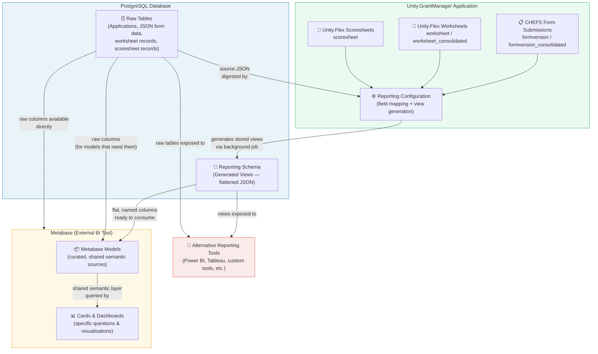
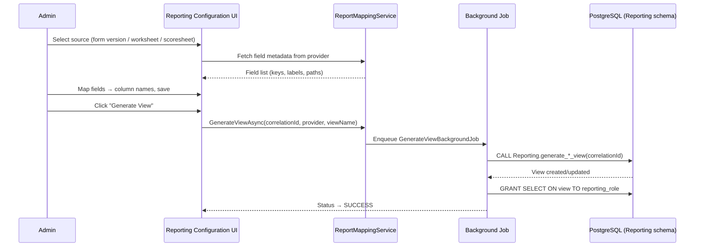
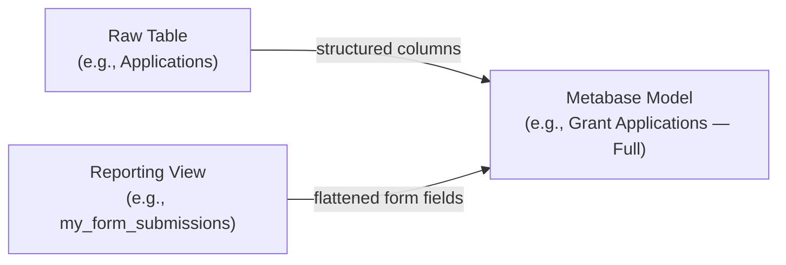
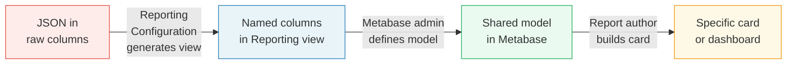
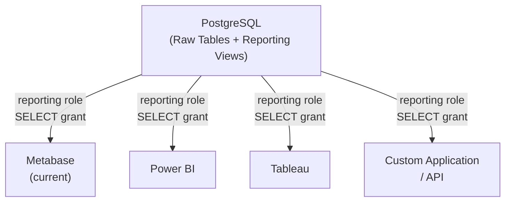

# Reporting Architecture

## Overview

The Unity Grant Manager reporting stack is built in discrete, purposeful layers. Each layer abstracts and enriches the one beneath it, so data moves from raw storage through structured views, into curated semantic models, and finally into specific visualisations or exports — with clear boundaries and responsibilities at every step.

```
Raw Database  →  Views (Reporting schema)  →  Metabase Models  →  Cards / Questions
   (source)         (structured, flat)         (shared context)     (specific outputs)
```

Any reporting tool — not just Metabase — can be pointed at the raw database and generated views to build its own layer on top. Metabase is our current choice, not a hard dependency.

---

## Architecture Layers



---

## Layer 1 — Raw Database

**What it is:** The PostgreSQL database that the application writes to directly. This is the authoritative source of record.

**What it contains:**
- Application records, applicant details, statuses, assignments, dates
- Form submission data stored as **JSON blobs** inside columns (CHEFS submissions)
- Worksheet field values (Unity.Flex) — current state
- Scoresheet field values (Unity.Flex) — current state

**Key characteristic:** Form submission JSON is opaque to standard SQL queries. A tool cannot easily filter or aggregate on individual form fields without first understanding the schema — that is what the next layer solves.

**Access:** Any database role with appropriate `SELECT` grants can read raw tables directly. Metabase models (or any other tool) may source from here when they need columns that are already structured (e.g., `ApplicationId`, `Status`, dates).

---

## Layer 2 — Views (Reporting Schema)

**What it is:** PostgreSQL views in the `Reporting` schema, generated by the Unity.GrantManager **Reporting Configuration** system. These views do the hard work of extracting individual fields out of the JSON and presenting them as ordinary, flat, named columns.

**How they are created:**



**Provider types and data characteristics:**

| Provider | Correlation ID | Data Nature | Use Case |
|----------|---------------|-------------|----------|
| `formversion` | Form Version ID | **Point-in-time / static** — immutable snapshot of a specific CHEFS form version's submission data | Reporting on what applicants submitted for a given form version |
| `formversion_consolidated` | Form ID | **Point-in-time / static** — merged across all versions of a form | Cross-version submission reporting for a single form |
| `worksheet` | Form Version ID | **Current state** — live worksheet field values as they exist today | Reporting on current worksheet data linked to a form version |
| `worksheet_consolidated` | Form ID | **Current state** — merged across all versions | Cross-version worksheet reporting |
| `scoresheet` | Form ID | **Current state** — live evaluation/scoring data | Reporting on assessor scores and evaluation criteria |

> **Important distinction:** `formversion` views capture what was submitted and do not change retroactively. `worksheet` and `scoresheet` views reflect the current state of those records, meaning the view data can change as worksheets and scoresheets are updated.

**What a view looks like:**

Before the view:
```sql
-- Raw: JSON blob, not queryable field-by-field
SELECT submission_data FROM Applications WHERE ...
-- Result: {"firstName":"Jane","projectBudget":50000,"region":"North"}
```

After the view:
```sql
-- View: flat, named columns
SELECT application_id, first_name, project_budget, region
FROM "Reporting"."my_form_v2_submissions"
WHERE region = 'North'
```

**Schema and naming:**
- All views live in the `Reporting` PostgreSQL schema
- View names and column names are sanitised to valid PostgreSQL identifiers (lowercase, underscores, max 63 chars)
- Column names are auto-generated from field keys or labels depending on provider, and can be overridden by administrators
- A database role is granted `SELECT` on each view after generation, which is what Metabase (or any other tool) uses to connect

---

## Layer 3 — Metabase Models

**What it is:** Metabase **Models** are curated, shared data sources defined inside Metabase. They sit between the raw data / views and the end-user questions, acting as a semantic layer.

**What they solve:** Views expose the right columns, but they don't carry business meaning on their own. A model adds:
- Friendly field names and descriptions visible to all report authors
- Implicit joins between related sources (e.g., linking a form submission view to application metadata)
- Pre-applied filters or transformations that should be consistent across all downstream reports
- A single trusted definition that multiple cards can reference — change the model, and all cards using it update automatically

**Source options for a model:**



A model may combine a raw table (for structured application columns) with one or more reporting views (for form field columns) through a join — giving report authors a single, unified source.

**Examples:**

| Model Name | Sources | Purpose |
|------------|---------|---------|
| `Grant Applications — Core` | Raw `Applications` table | Status, dates, applicant, assignments |
| `Application Form Responses — FY2024` | `formversion` view | Flattened CHEFS submission fields for a specific form version |
| `Assessment Scoresheets` | `scoresheet` view + `Applications` raw | Evaluation scores joined to application metadata |
| `Worksheet Summary` | `worksheet_consolidated` view | All worksheet responses across form versions |

---

## Layer 4 — Cards, Questions & Dashboards

**What it is:** The specific reports, charts, tables, and dashboards that end users see and use. In Metabase these are called **Cards** (saved questions) and **Dashboards** (collections of cards).

**Key characteristic:** Cards are narrow and specific. They answer one question ("How many applications by region this quarter?") by querying a model. Because cards inherit from models, the underlying data logic is not duplicated in every card.

**Types:**
- **No-code questions** — built using Metabase's visual query builder on top of a model; no SQL required
- **Native SQL questions** — custom SQL queries written directly against the database (can reference views or raw tables by name)
- **Dashboards** — assembled from multiple cards, often with filters and parameters

---

## Full Abstraction Flow



| Step | Who does it | What changes |
|------|-------------|--------------|
| Raw → View | Application administrator (Reporting Configuration UI) | Unstructured JSON → flat, queryable SQL columns |
| View → Model | Metabase administrator | Flat columns → named, joined, business-meaningful source |
| Model → Card | Report author | Abstract source → specific question / visualisation |

Each layer adds meaning without duplicating data. The raw database is the single source of truth; everything above it is a structured lens on top.

---

## Tool Independence

Metabase is the current BI tool, but the architecture does not depend on it. The `Reporting` schema views are standard PostgreSQL views, accessible to any tool that can connect to the database with the reporting role.



A team adopting a different tool would:
1. Connect the tool to the PostgreSQL database using the reporting role credentials
2. Point to the `Reporting` schema views for form/worksheet/scoresheet field data
3. Point to raw tables for structured application metadata
4. Rebuild the semantic / model layer within that tool's conventions

The view generation system (Reporting Configuration) remains the same regardless of which tool sits above it.

---

## Use Cases

### Use Case 1 — Form Submission Reporting (Point-in-Time)

> *"Show me all applications submitted under Form Version 3, with the project budget and region fields."*

- **Source:** `formversion` view generated from CHEFS form version 3's schema
- **Data nature:** Static — reflects what applicants submitted; does not change even if the form is updated later
- **Path:** Raw JSON submission → Reporting Configuration maps fields → view generated in `Reporting` schema → Metabase model joins view with application metadata → card filters and displays

---

### Use Case 2 — Worksheet Progress Tracking (Current State)

> *"What is the current completion status of worksheets for all open applications?"*

- **Source:** `worksheet` or `worksheet_consolidated` view
- **Data nature:** Current — reflects the live state of worksheet data as assessors fill it in
- **Path:** Unity.Flex worksheet records → Reporting Configuration maps fields → view generated → Metabase model → dashboard card refreshes to show latest state

---

### Use Case 3 — Scoresheet Evaluation Summary (Current State)

> *"What are the average scores per criterion across all applications in this intake?"*

- **Source:** `scoresheet` view joined to `Applications` raw table
- **Data nature:** Current — reflects assessor scores at query time
- **Path:** Unity.Flex scoresheet records → view generated → Metabase model with join → aggregation card on dashboard

---

### Use Case 4 — Cross-Version Consolidated Reporting

> *"Aggregate project budget across all versions of Form X, even though different versions had different field names."*

- **Source:** `formversion_consolidated` view (CorrelationId = FormId, not a specific version)
- **Data nature:** Static per submission, but the view covers all versions
- **Path:** Reporting Configuration generates a consolidated stored procedure (`generate_consolidated_formversion_view`) → single view normalises fields across versions → Metabase model → report

---

### Use Case 5 — Custom SQL Report (Direct View Access)

> *"Write a custom SQL query joining form fields with application dates for an ad-hoc data export."*

- **Source:** Directly queries `Reporting` schema view by name in a Metabase native SQL question or any other SQL client
- No model required — the view itself is the queryable surface
- Example:
  ```sql
  SELECT
      v.application_id,
      v.project_budget,
      v.region,
      a."Status",
      a."SubmissionDate"
  FROM "Reporting"."my_form_v2_submissions" v
  JOIN "Applications" a ON v.application_id = a."Id"
  WHERE a."Status" = 'Approved'
  ORDER BY v.project_budget DESC
  ```

---

### Use Case 6 — Alternative Tool Integration

> *"We want to use Power BI instead of Metabase."*

- Connect Power BI to PostgreSQL using the reporting role
- Import or DirectQuery against `Reporting` schema views (for form/worksheet/scoresheet fields)
- Import or DirectQuery against raw tables (for application metadata)
- Build Power BI datasets (equivalent of Metabase models) on top
- Views remain unchanged — the Reporting Configuration system generates and maintains them regardless of which tool reads them

---

## Summary

| Layer | Technology | Managed by | Data shape |
|-------|-----------|-----------|------------|
| Raw Database | PostgreSQL tables | Application writes | Normalised rows + JSON blobs |
| Reporting Views | PostgreSQL views (`Reporting` schema) | Reporting Configuration UI | Flat, named columns |
| Models | Metabase Models | Metabase authors | Named, joined, business-labelled sources |
| Cards / Dashboards | Metabase Questions & Dashboards | Report authors | Specific questions and visualisations |
