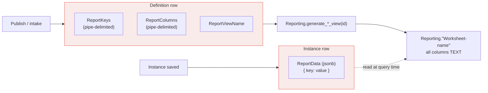

# Auto-Generated Reporting Views (Dynamic) — **Deprecated**

> **Status: deprecated, scheduled for removal.** This path predates the [Reporting Configuration](reporting-configuration.md) system and is retained only so that existing Metabase reports keep working. No new work should build on it. The removal plan is in [Deprecation](#deprecation) below.

## Overview

The Auto (also called *Dynamic*) path creates one PostgreSQL view per **CHEFS form version**, per **published worksheet**, and per **published scoresheet**, with no administrator involvement. It works by:

1. Flattening the source definition into a pipe-delimited list of **report keys** and matching **report columns**, stored on the definition row itself.
2. Flattening each instance's answers into a `ReportData` JSONB snapshot keyed by those report keys.
3. Calling a stored procedure that reads the key/column lists off the definition row and emits a view of `TEXT` columns, each one a lookup into `ReportData`.

Everything is `TEXT`, every column name is derived from the source key, and the view is regenerated wholesale on publish.



Every entry point is gated on the per-tenant `Unity.Reporting` feature (`FeatureConsts.Reporting`).

---

## The three generators

| Source | Entry point | Fields generator | View trigger | Stored procedure |
| --- | --- | --- | --- | --- |
| CHEFS form version | `ApplicationFormVersionAppService.UpdateOrCreateApplicationFormVersion` | `ReportingFieldsGeneratorService.GenerateAndSetAsync` | ABP background job `SubmissionsDynamicViewGeneratorHandler` (1s delay) | `Reporting.generate_submissions_view(uuid)` |
| Flex worksheet | `WorksheetAppService.PublishAsync` | `WorksheetReportingFieldsGeneratorService.GenerateAndSet` | local event `WorksheetsDynamicViewGeneratorEto` → `WorksheetsDynamicViewGeneratorHandler` | `Reporting.generate_worksheets_view(uuid)` |
| Flex scoresheet | `ScoresheetAppService.PublishScoresheetAsync` | `ScoresheetReportingFieldsGeneratorService.GenerateAndSet` | local event `ScoresheetsDynamicViewGeneratorEto` → `ScoresheetsDynamicViewGeneratorHandler` | `Reporting.generate_scoresheets_view(uuid)` |

Notes on each:

- **Form versions** only regenerate when `ReportViewName` is still empty — the call site is guarded by `string.IsNullOrEmpty(applicationFormVersion.ReportViewName)`. A form version that already has a view therefore never refreshes its keys or its view, even if the CHEFS schema is re-synced. It is also the only one of the three that raises a Teams notification on failure (`SubmissionsDynamicViewGeneratorHandler.NotifyTeamsAsync`).
- **Worksheets and scoresheets** regenerate on every publish, via `ILocalEventBus.PublishAsync(..., onUnitOfWorkComplete: true)`. Both handlers wrap the whole operation in a `try`/`catch` that only logs — a failed view generation is invisible to the user.

### View names

| Source | Pattern | Example |
| --- | --- | --- |
| Form version | `Form-{ApplicationFormName}-V{Version}` | `Form-Community Grants-V3` |
| Worksheet | `Worksheet-{Worksheet.Name}` | `Worksheet-project_budget-v2` |
| Scoresheet | `Scoresheet-{Scoresheet.Name}` | `Scoresheet-standard_review` |

These names are used verbatim as PostgreSQL identifiers. They are mixed-case and contain hyphens and (for forms) spaces — see [Known rough edges](#known-rough-edges).

---

## Persisted state

This is the data that feeds the auto views, and the data that Phase 2 of the deprecation removes.

### Definition columns — `ReportKeys`, `ReportColumns`, `ReportViewName`

All three are `text NOT NULL`, defined by `Unity.Flex.Reporting.IReportableEntity<T>` for the Flex entities and directly on `ApplicationFormVersion` for CHEFS.

| Table | Schema | Written by |
| --- | --- | --- |
| `ApplicationFormVersion` | `public` | `ReportingFieldsGeneratorService` |
| `Worksheets` | `Flex` | `WorksheetReportingFieldsGeneratorService` |
| `Scoresheets` | `Flex` | `ScoresheetReportingFieldsGeneratorService` |

`ReportKeys` and `ReportColumns` are two parallel `|`-delimited lists (`ReportingConsts.ReportFieldDelimiter = '|'`). The key is the lookup into `ReportData`; the column is the resulting SQL identifier.

- **CHEFS**: keys come from `ApplicationFormVersion.AvailableChefsFields`. Components of type `simplebuttonadvanced`, `datagrid`, and `hidden` are excluded outright; `simplecheckboxes` and `simplecheckboxadvanced` are expanded into one key per option value. Columns are the same keys truncated to `ReportingConsts.ReportColumnMaxLength` (63).
- **Worksheets / scoresheets**: keys and columns are produced per field by `ReportingFieldsGeneratorFactory` — `CheckboxGroupReportingFieldsGenerator` and `DataGridReportingFieldsGenerator` expand into multiple keys, everything else via `DefaultReportingFieldsGenerator` / `DefaultFieldsGenerator`.

### Instance columns — `ReportData`

All three are `jsonb NOT NULL DEFAULT '{}'`.

| Table | Schema | Written by |
| --- | --- | --- |
| `ApplicationFormSubmissions` | `public` | `GenerateReportDataHandler` on `ApplicationProcessEvent` (intake) |
| `WorksheetInstances` | `Flex` | `WorksheetsManager` on instance save → `WorksheetsReportingDataGeneratorService` |
| `ScoresheetInstances` | `Flex` | `ScoresheetsManager` on answer save → `ScoresheetsReportingDataGeneratorService` |

The generators seed the dictionary with every report key mapped to `null`, then overwrite the ones that have values, so the JSON shape is stable across instances. `ScoresheetsReportingDataGeneratorService` additionally writes a `TotalScore` entry. Both Flex generators swallow all exceptions and log — reporting data never blocks intake or assessment.

---

## The stored procedures

`generate_submissions_view`, `generate_worksheets_view`, and `generate_scoresheets_view` are effectively the same 58-line procedure three times over, differing only in the definition table, the instance table, and the passthrough columns.

```sql
CREATE OR REPLACE PROCEDURE "Reporting".generate_worksheets_view(IN table_a_id uuid)
...
    SELECT "ReportViewName", "ReportColumns", "ReportKeys" INTO view_name, view_columns, view_keys
    FROM "Flex"."Worksheets" WHERE "Id" = table_a_id;

    column_names := string_to_array(view_columns, '|');
    key_names    := string_to_array(view_keys, '|');
    ...
    -- one clause per key
    select_clause := ... format(
        'COALESCE((SELECT value::TEXT FROM jsonb_each_text("ReportData") WHERE key = %L LIMIT 1), '''') AS %I',
        key_names[i], column_names[i]);

    EXECUTE format('DROP VIEW IF EXISTS %I', view_name);
    EXECUTE format('CREATE VIEW "Reporting".%I AS SELECT ... %s FROM (...) AS subquery', view_name, select_clause, table_a_id);
```

Passthrough columns per procedure:

| Procedure | Definition table | Instance table | Passthrough columns |
| --- | --- | --- | --- |
| `generate_submissions_view` | `public.ApplicationFormVersion` | `public.ApplicationFormSubmissions` (filtered on `ApplicationFormVersionId`) | `Id`, `ApplicationId` |
| `generate_worksheets_view` | `Flex.Worksheets` | `Flex.WorksheetInstances` (filtered on `WorksheetId`) | `Id`, `CorrelationId`, `CorrelationProvider` |
| `generate_scoresheets_view` | `Flex.Scoresheets` | `Flex.ScoresheetInstances` (filtered on `ScoresheetId`) | `Id`, `CorrelationId`, `CorrelationProvider`, `TotalScore` |

`TotalScore` is the only non-`TEXT` column any of the three produces: `COALESCE(("ReportData"->>'TotalScore')::integer, 0)`.

There is a `column_definitions` variable built in all three procedures that is never used — dead code carried through every copy.

---

## Maintenance / ops tooling

Three IT-Admin-only application services exist to backfill drift. None have a UI; they are reachable through ABP's auto-generated API. Each takes an optional `tenantId` and otherwise loops every tenant, checking the `Unity.Reporting` feature per tenant.

| Service | Methods | What it backfills |
| --- | --- | --- |
| `FormsReportSyncServiceAppService` | `SyncFormVersionFields`, `SyncFormSubmissionData` | Form versions with an empty `ReportViewName`; submissions whose `ReportData` is empty or `{}` (batched 25 at a time) |
| `WorksheetReportingFieldsSyncAppService` | `SyncFields`, `SyncData` | Published worksheets with an empty `ReportViewName`; `ReportData` for **all** worksheet instances |
| `ScoresheetReportingFieldsSyncAppService` | `SyncQuestions`, `SyncAnswers` | Published scoresheets with an empty `ReportViewName`; scoresheet instance answers |

All are `[Authorize(IdentityConsts.ITAdminPolicyName)]`.

---

## Known rough edges

These are the reasons the path is being retired, not incidental bugs to fix in place.

1. **Everything is `TEXT`.** Numbers, dates, currency, and booleans all arrive as strings, so every Metabase model on top of an auto view has to cast. The explicit path emits real `NUMERIC` / `DECIMAL(18,2)` / `TIMESTAMP` / `BOOLEAN` columns via the `Reporting.safe_to_*` helpers.
2. **View names are not valid bare identifiers.** `Form-…`, `Worksheet-…`, `Scoresheet-…` all contain a hyphen and are mixed-case. `ReportColumnsMapRepository.IsValidPostgreSqlIdentifier` accepts only `^[a-zA-Z_][a-zA-Z0-9_]*$`, and `AssignRoleToAllViewsAsync` validates *every* view name it reads back from `pg_views` in the `Reporting` schema before granting. An auto view in the schema will therefore make the "assign role to all views" operation throw `ArgumentException` part-way through, leaving the grant loop incomplete. This is the sharpest interaction between the two paths and a concrete argument for removing the auto views early.
3. **Unqualified `DROP VIEW`.** `EXECUTE format('DROP VIEW IF EXISTS %I', view_name)` has no schema qualifier, so it resolves against `search_path` while the subsequent `CREATE VIEW` is explicitly `"Reporting".%I`. If `Reporting` is not on the search path the drop silently misses and the create fails on a pre-existing view. The explicit procedures qualify both statements.
4. **Column names are truncated, not de-duplicated.** `ReportingFieldsGeneratorService` truncates each key at 63 characters and does nothing about collisions; two long CHEFS keys sharing a 63-character prefix produce two columns with the same name and the `CREATE VIEW` fails. The explicit path runs a full sanitisation pipeline with numeric-suffix uniquing.
5. **Failures are silent.** All three handlers catch `Exception` and log. Only the submissions handler notifies Teams. There is no `ViewStatus` equivalent and nothing surfaces in the UI, so a tenant can sit with a stale or missing view indefinitely.
6. **Form-version views never refresh.** The `ReportViewName`-empty guard means a re-synced CHEFS schema does not update `ReportKeys`, so newly added form fields never appear in the auto view.
7. **`ReportData` is a second copy of the answers.** It duplicates data that already exists in `Submission`, `WorksheetInstances.CurrentValue`, and `Flex.Answers`, and can drift from them whenever generation fails — which is exactly what the sync services exist to repair.
8. **No cross-version story.** One view per form version means a report that spans versions has to be assembled by hand in Metabase. `formversion_consolidated` / `worksheet_consolidated` in the explicit path exist precisely to solve this.

---

## Deprecation

The removal is phased so that the reporting team can migrate Metabase reports at their own pace. **Phase 1 stops new auto views and new auto data from appearing; Phase 2 removes the existing views and the columns that fed them.** Phase 2 must not start until the reporting team confirms every Metabase question and model has been re-pointed at an explicitly configured view.

### Prerequisite: the explicit path does not depend on any of this

Verified against the SQL: none of `get_formversion_data`, `get_consolidated_formversion_data`, `get_worksheet_data`, `get_consolidated_worksheet_data`, or `get_scoresheet_data` reads `ReportData`, `ReportKeys`, `ReportColumns`, or `ReportViewName`. They read source data directly:

| Explicit provider | Reads from |
| --- | --- |
| `formversion`, `formversion_consolidated` | `public.ApplicationFormSubmissions."Submission"` |
| `worksheet`, `worksheet_consolidated` | `Flex.WorksheetInstances."CurrentValue"` joined to `Flex.Worksheets` |
| `scoresheet` | `Flex.ScoresheetInstances` → `Assessments` → `Applications`, values from `Flex.Answers` / `Flex.Questions`, total from `Reporting.calculate_scoresheet_total_score` |

So dropping the Auto path's columns cannot break an explicitly configured view.

---

### Phase 1 — stop generating

Goal: no new auto views are created, no new `ReportKeys` / `ReportColumns` / `ReportViewName` / `ReportData` values are written. Existing views and columns stay in place, so every current Metabase report keeps working unchanged.

**Remove the view-generation trigger from the three publish/intake paths:**

- `WorksheetAppService.PublishAsync` — drop the `reportingFieldsGeneratorService.GenerateAndSet(worksheet)` call and the `IReportingFieldsGeneratorService<Worksheet>` constructor dependency.
- `ScoresheetAppService.PublishScoresheetAsync` — same for `IReportingFieldsGeneratorService<Scoresheet>`.
- `ApplicationFormVersionAppService.UpdateOrCreateApplicationFormVersion` — drop the `reportingFieldsGeneratorService.GenerateAndSetAsync(...)` block (already carrying a "should be deprecated" comment) and the `IReportingFieldsGeneratorService` dependency.

**Delete the generation code:**

| Project | Delete |
| --- | --- |
| `Unity.Flex.Application/Reporting/` | `WorksheetsDynamicViewGeneratorEto.cs`, `WorksheetsDynamicViewGeneratorHandler.cs`, `ScoresheetsDynamicViewGeneratorEto.cs`, `ScoresheetsDynamicViewGeneratorHandler.cs`, `DynamicViewGeneratorEto.cs` |
| `Unity.Flex.Application/Reporting/FieldGenerators/` | the whole folder — `IReportingFieldsGenerator`, `IReportingFieldsGeneratorService`, `ReportingFieldsGenerator`, `ReportingFieldsGeneratorFactory`, `Worksheet`/`ScoresheetReportingFieldsGeneratorService`, `CustomFieldGenerators/`, `QuestionFieldGenerators/` |
| `Unity.Flex.Application/Reporting/DataGenerators/` | the whole folder — factories, `ReportingDataGeneratorServiceBase`, `AnswerGenerators/`, `CustomFieldValueGenerators/` |
| `Unity.Flex.Application/Reporting/` | `IReportableEntity.cs`, `ReportingExtensions.cs`, `WorksheetReportingFieldsSyncAppService.cs`, `ScoresheetReportingFieldsSyncAppService.cs` |
| `Unity.Flex.Application.Contracts/Reporting/` | `IWorksheetReportingFieldsSyncAppService.cs`, `IScoresheetReportingFieldsSyncAppService.cs` |
| `Unity.GrantManager.Application/Reporting/` | `SubmissionsDynamicViewGeneratorHandler.cs` (+ `SubmissionsDynamicViewGenerationArgs`), `FieldGenerators/`, `DataGenerators/`, `FormsReportSyncServiceAppService.cs` |
| `Unity.GrantManager.Application.Contracts/Reporting/` | `IFormsReportSyncServiceAppService.cs` |
| `Unity.GrantManager.Application/Intakes/Handlers/` | `GenerateReportDataHandler.cs` |

Keep `ReportingConsts` in both projects only if something else still references the delimiter or max length; otherwise delete both.

> **Do not delete the `Reporting/Configuration/` folders.** `Unity.Flex.Application/Reporting/Configuration/` (`WorksheetsMetadataService`, `ScoresheetsMetadataService`, and the two field schema parsers) and `Unity.GrantManager.Application/Reporting/Configuration/` (`FormMetadataService`) belong to the **explicit** path — they are what `WorksheetFieldsProvider`, `ScoresheetFieldsProvider`, and `FormVersionFieldsProvider` call to read field metadata. They share a parent folder with the Auto path's code but nothing else.

**Leave the properties in place for now.** `Worksheet` / `Scoresheet` / `ApplicationFormVersion` keep their three columns and the instances keep `ReportData`, now frozen at their last generated values. Removing `IReportableEntity<T>` means `SetReportingFields` goes away, so the properties become plain persisted state.

**Callers that must be handled in the same change:**

- `FormScoresheetOperationExecutor` (AI-generated scoresheets) reads and round-trips `ReportColumns`, `ReportKeys`, and `ReportViewName` through the AI payload, and `AIProviderPayloadValidator` *requires* all three properties to be present on a scoresheet payload. `AIPromptDataSeeder`'s scoresheet prompt template and `FormScoresheetResponse` also carry them. Phase 1 must either keep passing empty strings through, or — better — strip the three properties from the AI contract, the validator, the seeded prompt, and `FormScoresheetResponse` together. Note that changing the seeded prompt affects tenants with existing prompt rows; plan a data update alongside.
- `GrantManagerApplicationMapperlyProfile`, `FlexApplicationMapperlyProfile`, `CreateWorksheetDto`, `WorksheetDto`, and `ApplicationFormVersionDto` expose the three properties; drop them from the DTOs and mappers if nothing external reads them (nothing in the Razor pages or JS does — verified by search).

**What Phase 1 explicitly does *not* do:** it does not drop views, does not drop columns, does not drop the stored procedures. A tenant that has already generated auto views keeps them; they simply stop being refreshed.

**Verification for Phase 1:** publish a worksheet and a scoresheet, and re-sync a CHEFS form version, on a tenant with the `Unity.Reporting` feature enabled. Confirm no new rows/values appear in `ReportKeys` / `ReportViewName`, no new views appear in `Reporting` (compare `pg_views` before/after), and no `generate_*s_view` calls appear in the logs.

---

### Phase 2 — remove the data and database objects

**Precondition (hard gate):** the reporting team confirms in writing that no Metabase model, question, or dashboard — and no external consumer — references any `Form-*`, `Worksheet-*`, or `Scoresheet-*` view. Inventory them per tenant first:

```sql
SELECT schemaname, viewname
FROM pg_views
WHERE schemaname = 'Reporting'
  AND (viewname LIKE 'Form-%' OR viewname LIKE 'Worksheet-%' OR viewname LIKE 'Scoresheet-%');
```

Cross-check that list against the explicitly configured views, which are exactly the `ViewName` values in `Reporting."ReportColumnsMaps"` — anything in `pg_views` under `Reporting` that is *not* in that table is an auto view or an orphan.

**Steps, in order, as a single tenant migration:**

1. **Drop the auto views.** Generated names are not predictable from the migration alone, so drop them by pattern in a `DO` block over the `pg_views` list above (`EXECUTE format('DROP VIEW IF EXISTS %I.%I', ...)`).
2. **Drop the stored procedures:**
   ```sql
   DROP PROCEDURE IF EXISTS "Reporting".generate_submissions_view(uuid);
   DROP PROCEDURE IF EXISTS "Reporting".generate_worksheets_view(uuid);
   DROP PROCEDURE IF EXISTS "Reporting".generate_scoresheets_view(uuid);
   ```
   and delete `Scripts/generate_submissions_view.sql`, `Scripts/generate_worksheets_view.sql`, `Scripts/generate_scoresheets_view.sql` along with their `<EmbeddedResource>` entries in `Unity.GrantManager.EntityFrameworkCore.csproj` and their `RunEmbeddedScript` lines in `20260721203242_Initial.cs`.
3. **Drop the definition columns:**
   ```sql
   ALTER TABLE "Flex"."Worksheets"        DROP COLUMN "ReportKeys", DROP COLUMN "ReportColumns", DROP COLUMN "ReportViewName";
   ALTER TABLE "Flex"."Scoresheets"       DROP COLUMN "ReportKeys", DROP COLUMN "ReportColumns", DROP COLUMN "ReportViewName";
   ALTER TABLE public."ApplicationFormVersion" DROP COLUMN "ReportKeys", DROP COLUMN "ReportColumns", DROP COLUMN "ReportViewName";
   ```
   and remove the corresponding properties from `Worksheet`, `Scoresheet`, and `ApplicationFormVersion`.
4. **Drop the instance data columns:**
   ```sql
   ALTER TABLE "Flex"."WorksheetInstances"  DROP COLUMN "ReportData";
   ALTER TABLE "Flex"."ScoresheetInstances" DROP COLUMN "ReportData";
   ALTER TABLE public."ApplicationFormSubmissions" DROP COLUMN "ReportData";
   ```
   and remove the properties (`WorksheetInstance.ReportData` + `SetReportingData`, `ScoresheetInstance.ReportData` + `SetReportingData`, `ApplicationFormSubmission.ReportData`) plus `CreateWorksheetInstanceDto.ReportData` and `WorksheetInstanceReportDto`. `DataGridWriteService.GenerateReportDataForNewRowAsync` in `Unity.Flex.Web` also writes `ReportData` on new data-grid rows and must go with it.

   > `ScoresheetInstances.ReportData` also carries the `TotalScore` entry the auto scoresheet view exposes. The explicit path computes the total independently via `Reporting.calculate_scoresheet_total_score(instance_id)` off `Flex.Answers`, so dropping the column loses no scoring capability — but confirm no other consumer reads `ReportData->>'TotalScore'` before dropping.

5. **Regenerate migrations for both contexts** with the two-context command (`--context GrantTenantDbContext --output-dir Migrations/TenantMigrations`), and take a database backup before running Phase 2 in any environment — `DROP COLUMN` on `ReportData` is irreversible.

**Verification for Phase 2:** after the migration, `SELECT viewname FROM pg_views WHERE schemaname = 'Reporting'` should return exactly the `ViewName` set from `Reporting."ReportColumnsMaps"`. Run "assign role to all views" for the tenant — with no hyphenated view names left it should now complete without throwing (see rough edge 2).

---

### Sequencing summary

| | Phase 1 | Phase 2 |
| --- | --- | --- |
| Blocked on | Nothing — can ship immediately | Reporting team's Metabase migration complete |
| Removes | Generation code and its call sites | Views, procedures, and all six tables' report columns |
| Existing Metabase reports | Keep working (views frozen) | Break unless already re-pointed |
| Reversible | Yes (revert the commit) | No (data loss) |
| Tenant migration needed | No | Yes |
